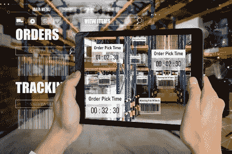

# 为什么移动数据采集对运输物流公司很重要

> 原文：<https://medium.com/nerd-for-tech/why-is-mobile-data-capture-important-for-transport-logistic-firms-62e3708263ad?source=collection_archive---------2----------------------->

随着世界的数字化和智能手机使用的增加，[移动数据采集](https://www.dynamsoft.com/web-twain/features/mobile-web-capture-sdk/)正在成为大多数行业的新规范。海运物流也不例外。从捕获详细的订单和交付信息到跟踪货物和仓库位置，条形码技术应用于运输物流的每一个环节。通过智能数据采集，运输和物流公司可以获得更好的结果。此外，这是当前的需要。

# 移动数据采集对运输物流的好处

移动捕捉为航运物流领域带来了诸多好处。下面列出了一些关键因素。

**显著节约成本:**借助移动数据捕获设备，您不必投资购买数十台专用设备，例如手持式激光条形码扫描仪。智能手机和平板电脑等移动设备可以执行智能数据捕获，从而简化日常运输物流任务。利用先进的移动数据捕获解决方案，仓库甚至可以求助于自动导向车(AGV)、无人机或移动机器人来进行有效的库存管理，而不会遗漏任何一个条形码！

**更好的跟踪:**无论手持条形码扫描仪多么强大，在条形码扫描方面都无法与智能设备相比。硬件扫描仪有多种局限性，这也是它们被移动扫描仪取代的原因。移动数据采集有助于改善运输和物流工作流程。当手持扫描仪无法扫描难扫描的条形码时，例如不完整、[皱巴巴的条形码](https://www.dynamsoft.com/blog/insights/crumpled-qr-codes-and-barcodes-in-retail-scenarios/)、密集或有角度的条形码，商业级条形码运输接收软件可以顺利扫描此类代码。因此，更好的跟踪没有错过扫描。

**安全、便捷的可扩展性:**升级传统扫描仪既困难又昂贵。在一个技术每分钟都在变化的世界里，变化是唯一不变的，也是最终的手段。选择移动智能设备，如智能手机和平板电脑，具有成本效益，因为它们可以根据运输物流公司的需求进行更新。数据加密、常规用户管理和维护等强大的安全功能可帮助您以最大的安全性进行扩展。

**易于集成:**移动数据收集在多个行业越来越受欢迎的另一个重要原因是它易于与现有的后端管理系统集成。对于运输物流公司，它可以很容易地与运输接收软件管理系统、库存管理系统或资源规划系统相结合。此外，它使数据捕获更快、更易管理，并且极其安全。

# 移动数据采集在航运物流中的应用

移动数据收集在许多方面有利于航运物流。让我们来看看关键的用例。

**有益于卡车司机:**移动数据收集使卡车司机收集、管理和分拣包裹的日常工作变得更加容易。无需手动输入数据，这进一步降低了出错几率，并加快了流程。此外，它还提高了合规性，消除了投资昂贵硬件的需要。

**轻松取货和卸货:**通过移动数据采集，运输物流公司可以在任何客户接触点实现实时包裹跟踪。通过这种方式，物流公司及其合作伙伴可以从[移动条形码扫描](https://www.dynamsoft.com/barcode-reader/sdk-mobile/)中受益，在每个阶段对货物进行分类、搜索和查找。

**最后一英里递送:**移动条形码扫描解决方案增加了流程的灵活性，确保包裹被递送到正确的位置并满足工作流程需求。

**发货&收货:**条形码扫描在发货和收货过程中至关重要，因为它有助于确保一切就绪，从而简化工作流程。移动数据收集很容易与发货接收软件并行集成，并允许员工扫描仓库内外的货物。

# 运输和物流中的移动数据收集:面临的共同挑战

虽然移动数据采集对于现代运输物流运营是必要的，但使用平庸的解决方案不会有任何好处。因此，大多数组织未能充分利用其优势。以下是他们可能面临的一些常见挑战。

**坚固的条形码:**下雨等天气条件可能会损坏条形码。使用具有普通条形码扫描能力的普通数据捕获解决方案不会让物流专业人员扫描具有这种条形码的运输标签。

**复杂的集成流程:**复杂的集成通常会威胁航运物流公司选择智能数据捕获。虽然领先的解决方案很容易集成，但对于大多数可用的选项来说，情况就不一样了。将数据捕捉功能集成到智能手机、可穿戴设备、无人机和机器人等移动设备中是平庸解决方案的另一个挑战。

**扫描缓慢繁琐:**别说批量条码扫描，普通条码扫描仪都无法提供快速条码扫描功能。在一家运输物流公司，每天必须扫描数千个标签，缓慢的移动数据收集将使事情变得更加困难。

**不支持重要的条形码类型:**并非所有智能数据采集解决方案都能支持所有标准的条形码符号体系，这就是问题的开始。普通条形码仅支持一维条形码符号体系和一些重要的 2D 条形码类型。如果你需要扫描一个[的 USPS 智能邮件标签](https://www.dynamsoft.com/barcode-reader/barcode-types/usps-intelligent-mail/)或者一个澳大利亚的邮政编码呢？

# Dynamsoft 如何解决这些问题？

Dynamsoft 是领先的计算机视觉品牌，以其企业级条形码读取、文档扫描和文本识别 SDK 而闻名。我们的 SDK 受到财富 500 强公司、地方政府、非营利组织以及各种规模的企业的信任。

我们的条形码扫描仪 SDK- Dynamsoft 条形码阅读器 SDK 是一款商业级[条形码扫描仪 SDK](https://www.dynamsoft.com/web-twain/overview/) (软件开发套件)，只需几行代码，即可帮助将条形码扫描功能嵌入到 web、桌面或移动应用程序中。它可以轻松集成到运输接收软件中，帮助物流公司应对上述挑战。

**扫描高难度条形码的能力:**Dynamsoft 条形码阅读器 SDK 设计用于在最具挑战性的条件下扫描高难度条形码，可以轻松[扫描运输标签](https://www.dynamsoft.com/blog/insights/shipping-label-scanner/)或因恶劣天气条件或误操作而损坏的条形码。

**易于集成:**通过选择 Dynamsoft 条形码阅读器 SDK，以最少的编码为智能手机、平板电脑、无人机或机器人等移动设备添加强大的条形码扫描功能。从库存管理系统到最后一英里交付解决方案，它可以快速集成到新的或现有的软件中。

**快速且高度准确:**使用 Dynamsoft 条码阅读器 SDK，一分钟内扫描 500 多个条码。此外，它比业界第二好的产品多读取 34.9%的条形码！

**支持所有标准条码符号:**选择 Dynamsoft 条码阅读器 SDK，您将不必再为无法扫描特定条码类型而烦恼。它支持所有主要的[条形码类型](https://www.dynamsoft.com/barcode-reader/barcode-types/)，从 1D 条形码到 2D 条形码符号体系、GS1 复合码、邮政编码、补丁码和 GS1 数据条码。

# 试用 Dynamsoft 条形码阅读器 SDK

您是否正在为您的物流业务寻找企业级条形码扫描解决方案？尝试[在线条形码扫描仪演示](https://demo.dynamsoft.com/barcode-reader/)以了解 Dynamsoft 条形码阅读器的运行情况。[下载 30 天免费试用版](https://www.dynamsoft.com/barcode-reader/downloads/)深入了解其特性和功能。从数百个 API 中选择，满足您最特殊的需求。

[联系我们的技术专家团队](http://support@dynamsoft.com)，为您的移动数据采集需求找到合适的解决方案。

*原载于 2022 年 12 月 28 日 https://www.dynamsoft.com***。**