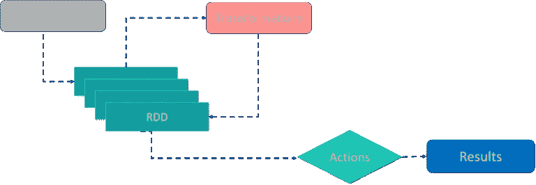

# 为什么 RDD 是不变的？

> 原文：<https://medium.com/nerd-for-tech/why-is-rdd-immutable-7503ddcbbd24?source=collection_archive---------0----------------------->

图片来源——quora.com

我们从中获得了什么好处？

在我继续之前，RDD 是什么？— *RDD 不是数据的集合。RDD 是创建数据集合的抽象。它只是一组描述或元数据，当对其进行操作时，这些描述或元数据将依次为您提供一组数据。*

> RDD 使用数据流编程模型。数据流是管道序列。管道是一种数据操作。

为什么呢？首先，Spark 是用 Scala 编写的，Scala 支持函数式编程的各个方面，比如 currying、lazy evaluation 等等。在我看来，Spark 开发人员可能已经决定利用这个方面，他们可能已经决定他们需要一个以确定性方式计算的抽象，并且应该能够支持并发消费。RDD 的不变性正好符合这里的条件。Spark 通过使用内存计算来提高性能。我们很可能希望内存中的“东西”是不可变的，因为这将消除频繁的缓存失效的需要。RDDs 的不变性同样适用于这里。多个线程访问相同的数据并对其进行操作，不变性消除了分布式环境中节点间同步的任何要求。

**血统:**试想一下，如果 rdd 不是不可变的。一旦我们遇到失败，我们能够确定性地重新开始上一步吗？——**号**

我想我们已经有足够的理由来解释为什么 rdd 是不可变的。

快乐学习！