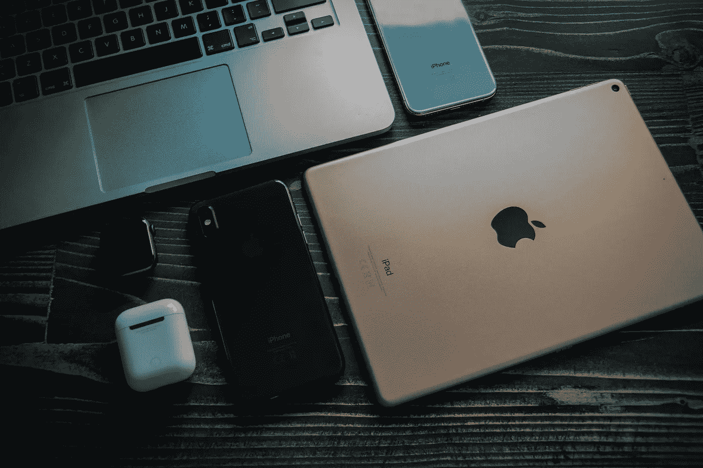

# 为什么是🍎被称为‘传奇’的生态系统？

> 原文：<https://medium.com/nerd-for-tech/why-is-the-ecosystem-called-legendary-dcafaeb8ab45?source=collection_archive---------1----------------------->

苹果生态系统

## 首先，让我们解决房间里的大象。什么是生态系统？

生态系统是由相互作用的电子设备组成的社区。这基本上意味着一组特定的设备能够使用专有软件进行交互。

**苹果**生产许多不同的产品，包括 iPhone、iPad、iMac、Macbook、Apple Watch、Apple TV、AirPods、Homepods 等等。

> 但是这些产品的伟大之处在于苹果内置的软件。

**Airdrop** :这是一个软件，它可以“无线”地帮助你发送全分辨率的文档、照片、视频、网站、地图位置等，并且没有大小限制，可以发送到附近属于*苹果生态系统*的设备上。

**Airplay:** 它允许在*苹果生态系统*中的设备之间无线传输音频、视频、设备屏幕和照片。

**连续性:**该功能允许用户使用属于*苹果生态系统*的设备打电话、发短信、传递文件、复制粘贴、自动解锁 Mac。

**iCloud:** 这是每个苹果设备内置的一项服务。这意味着所有的照片、文件、笔记等都是安全的、最新的，无论你在哪里，都可以在属于苹果生态系统的设备中使用。

剪贴板:这在当今时代的每部手机和笔记本电脑中都很常见。但是，other 的体验与苹果生态系统的设备不同的是，与 Windows/Android 相比，iPhone 上剪贴板中的文本可以更容易地传输到 Macbook。

所有的苹果设备！！！

> 如果你是这个生态系统的一部分，我们可以想象这种体验有多方便。

苹果为他们自己的用户开发的这些便利的功能和软件，只对那些已经采用了他们所有设备的人来说才是最好的。

如果一个苹果 iPhone 用户想买一副耳机，用户会更愿意购买*苹果 Airpods* 而不是任何其他产品，只是因为他会体验到额外的特性和功能。这适用于所有不同的苹果配件。

## **集权！！**

只去一家制造商那里就能满足你所有的技术需求，这很有帮助。如果你的任何设备有一些问题/缺陷，对用户来说这是一个非常方便和流畅的体验。满足所有需求的一站式商店！

# 这就是你如何建立一个万亿美元公司的方法 ☝🏼

那么，为什么其他公司没有采用这种试图将所有客户留在他们自己的生态系统中的方法呢？

很多公司都尝试过做自己的生态系统，**失败了**！

*为例，我们就拿* ***三星*** *来说吧。*

即使你拥有一部三星手机，一部三星 Tab，三星手表，三星笔记本电脑，三星 airbuds，这种体验也无法与苹果相比，因为三星将不得不使用 Android，Tizen 和 Windows。**(三种完全不同的操作系统，互不兼容)。**

## 原因是每年推出的 Android 手机过多！！

为 iPhone 开发的应用程序只有一个版本，因此质量得以保持，而为 Android 开发的应用程序有许多不同的版本，因为每年有 1000 多种不同的 Android 设备，因此与 Android 相比，为苹果开发应用程序变得容易得多。因此，许多应用程序在 iOS 上比在 Android 上有更好的功能。

今年推出的安卓手机的长长名单

好了，让我们把 Android vs iOS 的战斗留到改天吧！

安卓 vs iOS

所以今天博客的结论是。

> 一旦你成为苹果生态系统的一部分，你会因为品尝这个生态系统提供的软件功能而购买更多的苹果产品。

## 由埃沙安·库拉纳和❤️共同撰写

欢迎建设性的批评/赞赏！

在 [Linkedin](https://linkedin.com/in/eshaan-khurana) 上与我联系。

关注我的 [Github](https://github.com/eshaan007) 和 [Medium](/@eshaany2k) 了解更多技术内容！