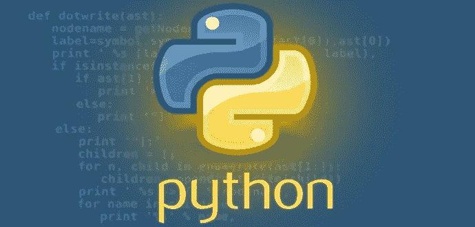
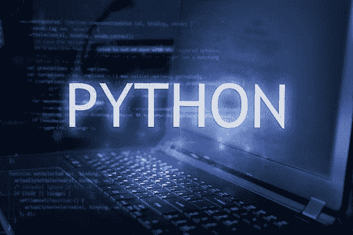

# 为什么 2021 年学习 Python 很重要？

> 原文：<https://medium.com/nerd-for-tech/why-learning-python-is-important-in-2021-67d1584b5871?source=collection_archive---------17----------------------->

Python 非常受欢迎，是世界上需求量最大的编程语言之一。为什么？

仅仅是因为它广泛的吸引力，并且是 AI 和 ML 强力支持的最强大的语言之一。

无论是数据科学还是大数据，或者是编码和应用程序开发，Python 的应用无处不在。适应能力就是这么强。这种语言最近变得如此受欢迎，以至于申请人急于学习 Python 的语言和编程能力。

如果你是一个有志于学习 Python，但又犹豫不决的人？"

今天，我们要打消这些疑虑！

[**为什么要学 Python？**](http://www.risingteq.com/why-to-learn-python-if-youre-not-a-programmer/)Python 是一种免费且易学的计算机语言。

它适用于大多数操作系统，用于分析数据、可视化、机器学习和网络开发。

Python 的主要优势之一是学习简单。

你不需要有技术背景，学习数学基础就足够了。

# **2021 年学习 Python 的理由**

1-这并不比 Python 简单！
他的根本简单是 Python 成为新手梦幻般选择的根本原因。经常想进入编码/数据科学领域的学生会想“为什么要学习 Python？”

Python 的基本语法(看起来很像英语)和良好的可读性使它成为一门易于入门的语言。当然，Python 的学习曲线远短于其他任何语言(Jave、C、C++等)。).此外，不用担心文档，Python 使您能够直接进入您的研究部分。

**2——Python 是非常通用和可扩展的**

Python 可以缩放和扩展。Python 的多功能性使您能够毫无问题地操作跨语言。除了 Java and.NET 组件，Python 也可以用于执行 C/C++库。

此外，实际上世界上每个人都支持 Python，例如 Windows、Macintosh、Linux 和 Solaris。

**3-Python 提供了满足您所有需求的库。** 不可能有其他语言像 [Python](http://www.risingteq.com/why-to-learn-python-if-youre-not-a-programmer/) 所能提供的库那么多。这种编程语言拥有最精选的库，对开发和数据科学工作非常有用。有 NumPy，SciPy，Scikit-Learn，Matplotlib，Pandas，StatsModels 等。得益于多年来大量的库的收集和合并，Python 的特性和功能有了很大的提高。

**4- Web 开发对 Python 来说轻而易举**

学习 Python 的另一个动机是它简化了 web 构建的过程。Python 的 web 开发框架多种多样，有 Django、Flask、Pyramid、TurboGears、Web2Py、Bottle、CherryPy、Hug、Falcon、Sanic、FastAPI 等。

这些 Python 框架结构帮助开发人员更快地构建可靠的代码。它可以实现自动化，从而减少流行(标准)解决方案的开发时间。这使得开发人员可以专注于应用程序逻辑等关键领域。此外，web 抓取也可以通过 Python 框架来实现。

**5-数据可视化丰富** 正如我们之前讨论的，Python 为所有需求提供了一些东西。它提供了几种查看数据的选择。Matplotlib(构建在 Pandas Plotting、Seaborn 和 ggplot 上的基本库，Plotly、Altair、Seaborn、Bokeh、Pygal、Geoplotlib、Gleam 和 Missingno 是 Python 中最常用的数据可视化工具。

使用这些数据可视化框架，您可以快速理解复杂的数据集。此外，您可以使用其他显示选项来查看您的发现，包括图形、图表、图形绘图、网络互动图表等等。

**6-Python 中提供了大量的测试框架**

Python 是测试或验证想法和产品的手段。它包含许多集成的测试框架，有助于故障排除和加速程序。

借助 PyTest 和 Robot Python 等框架，Python 提供了多平台和跨浏览器测试。其他测试框架如 UnitTest、behavior 和莴苣也是可用的。

**7-活跃的社区支持 Python** Python 提供了一个众所周知的、活跃的社区，你可以依赖它。如果您有编码或数据科学方面的问题，您可以随时向 Python 社区寻求支持。他们总是乐意帮忙。由于它是一种开源语言，每天都有新的开发在社区中完成，开发人员和程序员通过开发新的工具和库不断地为增强这种语言做出贡献。

**结论:**

Python 已经成为业界领先的编程语言，如果不是现在，它什么时候会被使用？

如果你想学习 python，如果你想尝试不同的库和工具，请查阅 [Rising Teq](http://www.risingteq.com/why-to-learn-python-if-youre-not-a-programmer/) ，这是一种解释清晰易懂的 python 语言。