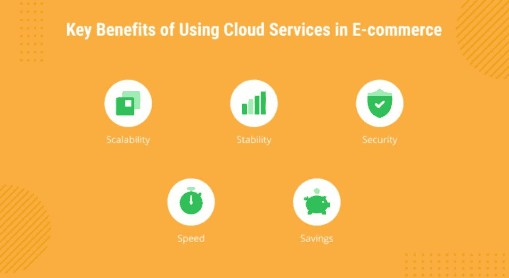
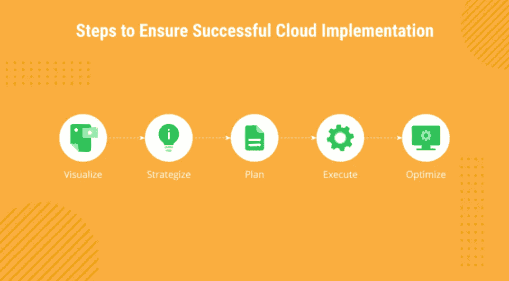

# 为什么要将你的电子商务业务转移到云端？

> 原文：<https://medium.com/nerd-for-tech/why-move-your-e-commerce-business-to-the-cloud-82768339c5cd?source=collection_archive---------2----------------------->

2021 年，电子商务企业面临的最大问题是什么？仅举几个例子，这些是波动的需求、市场上不可预测的情况、扩大和缩小规模的需要以及性能问题。此外，电子商务公司需要优化支出，更好地了解他们的运营。解决这些问题的方法之一是采用云。

在本文中，我们将温和地引导您了解将云计算用于电子商务的所有好处。

# 云中的电子商务:市场概述

正如《财富商业洞察》在其[报告](https://www.fortunebusinessinsights.com/commerce-cloud-market-102802)中所述，2019 年全球商务云市场规模为 123.2 亿美元，预计到 2027 年将达到 556.7 亿美元，在预测期内 CAGR 为 20.8 %。

根据【2021 年零售业的未来报告，由于疫情，2020 年电子商务市场激增近 34%。然而，预计 2021 年电子商务销售额将增长 14%。

世界上最大的电子商务市场是中国、美国和日本。在欧洲，电子商务销售额排名前三的国家是英国、德国和法国。

此外， [47%的零售高管](https://cloud.google.com/blog/topics/retail/new-google-cloud-research-on-covid-19s-impact-on-retail-during-2020-holiday)认为全球疫情加速了他们公司采用云的进程。Forrester 专家认为，云将推动电子商务和零售业的全面复苏。

# 云解决方案非常适合电子商务的主要原因

虽然云本身不是一个新事物，但一些公司仍然对云的采用及其与公司流程的集成犹豫不决。所以，这里是电子商务云服务的五大好处。

但是，让我们更深入地挖掘云对于电子商务的优势，并更准确地命名它们，这样您就可以清楚地看到它们的价值。

**研发**

研发是成功企业背后的两大支柱。对最新趋势的有效研究能把你的公司带到新的高度。在当今时代，时尚趋势和消费者偏好变化非常快，因此电子商务企业必须了解这些变化，并提出创新的想法来满足消费者的需求。云计算对公司的有效研发很有帮助。

**竞争市场中的稳定性**

为了在竞争中生存，能够在正确的时间做出正确的决定以及建立强大的资源管理是至关重要的。通过使用云计算技术，您可以实现这两个目标。

**成本效益**

成本效率是云计算最有益的特性。你可以根据业务中向上和向下的需求，轻松占据你所需要的空间。此外，如果您正在建立一个单独的部门来处理和维护数据，这可能是相当昂贵的。云计算可以为您解决大部分数据管理任务，从而避免这些费用。此外，由于有一个服务提供商团队来组织和维护您的数据，您可以轻松地专注于企业的其他资源。

**安全**

众所周知，基于云的方法非常安全有效。虽然安全问题是电子商务行业面临的主要问题，但云技术可以被视为高科技和数据管理的受保护途径。像你的同事 Emerline 这样的云服务提供商在他们的团队中有[安全专家](https://emerline.com/services/cyber-security-services)，他们管理云应用中的安全选项。这些专业人员随时准备加强您的 IT 部门。因此，对于数据管理来说，基于云的技术比自己维护更值得信赖。

**适应性**

云计算最大的特点之一就是它的灵活性。通过使用这种技术，您不需要阻止您的资源和资本来购买和存储大量的数据。您可以根据客户的需求轻松增加或减少空间。例如，在节日期间，客户需求增加，因此您可以轻松地增加或减少资源，以应对高需求和低需求。

**速度**

一个网站或其移动应用的速度很重要。当数百万用户同时访问网站时，很难保证网站的良好速度。事实是，公司必须花很多钱来提供这种基础设施。然而，通过使用云，企业可以在为其用户提供快速服务的同时确保显著的节约。

缓慢的加载时间和停机时间是电子商务行业的主要问题，这可以在基于云的技术的帮助下大幅减少。说到云解决方案，数据会实时上传到供应商的数据中心。

**高可用性**

过去，人们会依赖数据的物理可用性。然而，随着云计算的出现，情况发生了变化，它提供了从任何地方对关键信息的无限制访问。这项技术增加了数据的可访问性。此外，在当今时代，通过互联网连接访问数据是最可靠、最高效的选择之一。

**顺畅的资源管理**

云计算使资源管理变得非常容易和轻松。由于您将这项服务外包给第三方供应商，因此您不需要做任何事情来管理您的数据。一个准备充分的团队正在为您处理、维护和升级您的数据。

**快速应对新的市场挑战**

基于云的电子商务应用程序允许您快速应对新的市场挑战和机遇。通过了解顾客的评论，你可以相应地处理它们。

**恢复备份**

在电子商务行业，大多数活动都是基于服务器的。供电中断和诸如工作场所的物理损坏等不可预测的问题会导致数据崩溃和严重的收入损失。但是，如果您使用的是基于云的技术，您可以放心，不用担心这种痛苦，因为您所有的数据都安全地保存在云中，您可以按照通常的方式运营您的业务。

**高级客户**

云计算有助于寻找优质客户。通过跟踪对各种产品的访问，您可以找到客户的完美口味，并根据他们的要求调整您的产品。

**收入增加**

云计算为公司带来了难以置信的收入增长。由于非常经济高效，该解决方案的总成本将为您的企业节省大量资金。没有必要将多余的资金用于数据维护问题，而是将这些资金投入到其他业务增长领域。

**业务全球化**

云计算对于全球层面的业务拓展非常有用。通过使用互联网，你可以很容易地锁定世界各地的客户。这是一种有效且相对廉价的业务发展方式。世界各地的客户都可以轻松访问云。

**协同有效性**

云计算允许您的企业与世界各地的员工进行交流。不同位置的不同人可以同时访问公共数据、文件或信息。此外，您可以使用云计算与您的投资者、供应商、顾问和会计师共享信息。

**自动更新**

云计算公司与最新技术齐头并进。因此，当您的数据管理在云中进行时，系统会自动更新，您不必担心升级问题。

**基础设施支持**

在电子商务中，数据分析在了解客户需求方面起着至关重要的作用。数以百万计的用户每天都在搜索各种商品，因此获取用户的趋势和兴趣是一个棘手的问题。云计算服务和现代数据分析技术可以轻松解决这些问题。

尽管有许多好处，云转型可能是一个棘手的过程。深入了解整个组织的云使用情况并提供持续监督至关重要。只有这样，你才能控制成本，发挥全部潜力。然而，不要为了技术进步而采用云。在没有适当计划和实际需求的情况下推行云优先方法，您可能会增加成本、降低价值，并最终导致基础架构规模过大。那么，如何充分利用电子商务云呢？

# 确保成功实施云的 5 个步骤

有多种云采用框架，很多事情取决于业务需求。然而，典型的云转型之旅可以简化为五个主要步骤:可视化、战略、规划、执行和优化。每一步都由几个问题组成，你必须回答这些问题才能做出最好的决定并采取相应的行动。

## 1.形象化

你必须明白你在哪里，你想去哪里:这是这个过程中至关重要的一部分。

*   您考虑云的主要原因是什么？
*   您是否在寻找新的机会？
*   您是否需要更高的灵活性和可扩展性？

## 2.战略

为了正确地执行每件事，请检查您的资源、基础设施和架构。

*   评估现成的 SaaS 解决方案
*   考虑 IaaS 和 PaaS 选项
*   决定你是走向内部开发还是外包开发

## 3.规划

了解需要做什么、何时做以及如何做，对于成功的云实施至关重要。确保:

*   定义工作范围
*   发现跨系统依赖关系
*   设定明确的验收标准

## 4.执行

无论您是在设置基础架构、将您的应用程序迁移到云，还是重新开发您的遗留产品，请记住:

*   根据计划进行迭代
*   坚持验收标准
*   与您的用户共享结果，以便在需要时进行调整

## 5.最佳化

云的采用不会随着云的部署而结束，因此请确保:

*   创建运营仪表板
*   把你的日志放在手边
*   牢记 [DevOps](https://emerline.com/services/devops-services) 服务

在 Emerline，我们帮助客户开发适合其业务案例的最佳[云战略](https://emerline.com/services/cloud-application-development)，创建路线图，并开发最适合其业务需求的解决方案。我们在各种云解决方案方面拥有丰富的专业知识，无论是亚马逊云、SaaS、谷歌云，还是其他解决方案，我们都有能力为您的企业找到合适的技术，并以专业、无故障的方式实施。无论他们需要云就绪性评估还是基础架构设置、架构重新设计、迁移和维护，[我们都会在这里](https://emerline.com/contact-us)为他们提供全程帮助。

最初发表于 https://emerline.com。