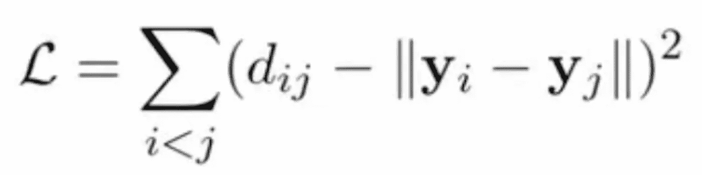
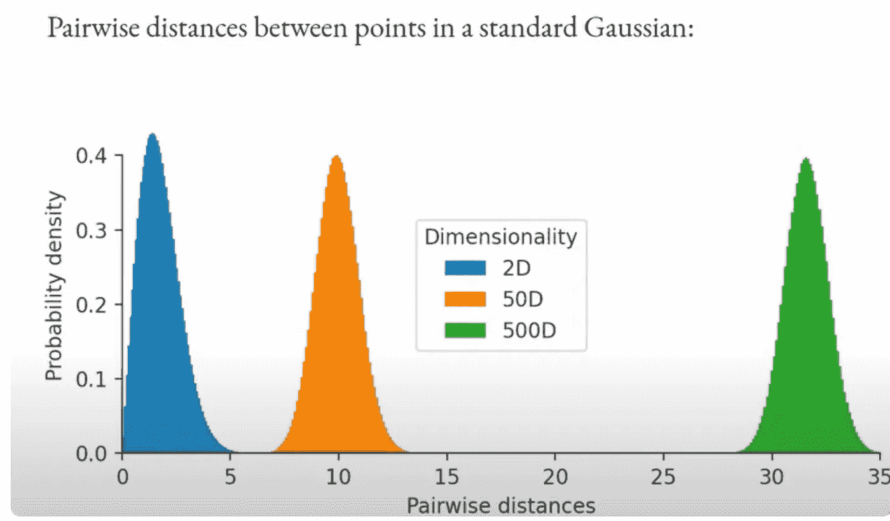
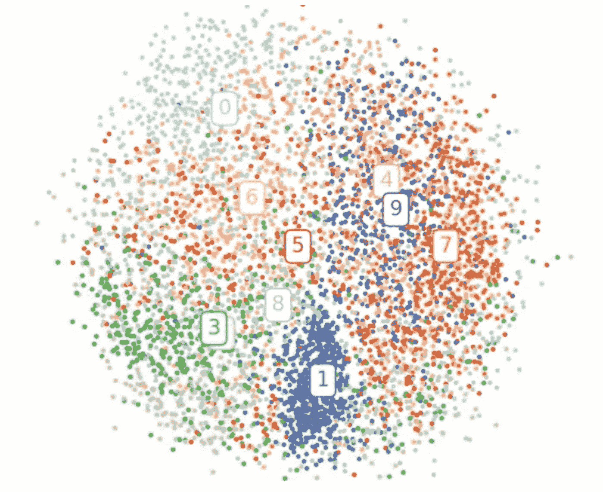

# 为什么多维扩展失败？

> 原文：<https://medium.com/nerd-for-tech/why-multidimensional-scaling-fails-9f4e65d51141?source=collection_archive---------11----------------------->

为什么 MDS 不能给我们有意义的嵌入:

MDS 基本上基于高维成对距离在 2D 或较低维度中排列点。

其所遵循的客观损失是:

其中，dij 是原始较高维度上的距离，而 yi -yj 是较低维度上的距离对，最好是 2D。

**保持高维距离通常不是个好主意，因为不可能保持它们(维数灾难)。**

什么是维度诅咒问题:

这些问题的共同主题是，当维数增加时，空间的量增加得如此之快，以至于可用数据变得稀疏。为了获得可靠的结果，所需的数据量通常随维数呈指数增长。此外，组织和搜索数据通常依赖于检测对象形成具有相似属性的组的区域；**然而，在高维数据中，所有对象看起来都是稀疏的，并且在许多方面是不相似的，**这妨碍了通用数据组织策略的效率。

现在回到我们的话题

让我们看看从具有单位方差的高斯随机生成的数据点的例子，并看看它们成对距离的分布

随着维度的不断增大，成对距离的分布也在朝着远离中心的方向移动，也就是说，这些距离最终会达到更高的水平。

因此，假设如果你想在 2D 有两个相隔很远的点，但这样做的话，会有一些靠近在一起的点，它们的成对距离为零，而这在原始维度中根本不存在。所以这里的要点是，你正试图让绿色分布与蓝色分布相匹配，由于蓝色分布，MDS 未能产生有意义的嵌入。

在 MNIST 的数据中嵌入结果似乎相当不可行。

MDS 的另一个问题是它的二次记忆和时间复杂性。

因此，T4 的做法是保持距离，而不是保护最近的邻国。

要查看有关该想法的更多信息，请查看下面的白皮书

[https://www.cs.toronto.edu/~hinton/absps/sne.pdf](https://www.cs.toronto.edu/~hinton/absps/sne.pdf)

希望你喜欢！

谢谢