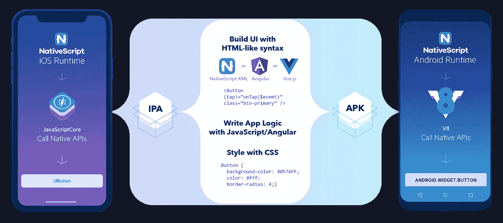
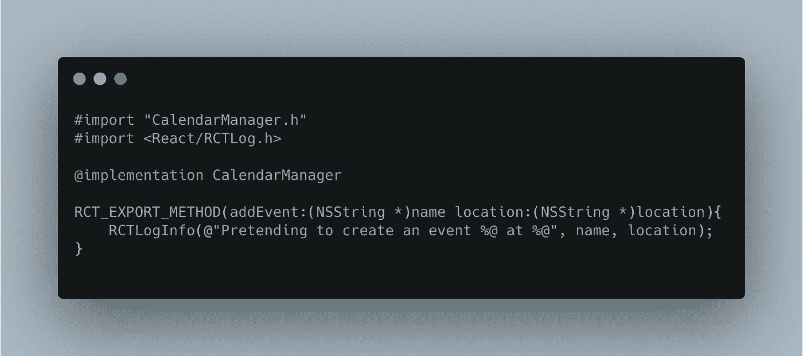
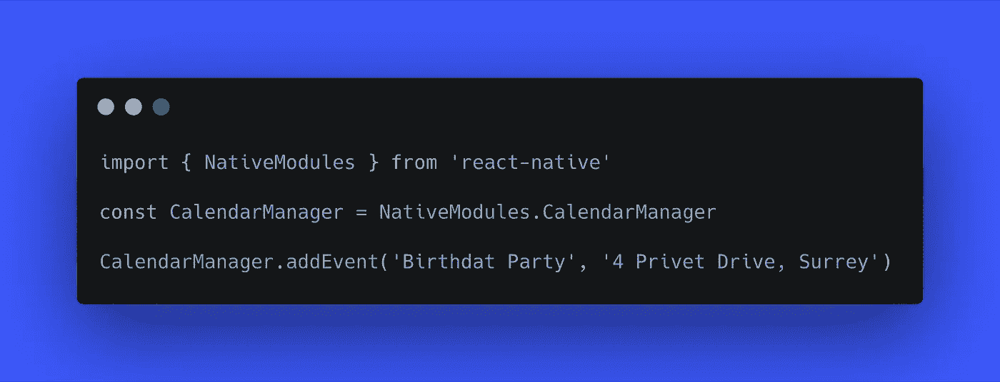
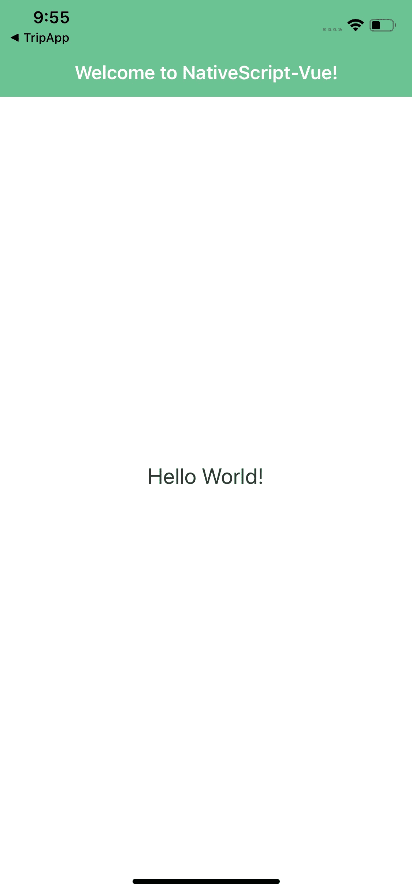
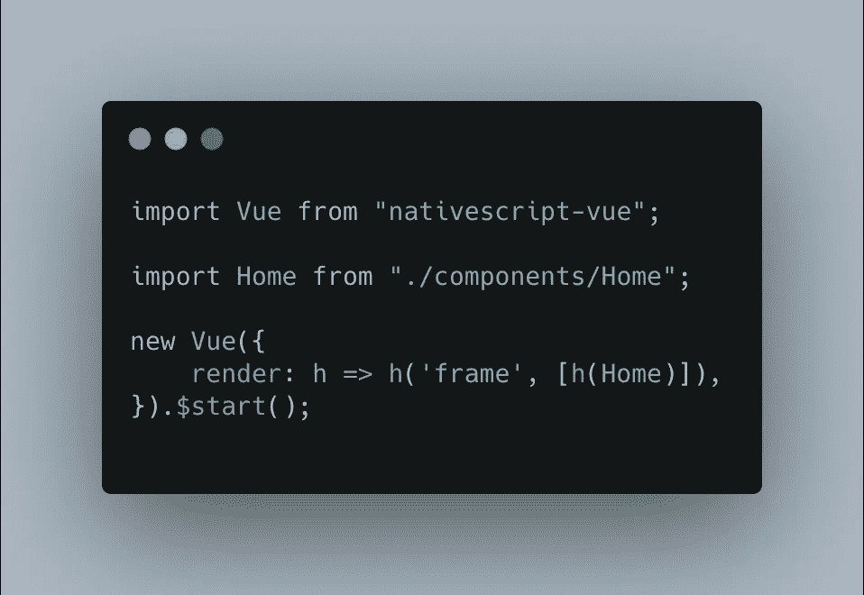

# 为什么是 NativeScript Vue？

> 原文：<https://medium.com/nerd-for-tech/why-nativescript-vue-7710ed686c1b?source=collection_archive---------6----------------------->

关于***React Native******Flutter***说的多了，但你听说过 ***NativeScript*** 吗？如果你的答案是“不！”，不要自责。

在这里，我们对什么是 ***NativeScript*** 和***native script-Vue***进行了概述，为什么要使用它们，我们甚至将迈出应用它们的第一步。



# 什么是 NativeScript？

就像***React Native******Native script***是一个允许为***Android******iOS***开发原生 app 的框架(只需编写一次)。
你可以查看更多:

[](https://nativescript.org/) [## 具有 Angular、Vue.js、TypeScript、JavaScript - NativeScript 的原生移动应用

### 免费的开源移动框架。构建真正的原生 iOS 和 Android 移动应用。获得 100%的原生 API 访问权限…

nativescript.org](https://nativescript.org/) 

# 好吧！但是为什么是 NativeScript 呢？

你一定在想“该死，又多了一个框架？为什么我要为这个框架离开 React Native 或 Flutter？”，相信我，这种想法很常见。毕竟，几乎每天都有新的 JS 框架诞生(尽管不是针对原生开发)。但是 NativeScript 并不是一个新的框架。它实际上比 React Native 本身还要老(如果我没弄错的话)。真正引起人们注意的不是发布日期(2014 年)，或者你可以只使用 JavaScript 编写“原生”应用(React 也是这样)，而是它提供的灵活性(一会儿让我们看看更多细节)。

# 让我们看看它是如何工作的

就像 React Native 一样，NativeScript 在 VM Javascript 之上工作，在 React Native 中访问本机 API，您需要访问一系列 API(桥 API)。



现在，在您的 JS 文件中，您可以像这样调用方法:



React Native 需要使用这种方法，因为 React Native 本身是在 VM Javascript 内部运行的，这也是它不能直接访问 iOS 和 Android 原生 API 的原因。

现在 NativeScript 采用了一种不同的方法。为了访问本机 API，NS 不使用 Bridge，而是在虚拟机中注入 iOS 和 Android APIs。因此，如果你需要访问一个本地 API，只需在你的 JS 文件中这样做:

```
java.lang.Math.min(3, 4)
```


# React 本机使用 React，但是我们用 NativeScript 做什么呢？

根据标题，你可以想象它是 **Vue** 吧？是也不是！
NativeScript 使我们不仅能够使用 **Vue** ，它还允许我们为每一种口味选择一些东西: **Angular** 、 **Vue** 、 **JavaScript、React、svelite**和 **TypeScript** 。如果到目前为止我提到的一切都不是您尝试 NativeScript 的理由，我不知道还有什么理由。

 [## React Native 将本机优先选项编写为 React Native

### 反应原生的原生优先选择

React native React-native script . net lify . app 的原生优先替代方案](https://react-nativescript.netlify.app/) [](https://svelte-native.technology/) [## 纤薄的原生*纤薄的移动开发体验

### 主页苗条移动开发经验苗条原生是一种新的方法来建立移动应用程序使用…

纤薄的原生技术](https://svelte-native.technology/) 

# 把手放在某物或者某人身上

## 发展环境

顾名思义，我们将使用 ***NativeScript-Vue*** ，但是您可以使用您偏好的 JS 框架。
为了避免在 NativeScript 的开发环境上浪费时间，在继续下一步之前，请遵循本教程( [**MacOSX**](https://docs.nativescript.org/start/ns-setup-os-x) ， [**Windows**](https://docs.nativescript.org/start/ns-setup-win) 和 [**Linux**](https://docs.nativescript.org/start/ns-setup-linux) )。

## 创建应用程序

如今，在应用程序开发中，我最喜欢的一点是开始一个新项目是多么容易，并且所有框架(无论是 React Native、Flutter、IONIC 还是 NativeScript)都做得很好。知道了这一点，我们现在将在终端中执行该命令:

```
ns create instagram --vue
```

现在让我们运行一个 ***yarn install*** (或者 ***npm install*** )这样我们的应用程序的所有必要模块都将被安装。

## 运行应用程序并了解其结构

到目前为止，这是超级容易的，如果现在事情发生变化，这将是可悲的，对不对？因此，启动我们的新生儿应用程序就像所有其他步骤一样简单。只需执行:

```
ns run ios // or ns run android
```



结果

已经使用过 ***Vue*** 的人，将会对它驾轻就熟，因为它具有相同的结构并使用相同的语法。我们将集中在一个文件夹( ***app*** )中，它包含了我们 app 的所有文件。在那里我们将创建我们的 ***视图*** ， ***样式表*** ， ***图片*** ， ***字体等等*** 。
下面我们来分析一下 ***main.js*** 文件。



在第一行我们有一个***Vue/native script***实例。
第二行，我们导入主视图( ***Home.vue*** )。

## 修改应用程序

不要灰心，我们不会仅仅停留在理论上，我们会更进一步，让我们的 app 做一些牛逼的事情。为此，我们将改变我们的观点(App.vue)。

让我们来看看 ***App.vue***
1 中做了什么。我们修改 ***ActionBar*** 添加 instagram logo。
2。我们使用 ***ScrollView*** 来拥有一个垂直滚动条。
3。我们导入并使用 ***Post*** 组件(接下来我们将创建 logo)。
4。我们使用古老的 ***CSS*** 来设计我们的应用程序。

## 创建 Post 组件

就像任何好的结构一样，让我们有一个组件来管理我们的帖子。为此，只需在 ***组件*** 文件夹中创建一个新文件，名为 ***Post.vue***

让我们来看看 ***Post.vue
1 中有什么内容。*** 我们使用 ***Image*** ， ***StackLayout*** ，***flexbox layout***和 ***Label*** 组件创建了一个帖子的结构(如果你想了解更多关于*native script 组件的信息，我推荐你看一下文档)。
2。我们设置一个 ***道具图像*** 来动态接收图像；
3。我们用好旧的 ***CSS*** ❤*

*[](https://nativescript-vue.org/en/docs/introduction/) [## 一个 NativeScript 插件，用于使用 Vue.js 构建真正的本地应用程序

### NativeScript 是一个开源框架，用于使用 JavaScript 构建真正的原生移动应用程序。Vue…

nativescript-vue.org](https://nativescript-vue.org/en/docs/introduction/) 

# 结果

做完这些，我们就到了期待已久的时刻，结果！看看我们如何设法用几行代码就获得了惊人的结果。


# **完成**

现在我们知道如何使用***native script-Vue***来安装和运行我们的应用程序，我希望这个神奇的框架能引起你的注意。

源代码可以在 ***Github*** 上找到

[](https://github.com/RafaelAugustoS/Instagram-NativeScript-Vue) [## RafaelAugustoS/insta gram-native script-Vue

### 在 NativeScript-vue 文章期间创建的项目-RafaelAugustoS/insta gram-native script-Vue

github.com](https://github.com/RafaelAugustoS/Instagram-NativeScript-Vue)*