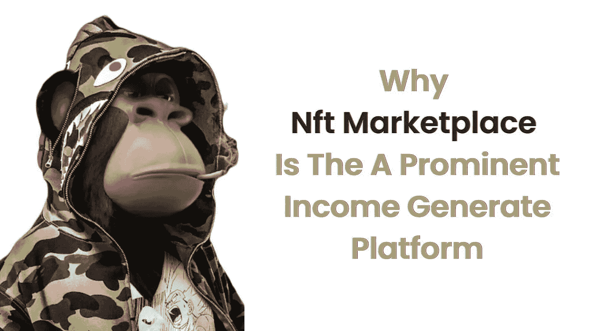

# 为什么 Nft 市场是一个突出的创收平台

> 原文：<https://medium.com/nerd-for-tech/why-nft-marketplace-is-the-a-prominent-income-generate-platform-909ee2b817f3?source=collection_archive---------4----------------------->

在这个数字时代，人们对新趋势更感兴趣。不可替换的令牌排除了世界。NFT 市场大约花费了 410 亿美元。NFT 市场的商业模式提供了多种有效创收的方式。

NFT 是不可替代的象征。不可替代的令牌是一种数字资产，可以呈现艺术、音乐、游戏、元宇宙和迷因等现实世界的对象。这是你收藏品的数字证书。它是你的 NFTs 的所有权。

# 让我们了解 NFT 市场平台

[NFT 市场平台](https://www.clarisco.com/nft-marketplace-development)是一个分散的平台，用于交易和存储数字收藏品。它允许我们创建、购买、出售和投标我们的 NFT 代币。NFT 市场平台在各种区块链网络上开发，如以太坊、索拉纳、多边形、创和币安智能链。

许多企业家通过 NFT 市场平台获得了巨大的利润。这意味着 NFT 市场有一个惊人的收入模式。下面列出了列表收入模型…..,

*   上市费用
*   铸造费
*   交易费用
*   投标费用
*   私人销售
*   加盟计划
*   初始安装费用

# 上市费用

NFT 市场为内容创作者生成的数以千计的虚拟收藏品提供了一个集中点。他们把每一幅 NFT 分成不同的种类，并适当地展示出来。每次刊登，你都可以收到刊登费。

# 铸造费

NFT(艺术品、时尚配饰、游戏、运动器材和交易卡)必须注册才能使用区块链网络。通过批量铸造加密收藏品，而不是一次一个，内容制作者可以支付更低的成本。

# 交易费用

对等交易是在 NFT 市场上购买和销售数字收藏品时完成的。加密货币投资者处理的每笔支付都要缴纳 NFT 销售平台的交易费。强制收取交易费是为了弥补与保持区块链网络运行相关的天然气成本。

# 投标费用

为了成功竞标 NFT 市场上出售的加密货币收藏品，感兴趣的 NFT 买家必须支付一定的费用。在包含有关最低价格和最高价格的信息后，他们必须在截止日期前提交报价。

# 私人销售

NFT 的创建者可以将销售指定为私人的，并输入被允许购买加密货币集合的钱包地址的信息。其他加密货币投资者可以看到 NFT 的详细信息，但他们无法购买它，因为只有一个投资者可以这样做。NFT 市场对安排数字收藏品的私人销售收取费用，因为 NFT 卖家需要一些时间来找到潜在买家。

# 加盟计划

该计划仅面向 NFT 市场的合作伙伴。NFT 销售平台对各种激励措施收取特定的费用，包括实时共享加密收藏品需求的统计数据，管理空投和奖金计划，保证立即创建拍卖，以及 HTTP API 集成，用于过滤有关投标、数字资产和钱包地址的信息。

# 初始安装费用

想要在 NFT 市场上市他们的第一批加密货币收藏品的内容制作者必须处理这个问题。NFT 的创作者必须支付一定的费用，才能将他们的数字收藏转移到这个平台上，并在那里出售。每个 NFT 销售平台都由一套协议支持。

# 以下是 NFT 市场平台的主要优势

# 安全性

想要在 NFT 市场上市他们的第一批虚拟货币收藏品的内容制作者必须处理这个问题。NFT 的创作者必须支付一定的费用，才能将他们的数字收藏转移到这个平台上，并在那里出售。每个 NFT 销售平台都由一套协议支持。

# 分散的

由于 NFTs，创作者可以从他们的作品中获得切实的利益。艺术是一个需要代理来销售和营销他们作品的领域。NFTs 使最初的发明者能够与他们的客户直接交流和开展业务。通过让制作人在每次交换 NFT 时获得佣金，这种模式也帮助了创作者。

# 智能合同

智能合同是通过电子签署协议启动的，这有助于避免欺诈，包括消除免佣金的中间商。智能合约是用代码行创建的，以实现流程的自动化。

# 透明度

用户可以看到市场中发生的每一笔交易。区块链网络保证了无缝的支付和交易过程。

# 即时支付

在 NFT 市场上，支付和费用会立即转换成加密货币。访问该交易网站不需要任何个人信息或信用卡详细信息。

# 最后的想法

随着 NFTs 整合到其动态生态系统中，顽强的加密货币经济增长得更快了。未来可能会出现各种各样的 NFT 市场。对于艺术家、时装设计师、游戏开发商、摄影师和体育迷的需求，将有专门的 NFT 销售平台。这将大大提高数字收藏品的价值。

企业家现在可以充分利用有利的市场条件和积极的投资者情绪来建立他们的 NFT 买卖平台。现在就开始创造一个 [NFT 市场发展](https://www.clarisco.com/nft-marketplace-development)来快速开始赚取巨额利润。