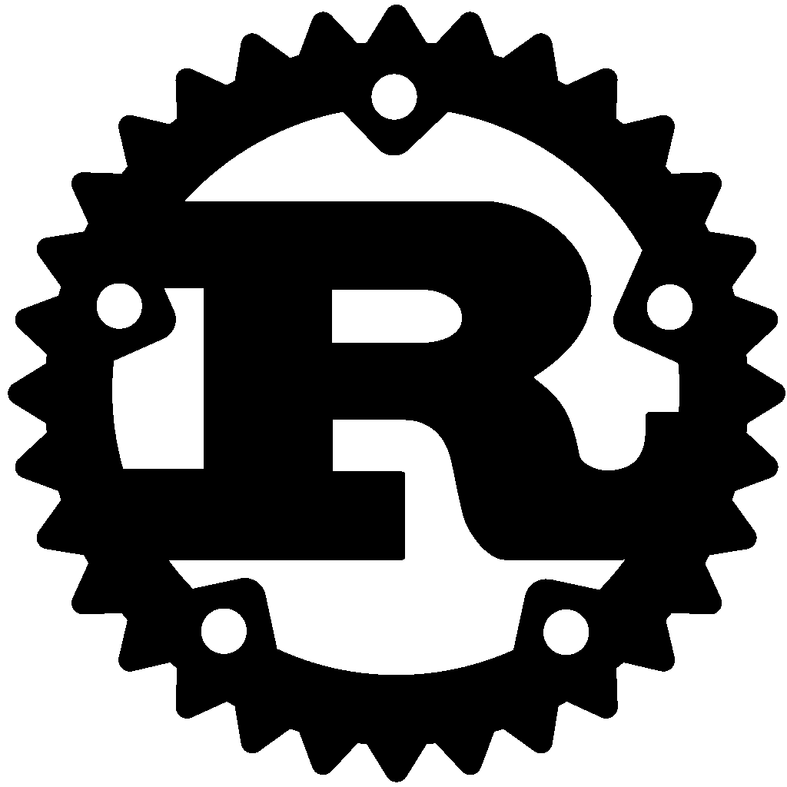

# Rust 为什么会流行？

> 原文：<https://medium.com/nerd-for-tech/why-rust-is-getting-popular-fd36524892ec?source=collection_archive---------12----------------------->

不管你实际上在研究什么技术，关注其他语言、库和框架中发生的事情是非常重要的，简单的方法就是关注我的博客，因为我一直关注这个新的精彩新闻。

# 锈

Rust 赢得了开发者的喜爱，在今天的视频中，我们将谈论它为什么会发生，以及可以预见的关于 rust 的事情。

任何一个 rust 的主要目标都知道，如果我要对开发者绝对友好，那就是这样。开发者将如何采用 rust，rust 的创造者对此非常清楚。Rust 将参与竞争，而 C++现在正以惊人的速度玩着占主导地位的游戏，这个 rust 只比它慢一点点，所以现在这是一个可以接受的妥协。C++写代码是绝对棘手的，我不是在说只是写代码来循环一些东西或一些竞争性的编程挑战。我是在说现实世界的项目。在 c++中乱搞线程是不容易的 最重要的是，它需要安装一些依赖项和其他东西，然后这就变成了 C++中的一个全新的噩梦。

Rust 直接从语言内部解决所有这些问题，这就是为什么很多人考虑采用 rust 或者至少现在看一看它的原因。rust 的一个优点是有一个统一的设置，我可以在那里浏览和查看这种语言。这不是一个简单的例子，至少对于 c++来说，我可以正式查阅他们的文档 看看这些文档，理解所有条件、循环、函数的语法是多么容易，不管是什么，都在那里，你可以很容易地阅读和理解，写得很好的文档现在还有一件事，正如我所说的，在 C++中安装新的依赖项是如此之多的事情，它并不真的那么难，但是是的，它有时会产生许多问题。

我非常喜欢这个 rust，我没有玩太多，只是看看文档就知道他们有多关注测试。单元测试和所有这些测试大部分都是语言本身内置的，我有点喜欢它，我想如果你在玩 rust。为什么不安装它，只写一个简单的 hello world 或用几个条件进行测试，这是一种非常神奇和令人敬畏的语言，它非常容易上手，如果你把它与 c++的等价物进行比较，这条路线有点前卫，但在 rust 中，它更容易一些，当然， 我很信任这一点，因为它出来得太晚了，所以他们已经解决了几乎所有的问题。我最初非常喜欢的一点是，这种语言给了你很多可以使用的插件，例如，我使用 VS 代码，已经有可用的代码片段，我只需安装它就可以支持我的代码编写速度。现在，我喜欢这种语言的另一点是，他们试图建立社区。

现在，我对创作者的电子邮件和他们的 Github 回购是如何简单地在网站上提供的印象非常深刻。我知道 rust 是一种新语言。所以会有很多 bug，你可以与这些开发者互动，这种联系绝对是一件令人惊讶的事情，你知道吗，他们甚至在稳定的 rust 上有了下沉和重量，我认为这是非常伟大的一步，我认为这种语言正在以非常好的速度发展。

别忘了留下你的回答。✌

大家敬请关注！！为了把我的故事发到你的邮箱里，请订阅我的时事通讯。

感谢您的阅读！不要忘记给你的掌声，分享你的回答，并与朋友分享！！