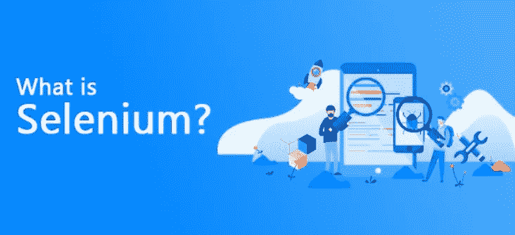
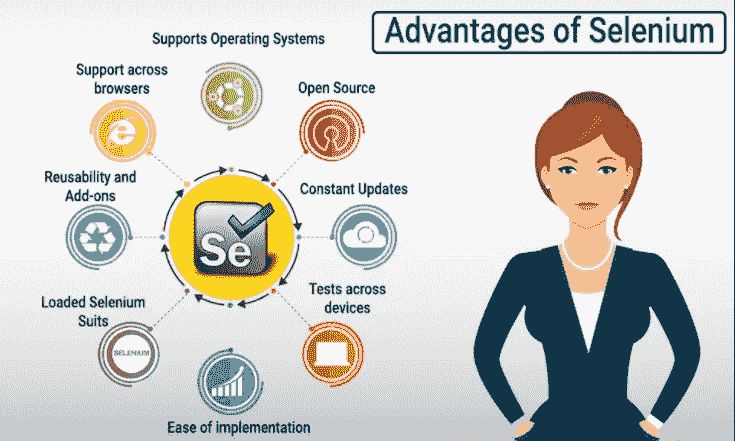
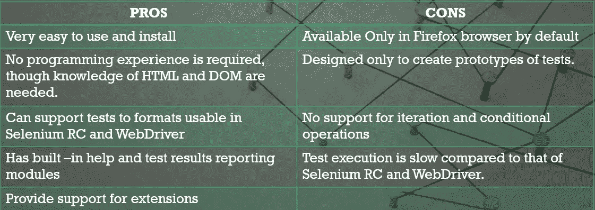
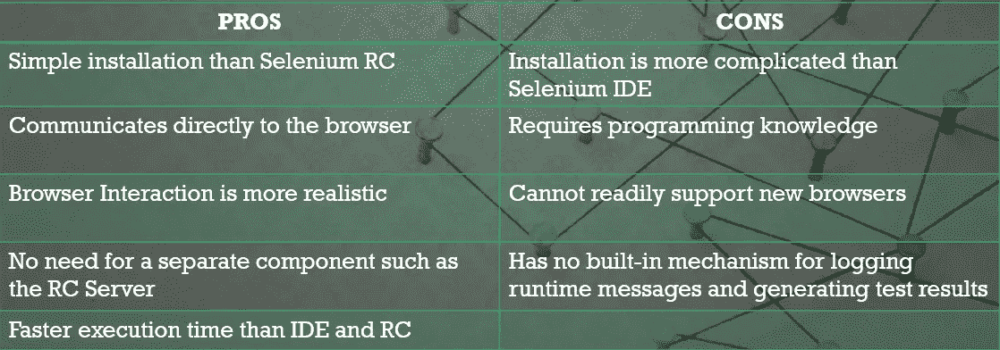

# 为什么是硒？

> 原文：<https://medium.com/nerd-for-tech/why-selenium-fe40d2c91457?source=collection_archive---------11----------------------->

# 介绍

Selenium 是一个免费(开源)的自动化测试框架，用于验证跨不同浏览器和平台的 web 应用程序。你可以使用多种编程语言，如 Java、C#、Python 等。创建 Selenium 测试脚本。使用 Selenium 工具完成的测试通常被称为 Selenium 测试。

**什么是软件测试？**测试软件是否按要求运行。

**测试的主要目标**

1.  预期结果==实际结果(测试通过)
2.  预期结果！=实际结果(测试失败)

**两种测试:**

1.  人工测试
2.  自动化测试

# 使用硒的优势

使用 selenium 可以轻松测试 web 应用程序，而无需编写测试脚本，该软件附带了简单的导航工具，测试人员无需编写任何脚本即可编写测试用例，使用 selenium 还有许多优点，如下所列。

1.  *语言和框架支持*
2.  *开源可用性*
3.  *多浏览器支持*
4.  *跨多种操作系统的支持*
5.  *易于实施*
6.  *可重用性和集成*
7.  *灵活性*
8.  *并行测试执行和更快上市*
9.  *更少的硬件使用量*
10.  *易学易用*
11.  *不断更新*

工具的优势

# 硒的成分

Selenium 不是一个单一的工具，而是一套工具。它有四个组成部分

1.  ***硒集成开发环境***
2.  ***硒网驱动***
3.  ***硒栅***
4.  ***硒遥控器***

## *硒 IDE*

*这是一个简单的记录和回放工具，仅作为 Mozilla Firefox 的附加组件，但我们也可以在其他浏览器中添加扩展。它用于原型测试。用 IDE 编写的测试用例可以用许多编程语言导出，如 Ruby、Java、C#等。编辑和调试选项以及记录也是可用。对于初学者理解 Selenium WebDriver 的语法是一个极好的工具。*

**

*ide 利弊*

## *Selenium WebDriver*

**它是 Selenium 套件中最重要的工具。由于 RC 的许多限制，开发了 WebDriver。它不像 Selenium 服务器那样需要任何手动过程。代码和浏览器之间有直接的通信。**

**

*web 驱动程序的利弊*

## ***硒 RC:***

**Selenium RC(远程控制)是 Selenium Suite 的第一个工具。早期它被称为 JavaScript Executor。RC 是使 Selenium 在市场上出名的工具。它是第一个支持多种编程语言(JAVA、Ruby、Perl、PHP、Python 和 C#)的工具。它还支持几乎所有主要的浏览器供应商，如 Mozilla Firefox、Google Chrome 和 Internet Explorer。所有支持 JavaScript 的浏览器都可以使用这个工具实现自动化。硒 RC 又名* ***硒 1*** *。**

## ***硒栅:***

**它是 selenium 套件的最后一个组件，用于并行测试或分布式测试。它允许我们同时在不同的机器上执行测试脚本。有一个控制各种机器上的执行的中枢，并且有多个节点在其上完成实际的实现。**

*网址: [selenium.dev](https://www.selenium.dev)*