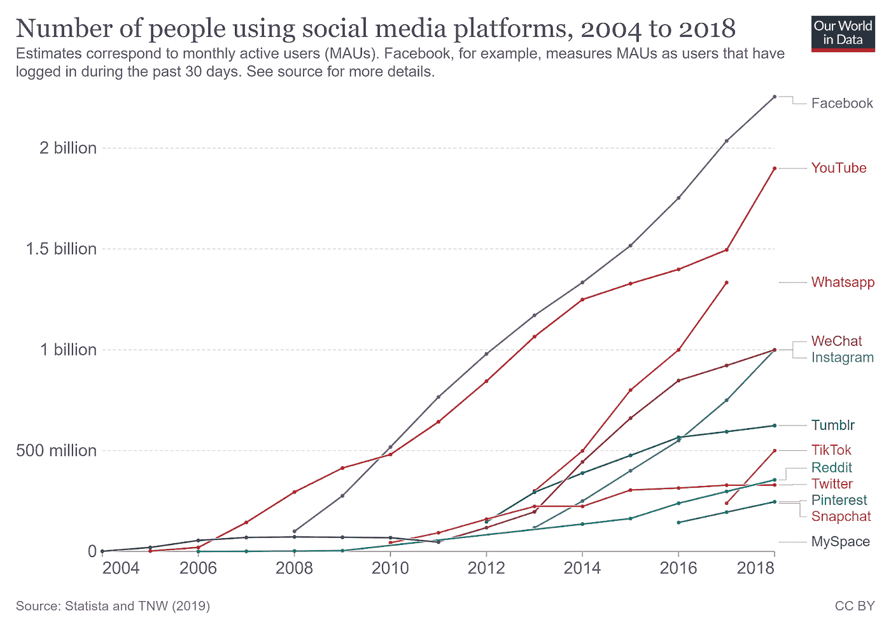
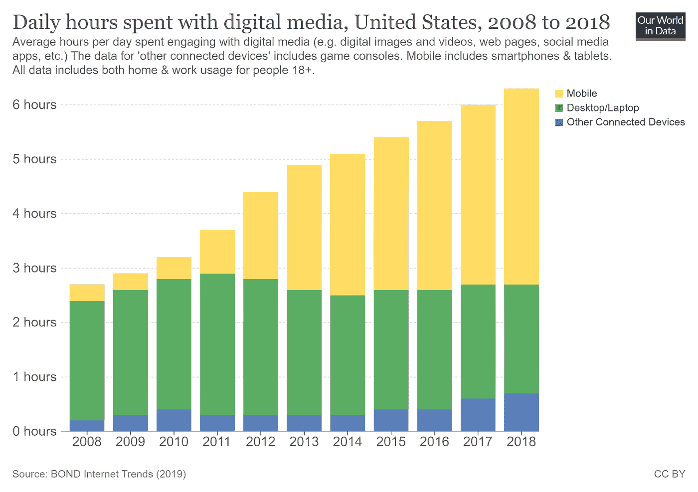
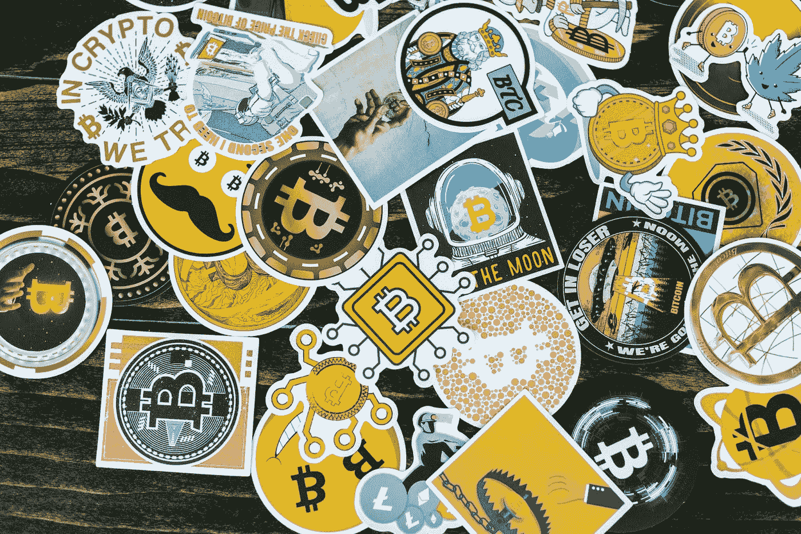
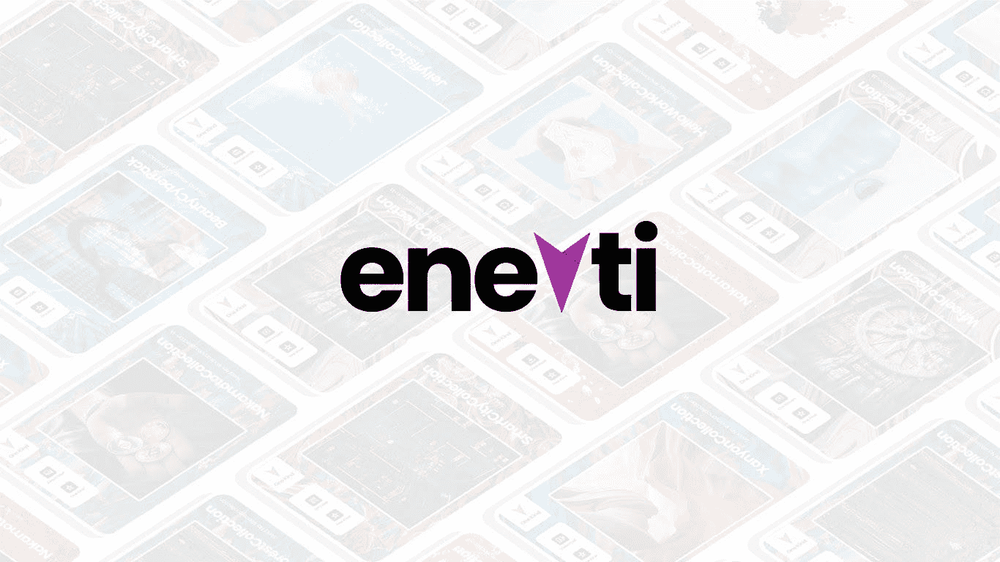
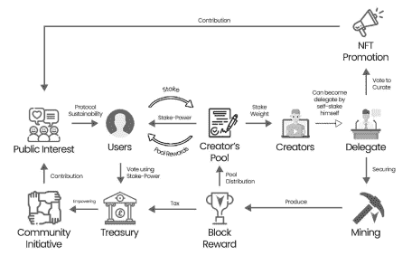

# 为什么社交媒体要去中心化？

> 原文：<https://medium.com/nerd-for-tech/why-should-social-media-be-decentralized-fe626ab9c3b1?source=collection_archive---------7----------------------->

照片由[像素](https://www.pexels.com/photo/close-up-photography-of-smartphone-icons-267350/)的[皮克斯拜](https://www.pexels.com/@pixabay)拍摄

如今，社交媒体已经成为我们日常生活中越来越重要的一部分。社交媒体是一个基于计算机的平台，便于分享我们的思想、想法和信息，以便与其他人交流。人们需要相互交流，社交媒体促进了这种交流[ [1](https://dewzilla.com/a-brief-history-of-social-media/) ]。社交媒体改变了世界。这些技术的快速采用正在改变我们从新闻中获取信息的方式，我们寻找合作伙伴的方式，以及我们组织起来要求政治变革的方式。

2004 年至 2018 年使用社交媒体平台的人数(数据中的我们的世界)

从上面的图表中，我们知道脸书是当今最受欢迎的社交媒体平台，拥有 23 亿用户。YouTube、Instagram、微信紧随其后，用户超过十亿。Tumblr 和抖音紧随其后，拥有超过 5 亿用户。此外，年轻人比老年人更有可能使用社交媒体。但是一些平台在年轻人中更受欢迎。

2008 年至 2018 年美国每天花在数字媒体上的时间(数据中的世界)[ [2](https://ourworldindata.org/rise-of-social-media)

此外，在过去十年中，社交媒体使用的增加伴随着人们在线时间的大量增加。有证据表明，在其他富裕国家，人们每天也花很多时间上网。正如我们所看到的，经合组织的平均时间超过每天 4 小时，在一些国家，平均时间超过每天 6 小时。

# 为什么集中化对社交媒体不利？

照片由 [Pixabay](https://www.pexels.com/@pixabay) 从[像素](https://www.pexels.com/photo/black-android-smartphone-on-top-of-white-book-39584/)拍摄

社交媒体公司通过实施高效广告作为其主要商业模式而生存。这种商业模式迫使他们收集和利用尽可能多的用户数据，以便学习和个性化最适合我们的广告。这听起来可能是个好主意，但实际上，我们的隐私正面临极大的风险！

数据泄露事件给许多用户敲响了警钟，迫使他们重新思考自己与社交媒体和个人信息安全的关系。根据皮尤信托进行的数据，80%的社交媒体用户报告担心企业和广告商访问和使用他们的社交媒体帖子[ [4](https://sopa.tulane.edu/blog/key-social-media-privacy-issues-2020) ]。

据英国广播公司网站报道，一名自称汤姆·莱恩的黑客收集了来自世界各地的 7 亿 LinkedIn 用户的数据库，并以大约 5000 美元的价格出售。这一事件以及其他类似的社交媒体抓取事件引发了一场激烈的辩论，即我们在个人资料上公开分享的基本个人信息是否应该得到更好的保护[ [8](https://www.bbc.com/news/business-57841239) ]。

作为广告商业模式的含义之一，创作者被高度激励去创造最符合第三方利益的“点击诱饵”内容，将广告放在受尊敬的社交媒体平台上。具有讽刺意味的是，创作者并没有真正受到激励去创作“最能服务于观众的原创和真实的内容”。这创造了一个以广告为中心的平台，而不是以社区为中心的平台。我们需要社交媒体的创新，以社区为中心，而不是广告。

# NFT 社交媒体的上升趋势！

照片由 [RODNAE Productions](https://www.pexels.com/@rodnae-prod) 从 [Pexels](https://www.pexels.com/photo/assorted-stickers-on-the-table-8369590/) 拍摄

如果你使用社交媒体，你肯定会注意到人们对 NFTs 作为一种交易数字艺术品的方式越来越感兴趣。有了区块链支持的 NFTs，每件艺术品的实际所有权第一次可以追踪，这改变了游戏的使用方式，并使数字艺术与经典艺术交易更加一致。通过 Instagram、脸书、推特和抖音等社交媒体，你可以期待看到更多 NFT 前线的信息流入你的社交媒体流。**最重要的是，NFT 实现了创作者和观众之间的直接联系和货币化。**

此外，社交媒体巨头拥抱 NFTs 可能是在日益数字化的世界中使用的新声誉系统的开始。Twitter 正在试验 NFTs，允许用户将他们的收藏显示为他们的个人资料图片。在 2021 年 9 月 28 日的一份声明中，Tiktok 透露，它将推出一个 NFT 系列，灵感来自其顶级创作者，包括里尔·纳斯 X、贝拉·波阿奇、柯蒂斯·罗奇等人。NFTs 将在以太坊网络上推出，并由不可变 X 提供支持，这是第二层 NFT 协议不可变[ [6](https://cointelegraph.com/news/twitter-and-tiktok-embrace-nfts-mainstream-adoption-incoming) ]的新扩展解决方案。

此外，Meta(前脸书)旗下的社交媒体平台 Instagram 正在探索整合不可替代令牌(NFTs)。许多人认为，随着 NFTs 的发展，NFT Instagram 将很快为创作者提供付费服务。你可以在 Patreon 或 OnlyFans 上提供类似的服务，这两家网站都为内容创作者提供管理订阅服务和创收的工具。

然而，当前的社交媒体平台是建立在一种集中的思维模式之上的。我们是否也希望我们的 NFT 由这样的集中实体来管理？

# 认识 Enevti:真正去中心化的社交媒体 NFT 平台！

[Enevti.com](https://enevti.com)

为了解决非职能部门未被社交媒体平台集中的问题， [Enevti 创建了自我维持的治理](https://enevti.com/governance/)。这是一个**公平的所有权经济结构，在 Enevti 生态系统中使用以创造者为中心的分散自治组织，令牌持有者可以根据其股权对国库提案进行投票**。在这种情况下，合格的创作者可以成为安全网络的代表，并通过管理最佳 NFT 来授权社区。

Enevti 自我维持治理图解(图片:Flaticon.com)

自我维持的治理设计有三个主要组成部分，即以创造者为中心的 dpo、分散式推广和分散式财务，可解释如下[ [3](https://enevti.com/whitepaper/) ]:

1.  以创作者为中心的 DPoS 我们设计了区块链共识，其中代表的来源是创造者。因此，代表和令牌持有者之间的关系是更民主、更有意义和更可信的关系。这就把创作者和粉丝的关系延伸到了下一个层次。预计参与人数会增加。
2.  **分散推广；**我们引入了基于民主投票程序的 NFT 晋升系统。社区才是决定推广什么 NFT 的人，而不是侵犯隐私的算法。
3.  **分权国库；**我们还引入了分散的资金管理系统，机构群体可以决定并资助协议的发展方向。

有兴趣了解我们上述解决方案的更多信息吗？查看我们的白皮书:[http://enevti.com/whitepaper/](http://enevti.com/whitepaper/)

# 结论

社交媒体催生了创造者经济。此外，他们需要通过利用用户数据来实现高效的广告模式，从而成为中央中介，导致创作者经济空间中不可持续和错位的激励。

由于进入社交媒体平台的 NFTs 越来越受欢迎，并且它存在集中化的风险，Enevti 为其创建了一个解决方案，即自我维持的治理，包括以创作者为中心的 dpo、分散的推广和分散的资金。我们相信它会把权力还给用户，而不是变得集中化。我们知道这将有利于用户，比如他们的数据不会被社交媒体平台利用。

# **参考文献:**

[1][https://dewzilla.com/a-brief-history-of-social-media/](https://dewzilla.com/a-brief-history-of-social-media/)

[2][https://ourworldindata.org/rise-of-social-media](https://ourworldindata.org/rise-of-social-media)

[https://enevti.com/whitepaper/](https://enevti.com/whitepaper/)

[4][https://SOPA . Tulane . edu/blog/key-social-media-privacy-issues-2020](https://sopa.tulane.edu/blog/key-social-media-privacy-issues-2020)

[5][https://www . social media today . com/news/the-basics-of-nfts-infograph/607589/](https://www.socialmediatoday.com/news/the-basics-of-nfts-infographic/607589/)

[6][https://coin telegraph . com/news/Twitter-and-tiktok-拥抱-nfts-主流-采纳-传入](https://cointelegraph.com/news/twitter-and-tiktok-embrace-nfts-mainstream-adoption-incoming)

[7][https://www . cmn news . live/the-future-of-NFT-insta gram-adoption/](https://www.cmnnews.live/the-future-of-nft-instagram-adoption/)

[8]https://www.bbc.com/news/business-57841239