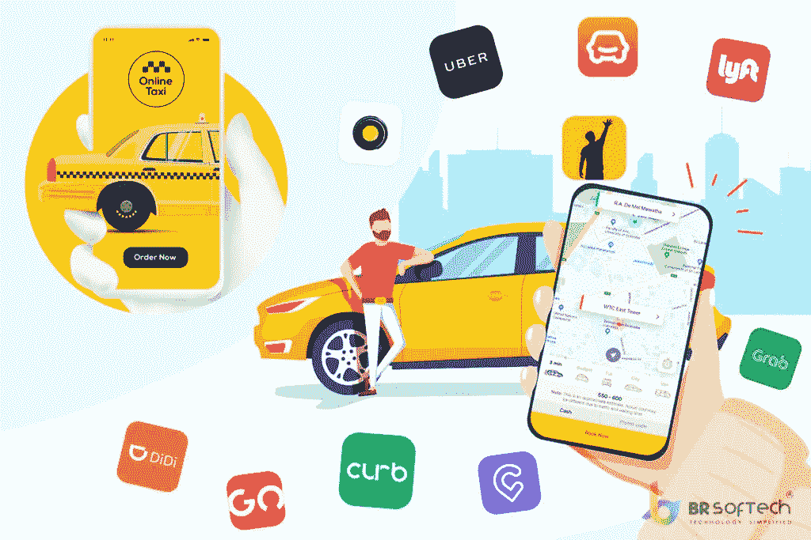

# 为什么您应该投资按需出租车预订应用程序开发？

> 原文：<https://medium.com/nerd-for-tech/why-should-you-invest-in-an-on-demand-taxi-booking-application-development-acc4d171603c?source=collection_archive---------10----------------------->

你想知道如何制作一款能与优步或 ola 匹敌的打车应用吗？构建出租车预订应用程序是出租车公司保证方便客户的最佳方法。

美国拥有超过 2.85 亿辆汽车。需要出租车的原因是为了应对交通和人口问题，而且这种支持有些昂贵。

多年来，出租车行业的发展似乎永无止境。这还不足以满足需要。

这就是在线打车应用开发公司如今如此主流的原因。

Statista 估计，到 2021 年，打车应用客户端将增长 2.5%，打车收入将增长 60%。

显而易见，如今成为出租车司机是合理的选择。

如果没有一个多功能的应用程序，我们无法想象一个蓬勃发展的业务，因此也要将您的时间和金钱投入到打车应用程序的发展中。

不管你是否忽略了这些进步，都有残酷的竞争。

既然有如此无数的在线出租车预订发展机会，你需要炮制一些特殊的东西，使客户选择你而不是其他竞争对手。

既然有如此多的在线出租车预订发展选择，你需要编造一些特别的东西来说服客户选择你。

# 最成功的在线出租车预订移动应用

自从优步、Lyft 和 ola 开始涉足出租车业务以来。定制的出租车应用程序和类似优步的应用程序是两种不同的东西:

## **出租车与拼车**

出租车和拼车管理是为旅行者提供交通工具的两种组织形式。

出租车是一种更有经验和更习惯的交通方式，然而，在目前的气候下，人们希望多功能性，并喜欢乘坐出租车。

在我们当前的现实中，大量客户青睐优步或 Lyft 这样的新业务，传统的打车组织正在努力保持优势。

无论如何，这是有道理的:拼车更实惠，也更有帮助。

一家传统的出租车公司声称其招募的车队和使用完全受保护的出租车司机。

当客户给传统出租车打电话时，互动就像 Lyft 或优步:经理看到你的位置，选择一个附近的司机，并让他搭车。

拼车公司为两个乘客和司机提供了一个重要的舞台，允许他们通过一个应用程序联系起来。

它允许买家快速需求车辆，并向私人司机提供基于佣金的职位。

虽然拼车组织确实有一个简陋的车队，但这更多的是一种预防措施，而不是先决条件。

他们可以以一定的佣金将车租给司机，但大多数需要尝试拼车的司机都是用自己的车来拼车。

重要的一点是，出租车公司只为乘客服务，而拼车服务于乘客和司机。

# 出租车预约应用的利与弊

首先，传统的出租车不会对司机和乘客造成任何伤害。出租车组织保护所有的工人。

同样，当旅行者在车内时，拼车司机只受保护策略的保护，而应用程序是动态的。此外，出租车组织共同审查司机的经历。

拼车司机同样需要确认，尽管这并不详尽。假设你曾经犹豫是否与陌生人同乘一辆车。

在这种情况下，你在出租车里会感到更自在，因为如果出租车司机让乘客失望，他们会损失很多。

原因在于，与可能将拼车视为副业的私人司机不同，拼车几乎是他们全部的收入来源。

易用性曾经是一个问题，因为在使用移动应用程序时，保持“匿名”比打电话和与人交谈更容易。

Curb 是一个很好的例子，说明了出租车行业如何朝着移动化迈出了重要的一步，并构建了移动应用程序。

不可否认，拼车更实惠、更快捷、更简单。优步，你可能会发现评估标准与真实成本不一致。

我们应该继续学习关于出租车应用程序改进的部分，并了解在线出租车预订程序是如何工作的，因为你知道这两种类型的交通管理之间的区别。

# 打车预约 App 是如何运作的？

客户与在线出租车预订应用程序通信。当您请求出租车时，应用程序遵循以下工作流程:

1.  乘客通过输入上下车地点请求乘车
2.  应用程序计算价格
3.  该应用程序为骑手分配一名司机
4.  驾驶员收到关于乘坐的通知
5.  司机确认乘坐的详细信息，如果司机通过乘坐，那么在这种情况下，应用程序自动分配给其他司机
6.  乘客接受细节和费用
7.  一名司机遇到一名骑手，将他/她放在该地点
8.  骑手可以用现金或网上支付
9.  该应用程序允许司机和骑手互相评分

这两个出租车和拼车组织使用类似的系统。主要的对比是，如果出租车管理部门有自己的车队，需要像优步一样提出申请，订单可以自然分配。

# 为什么优步是最好的出租车预订应用？

出租车行业竞争激烈，越来越多的企业家和企业正在进入这个行业。

随着出租车行业的扩大，要求也在变化。因此，如果你想保持需求，及时更新现有的在线出租车预订软件并增加新功能是至关重要的。

钦佩那些成功的人是最好的技巧，可以让你知道如何设计一个比对手更优秀的打车软件。

首先映入眼帘的是优步。不同国家的许多人一直在使用它。

我们应该了解优步是如何保持其作为地球上最好的出租车预订应用的地位的。

优步绝对是第一个拼车政府。几年来，它的用途一直局限在最基本的组件上，然而，优步富有想象力的团队明白这是一个理想的改变机会。

自 2013 年以来，他们一直在为有明确要求的客户削减各种商品。他们暗指各种各样的车辆，包括 UberBlack、UberKids 等。

他们同样执行了一些富有想象力的任务。以超级小猫为例。

骑手们可以要求和可爱的小猫一起外出 15 分钟。然后，他们在这一点上给了所有的现金生物封面。

他们后来增加了包裹和食物运送，作为送食物的志愿者的补充升降机。优步的真实地点包含了更广泛的历史。

显而易见，“如何在印度规划一家打车应用和出租车预订应用开发公司”这一主题并不是最麻烦的。

要想让它成为最好的出租车预订应用有点困难。最基本的是根据最近的时尚和商业趋势来预测客户的兴趣。