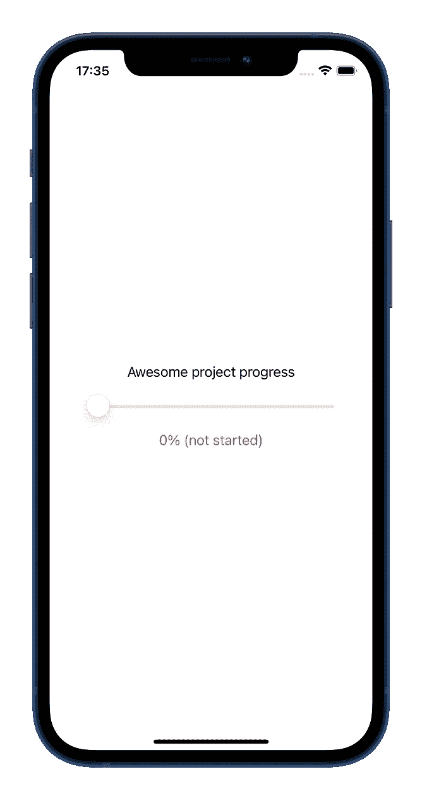
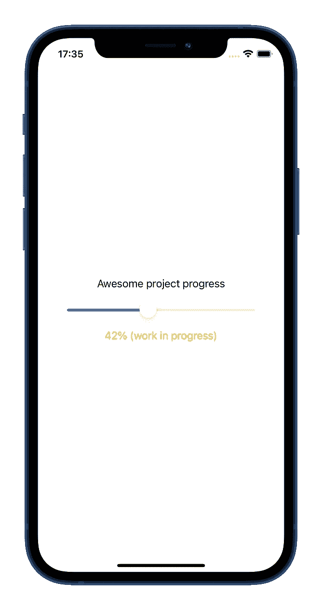
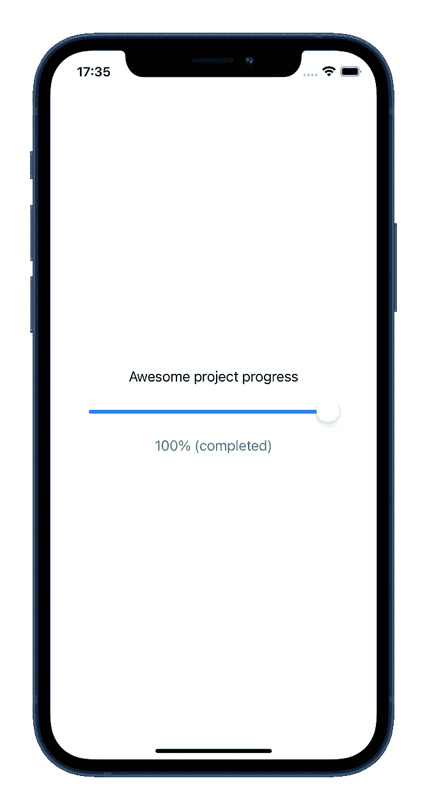

# 为什么 TDD 在 iOS 开发中很少使用

> 原文：<https://medium.com/nerd-for-tech/why-tdd-is-so-rarely-used-in-ios-development-4bc80dc773a9?source=collection_archive---------11----------------------->

在 [Unsplash](https://unsplash.com?utm_source=medium&utm_medium=referral) 上由 [Aron 视觉](https://unsplash.com/@aronvisuals?utm_source=medium&utm_medium=referral)拍摄的照片

常规的软件开发实践是在代码之后**编写测试。但是测试驱动开发(TDD)遵循相反的方法。简而言之，TDD 是一种软件开发范例，它意味着在**编写实际代码之前先编写测试**(如果你愿意，可以在[维基百科](https://en.wikipedia.org/wiki/Test-driven_development)上找到正确的定义)。**

我不会深究它的细节、利弊——所有这些都已经讨论过很多次了。我更愿意把重点放在为什么一个众所周知并且经常被讨论的方法，比如 TDD，在 iOS 开发中很少被团队使用(当然是基于我自己的经验)。

以下是每次想到在 iOS 开发中使用 TDD 都会让我三思的事情:

1.  **使用 TDD，添加功能需要在应用程序和单元测试之间不断切换**。在这种情况下，需要花费大量的时间，因为方案之间的切换需要重建(并且它们不是递增的)。这对于重建可能需要几分钟的大型项目来说尤其痛苦🕒。
2.  **在模块化应用**中，测试通常位于不同的子项目中(例如，在模块示例应用中)。因此，**两个 Xcode 项目必须同时打开**，并且您必须在 TDD 周期期间在它们之间切换🔁。
3.  我喜欢在开始写代码之前想出最终的设计和命名。但是一般来说，它们在最初编写后会被改进几次。**使用 TDD，小的进行中的工作改进的成本加倍了**,因为必须对代码和已经编写的测试✔️✔️.都进行修改

# 请告诉我有什么不同！

让我们试着看看在使用和不使用 TDD 的情况下开发相同功能的区别。

想象一下，我们正在开发一个项目管理应用程序，我们必须添加一个全新的功能，允许用户拖动项目进度滑块，并在 UI 上看到相应的项目状态。

因为这是一个演示，所以事情被尽可能地简化了:UI 非常简单，应用程序遵循模型-视图-演示者模式，只有演示者部分包含测试。

区别在于，使用 TDD 如何影响这个特性的开发:

*   使用 TDD 迫使我做更小的迭代提交:4 对 7。
*   没有 TDD 也可以达到同样的代码覆盖率:100%😉
*   使用 TDD 会导致测试数量稍微多一点:7 比 8。差别并不大，但是 TDD 肯定会让你更专注于测试。
*   演示者的大小是一样的🤷
*   使用 TDD 会导致测试代码的规模变小。这可能是两个原因造成的。首先，TDD 周期迫使你只向当前添加的功能添加测试，而不是添加一行测试代码。其次，循环有重构步骤，帮助你不断改进测试代码。
*   为了公平起见，跳过了时间比较，因为第二次编码对我来说更容易，这是由于之前获得的经验，也就是肌肉记忆。但是我可以肯定地说，TDD 需要更多的时间🕐

你可以在 GitHub 上找到完整的代码:[带 TDD](https://github.com/isavynskyi/ProjectTracker/tree/main/ProjectTracker_TDD_ON) 和[不带 TDD](https://github.com/isavynskyi/ProjectTracker/tree/main/ProjectTracker_TDD_OFF)

> 非常感谢丹尼尔·拉格对✍️的评论