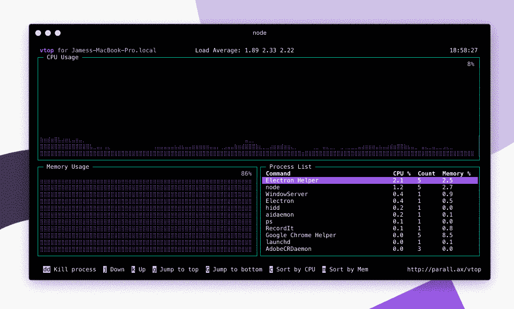

# 为什么命令行界面被高估了

> 原文：<https://medium.com/nerd-for-tech/why-the-command-line-interface-is-overrated-497fd4ecd7a6?source=collection_archive---------10----------------------->

回想一下您大量使用命令行的某一天。你能从记忆中回忆起命令和论点吗？还是要通过反复看文档来温习？如果你和我一样，那么很可能是后者。

## 命令行程序的弱点

事实是，我们人类不擅长在没有视觉线索的情况下记忆字符序列。这就是为什么带有图形用户界面(GUI)的工具更容易上手的原因。一个设计良好的图形工具会将用户的注意力引向最重要或最相关的信息。此外，它引导用户通过不同的屏幕来帮助他们完成任务。

与命令行界面(CLI)程序相比，在最坏的情况下，命令行界面程序要求用户在使用工具之前准确地知道命令。也就是说，有一些命令行工具可以通过使用 ASCII 字符来绘制可视组件，从而提供非常高级的用户界面。这方面的例子有午夜指挥官和 vtop。

[vtop](https://github.com/MrRio/vtop) —命令行的图形化活动监视器

然而，对于大多数命令行程序来说，我们仍然停留在传统的“输入一个命令，得到一个响应，然后重复，直到完成为止”的模式中。因此，您可能会发现自己在开始时查阅了大量文档。记住各种命令和选项需要时间。更重要的是，如果你长时间不使用这个工具，下次使用它的时候你可能需要刷新你的记忆。

大多数 CLI 程序都附有用户手册。但是对于一个只想知道如何快速解决问题的初学者来说，这些可能太长太详细了。如果你看一下大量的 StackOverflow 问题，这些问题问的是应该使用哪个确切的命令，那么用户学习一个新的 CLI 工具会有多大的困难是显而易见的。虽然在工具的文档中经常有明确的描述。

用户不仅要花大量的时间浏览手册和网页，还会分散他们的注意力。这是值得注意的，因为为了最佳地工作，你需要最小化上下文切换和中断的次数。

命令行程序在这方面也失败了，因为它们通常比图形程序需要更多的认知努力。这是因为即使对于更有经验的用户来说，将你的意图转换成正确的命令也是相当令人困惑的。图形程序需要更少的精神能量，因为它更容易将视觉概念如颜色、字体、图标和布局与其预期目的联系起来。不要忘记工具提示、对话框、滑入面板、图像、动画和图表。

用户体验在很大程度上决定了你的程序将如何被接受。由[凯利·西克玛](https://unsplash.com/@kellysikkema?utm_source=medium&utm_medium=referral)在 [Unsplash](https://unsplash.com?utm_source=medium&utm_medium=referral) 上拍摄的照片

但我认为 CLI 的最大缺点是，它们不能清楚地表明哪些功能是可用的。只有通过阅读手册，你才能了解这个程序的能力。(尽管如我之前所说，也有提供选择菜单或自动完成的工具例外)。另一方面，GUI 通过菜单、窗口和其他可视元素来呈现所有可用的功能，从而解决了这个问题。

虽然知道正确的命令并不意味着您在使用 CLI 工具时不会有痛苦的经历。因为您仍然可能犯输入错误，这可能会带来可怕的后果。命令行工具在防止您犯严重错误方面的保护措施往往比较少，比如擦除部分硬盘或意外重启生产服务器。这是因为最强大的命令通常也是最简单的。

## 当命令行界面有意义时

我并不是说命令行程序天生就不好。在许多情况下，它们肯定是有用的。例如在系统不提供桌面环境的情况下。例如，当您需要使用 SSH 对服务器虚拟机进行更改时。在这种情况下，你需要借助命令行工具，比如`vi`来编辑文本文件，或者`rsync`来同步计算机之间的文件。

选择命令行界面的另一个原因是当您想要最小化计算资源的消耗时。因为图形应用程序运行起来要沉重得多，所以对于像服务器这样的性能关键型系统来说，它们通常不是一个好主意。如果您试图削减每一点处理开销，图形前端通常是最容易删除的。

当你希望你的程序主要由精通技术的人使用时，比如软件开发人员、系统管理员或信息科学家，这也是不同的。该用户组通常更喜欢命令行，有些人甚至更喜欢它而不是图形工具。除此之外，Linux 和 macOS 用户往往比 Windows 用户更熟悉命令行。

当您计划支持自动化时，使用命令行界面也是有意义的。如果程序可以用文本命令执行，那么它可以作为 shell 脚本、别名、cronjob 的一部分运行，或者在特定事件后在后台运行。UNIX 哲学实际上提倡程序有一个明确定义的目的，并在标准输入/输出上运行。好处是多个程序可以很容易地链接在一起完成更复杂的任务。

三个程序的流水线在文本终端上运行。图表由 XcepticZP[https://commons.wikimedia.org/w/index.php?curid=11524651](https://commons.wikimedia.org/w/index.php?curid=11524651)

另一个要考虑的是开发时间。CLI 通常构建起来更快，因为你不需要像 GUI 那样考虑布局和风格。出于这个原因，我通常会选择小型实用程序的命令行界面。

而且你不应该只想到最初的开发时间。而且还包括将程序移植到不同平台上所花费的额外时间。不同操作系统上的 shell 语言之间的差异(例如，Windows 有 *cmd* 和 *PowerShell* ，所有类似 UNIX 的操作系统都有 *bash* )比 [GUI 框架](https://en.wikipedia.org/wiki/List_of_widget_toolkits)之间的差异要少。出于这个原因，命令行程序也可以更容易移植。

## 两全其美

即使 CLI 有一些好处，我仍然相信 GUI 能给用户带来更好的体验。总之，你不需要选择。因为您也可以考虑通过提供两者来实现混合方法。在某种程度上，这确实是最好的战略选择，如果你有这种奢侈的话。因为通过这两者，你可以支持最大数量的用例。

事实上，许多程序在接收 GUI 之前都是从命令行界面开始的。因为 CLI 提供了可供面向用户的前端使用的绑定，所以这是一个明智的策略。一个例子是`git`，它最初是一个命令行应用程序。但是随着它的流行，出现了许多图形前端，如 Git GUI、SmartGit、GitKraken 和 Sourcetree。

最后，是否开发 CLI、GUI 或两者都开发的决定主要取决于具体情况。因此，如果你没有时间或资源来开发多种用户界面，选择一个对你目前的情况最有意义的。

来源:

 [## 编码虚拟现实系统中的命令行界面与图形用户界面

### 本文对命令行界面和图形用户界面进行了比较。我们开发了一种…

dl.acm.org](https://dl.acm.org/doi/10.5555/1698252.1698278) 

[https://ieeexplore.ieee.org/abstract/document/6297188](https://ieeexplore.ieee.org/abstract/document/6297188)