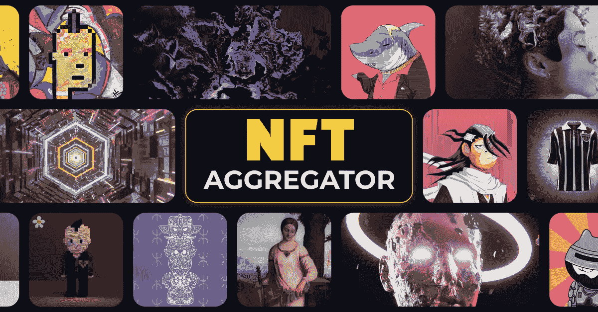

# 为什么 2023 年是 NFT 聚合器市场？完整指南

> 原文：<https://medium.com/nerd-for-tech/why-the-nft-aggregator-marketplace-in-2023-complete-guide-54d22e36d66f?source=collection_archive---------4----------------------->

## NFT 集合市场是一个平台，使得用户能够在不访问这些市场的情况下交易来自不同 NFT 市场的 NFT 集合。

2023 年的 NFT 聚合市场

当我们把目光投向体育弱势群体获得丰厚冠军的故事之外时，NFT 世界的演变将是一个鼓舞人心的故事，可以告诉后代。虽然不可替代令牌可能没有被全球大部分人很好地理解，但可以肯定的是，大多数人都听说过一些与 NFT 相关的术语。展望 2023 年，“[**”NFT 聚合器市场**](https://bit.ly/3FrNMdn) ”可能是在 Web3 生态系统中敲响警钟的一个词。让我们看看随着新的应用程序不断出现，最新的 NFT 平台模型如何在数字空间中发展。

# NFT 聚合器市场:概述

一般来说，NFT 集合市场是一个应用程序，人们可以在这个应用程序中比较不同市场企业的 NFT 收藏品的价格。这些平台在分析工具和计算器的支持下实现了这种功能，这些工具和计算器在提供价格数据的同时考虑了各种可变因素。

> NFT 聚合器平台—所有非功能性测试的一个地方

除了充当向导之外，一些聚合器允许人们通过类似购物车的功能在一次交易中从不同的市场购买多个 NFT。 **Gem.xyz** 、 **Genie.xyz** 、 **Blur.io** 和 **Rareboard** 是当前 Web3 世界中流行的 NFT 市场聚合器。该平台还包含更多独特的特性，我们将在下一节中看到。

## NFT 市场聚合器的意外元素

*   **合并列表:**为了帮助客户评估并做出明智的选择，我们的 NFT 聚合器市场平台有一个主页，显示来自各种市场的趋势 NFT。
*   **建议的 NFTs:** 根据用户最近的活动，该平台在用户同意的情况下独家跟踪用户的活动，向用户推荐 NFT 系列，供用户查看和购买。
*   **先进的搜索引擎:**由于复杂的搜索引擎增加了过滤和排序选项，用户不再需要浏览平台来搜索和检查他们喜欢的非功能性食物的费用。
*   **价格比较:**用户可以使用聚合器比较所有市场上的 NFT 价格，为他们做出决策提供重要信息。
*   **购物车:**有了购物车的帮助，消费者可以一次买好几份 NFT，节省了分别购买的时间和交易成本。
*   **用户端仪表板:**用户和管理员在 NFT 市场聚合器上获得无缝体验所需的数据显示在仪表板上。
*   **集成的 Web3 钱包:**用户可以使用应用程序的内置钱包在单笔交易中持有和处理各种 NFT 资产，这些钱包可以在区块链之间顺畅地运行。

## 更多的特性增加了额外的功能

*   **懒人铸币:**在聚合应用上，懒人铸币让购买者铸造他们购买的 NFT 并支付区块链的汽油费，减轻了新卖家的一些负担。
*   **创作者版税:**在出售他们的 NFT 之前，创作者可以在市场上指定版税，这些版税将在每次二次销售后存入他们的加密货币钱包。
*   **支付网关:**市场聚合器通过允许以法定货币和加密货币支付来帮助加密货币社区之外的消费者。

## NFT 市场聚合门户如何影响最终用户？

一个 NFT 聚合器市场应用程序会影响所有的终端——创作者、卖家和买家。首先，用户可以快速分析 NFT 世界的流动，从而嗅出可能的趋势，如果挖掘正确，这些趋势可能会像病毒一样传播。此外，通过允许用户在市场平台上比较同一 NFT 系列的价格，这些平台通过分析信息增强了意识并影响用户的决策。

具有贸易头脑的 NFT 投资者甚至可以分析当前的 NFT 趋势，并据此制定下一步行动的策略。然而，对于创作者来说，这些平台可以很好地服务，因为基于不同区块链的用户将接触到他们的创意作品，创造了他们被出售的高机会。

## 终极问题是:这个平台在 2023 年作为一种商业选择是否可行？

回到名义上的问题，2023 年，NFT 聚合器市场模式真的是一个有利可图的项目吗？是的，当然可以，因为它的本质是拥抱其他平台(NFT 市场),而不是与它们竞争。这种平台对于那些希望在不被现有巨头打击的情况下获得长期收益的 Web3 创业者来说可能是理想的。

这种模式的收益也很可观，因为有多种渠道可以利用，包括交易费用、原生代币价格利润和广告租金。因此，在 2023 年将 [**NFT 市场聚合器作为一项业务来运营的可行性应该是毫无疑问的。**](https://bit.ly/3FrNMdn)

## 结论

从今以后，由于上述好处，将这个平台作为一项业务可以使一个 Web3 企业家受益。如果你有类似的商业愿望，需要专业的帮助，一个经验丰富的 NFT 聚合市场开发公司可以来救援。你只需要列出你的技术和非技术需求，它的专家会把它们整合到一个专为你打造的全新应用中。你也不用担心产生的费用，因为有多种定价方案可供选择。

> ***“评估你的选择，启动一个 NFT 市场聚集器，在 Web3 中缓慢前进！”***