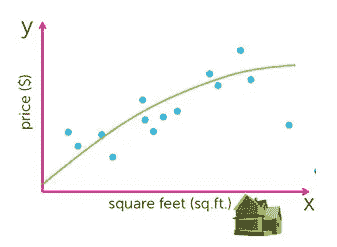
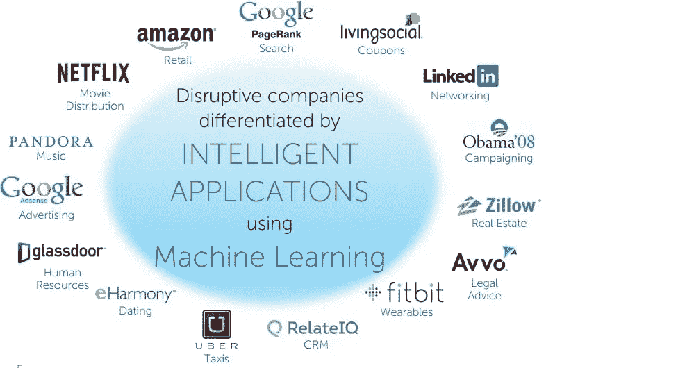

# 为什么要学习机器学习？

> 原文：<https://medium.com/nerd-for-tech/why-to-learn-machine-learning-bdade15c0bd?source=collection_archive---------22----------------------->

图片取自[https://www . zeol earn . com/magazine/guide-to-machine learning-with-python-training](https://www.zeolearn.com/magazine/guide-to-machine-learning-with-python-training)

除了科技之外，我们经常听到“机器学习”和“人工智能”等流行词汇被用于不同的行业。我们看到它们被用于医学、计算生物学和占星术等不同的领域。在机器学习的帮助下，工作对我们来说变得很容易，我们能够最大限度地理解和使用数据，并分别获得最佳输出。

我们可以看到，网飞和亚马逊等公司将机器学习算法用于推荐系统。除此之外，NASA 等航天公司分别在火星等不同星球使用机器学习进行自动驾驶。我们看到，在机器学习和深度学习的帮助下，每天都有新的应用被创造出来。

当我们看像 NASA 这样的航天公司时，会产生大量的数据。在数据的帮助下，我们能够分别执行分析和执行机器学习预测。可能有一些对执行机器学习预测至关重要的重要特征。例如，考虑分别预测房价的情况。我们看到，为了预测房价，我们必须了解一些重要的参数，如年份、卧室数量和位置。因此，进行探索性数据分析以了解不同的特征变得很重要。

基于单特征机器学习的房价预测

随着每天产生越来越多的数据，公司正试图利用这些数据并进行机器学习分析，以便分别在测试集中获得最佳结果。过去，没有足够的计算能力来执行机器学习预测。此外，没有足够的数据可用于生成具有良好准确度、精确度和召回率的非常好的机器学习输出。

从上面可以看出，与前几代相比，生成了大量数据，计算能力也有很大提高。因此，如果一个人学习数据科学和机器学习，那么这将是一件好事，因为这些数据可以被使用，并且可以分别为不同的公司创造商业影响。假设公司产生的数据越多，不同机器学习算法的预测就越好，数据科学家和机器学习工程师的预测范围就越大，这是很好的假设。

这就是为什么不同公司对机器学习工程师、商业分析师和数据科学家有巨大需求的原因，因为他们正在产生大量数据，并寻找能够为公司带来有意义的见解的人，以便他们能够做出决定，确保他们分别产生利润。

使用机器学习的公司列表

使用机器学习将确保预测被生成并用于不同的结果。因此，这导致对未来更好的预测。当公司已经知道某些事件和结果的预测时，他们可以节省大量的金钱和精力。

# **结论**

学习机器学习将是明智的，因为随着公司产生大量数据，对机器学习有巨大的需求，并且有良好的计算能力来运行机器学习模型进行预测。还可以看出，随着越来越多的数据由不同的公司通过不同的平台生成，未来对这些工作的需求将会增加。因此，学习数据科学和机器学习可以给人们带来优势，因为他们将明智地利用不同公司中存在的数据，并使用它们来确保这些公司产生利润。