# 为什么我们需要协方差、相关性和因果关系？

> 原文：<https://medium.com/nerd-for-tech/why-we-need-covariance-correlation-and-causation-86d47eb1bb7f?source=collection_archive---------13----------------------->

我们多次听说过相关性、协方差和因果关系，但所有这些术语都有点令人困惑。如果你正在读这篇博客，那么就没有困惑的空间，所以，请读完这篇博客。

当我们必须找到特征之间的关系时，使用所有这些术语。相关性、协方差和因果关系主要属于统计学领域，但它也是数据科学中一个非常有用的概念。好了，现在介绍完了，让我们跳到概念上。

# 目录:

**1)协方差**

**2)相关性**

**2.1)皮尔逊相关系数:**

**2.2)斯皮尔曼秩相关系数:**

**3)因果关系**

**4)总结**

**5)轮廓**

**6)参考文献**

# 1)协方差:

a)找出特征之间的关系是有用的，即，让我们有两个特征 X 和 Y，因此通过计算协方差，我们可以容易地找出 X 和 Y 是正相关还是负相关。

正关系:—如果特征 X 的值随着特征 Y 的值的增加而增加，或者特征 X 随着特征 Y 的值的减少而减少，那么我们可以称它们的关系为正关系。

负关系:如果特征 X 的值随着特征 Y 的值的减小而增加，或者反之亦然，那么我们可以称它们的关系为负关系。

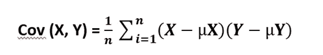

在哪里，

**n →** 数据点总数

**X，Y →** 特征

**X →** 特征 X 的均值

**Y→特征 Y 的均值**

****协方差的缺点:****

**1)找出特征之间的关系是有用的，但是我们不能比较它们之间的协方差，因为我们不能通过计算协方差来获得量值。因此，不可能比较两个协方差值**

**2)特征的协方差值相对于单元改变。也就是说，让我们有两个特征高度以 cm(h)为单位，重量以克(w)为单位，协方差是 cov(h，w)。**

**现在让我们采用不同单位的相同特征，即以米(H)为单位的身高和以千克(W)为单位的体重，协方差是 cov(H，W)。但是我们在两个协方差计算中得到的值是不同的，即 cov(h，w) ≠ cov(H，W)**

# **2)相关性:**

**在相关性方面，我们将讨论协方差的缺点。相关性是协方差的一种标准化形式。这种标准化是通过将协方差除以特征的方差得到的。**

**有两种方法用于计算相关性:**

****2.1)皮尔逊相关系数:****

**1)用于计算特征之间的相关性，用 **ρ** 表示**

**2)相关系数(ρ)总是位于+1 和-1 之间。**

**-1<= ρ<= 1**

**3) 0 < ρ <=+1 represent the positive relationship (if ρ=+1 then all points lie on the linear line while if points are missing the linear line, then their coefficient lies between the range 0< ρ**

**4) -1<= ρ <0 represent the negative relationship (if ρ=-1 then all points lie on the linear line while if points are missing the linear line, then their coefficient lies between the range -1< ρ <0)**

**5) Check the below-mentioned relationship between the X and Y in terms of the ρ.**

**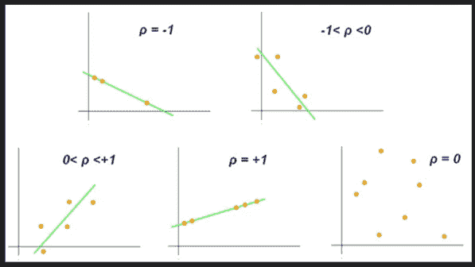**

**Variation in the ρ value w.r.t the distribution of data points of two features**

**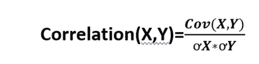**

**Where,**

****Cov(X，Y)** à特征 X 和 Y 的协方差**

**特征 x 的ơXà方差**

**特征 x 的ơYà方差**

****2)** **特征 X 的方差和均值计算公式:****

**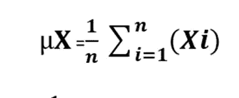****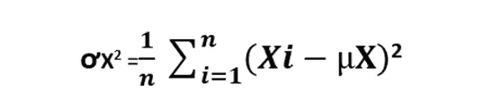**

****2)特征 Y 的方差和均值计算公式:****

**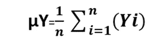****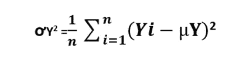**

****计算示例:****

**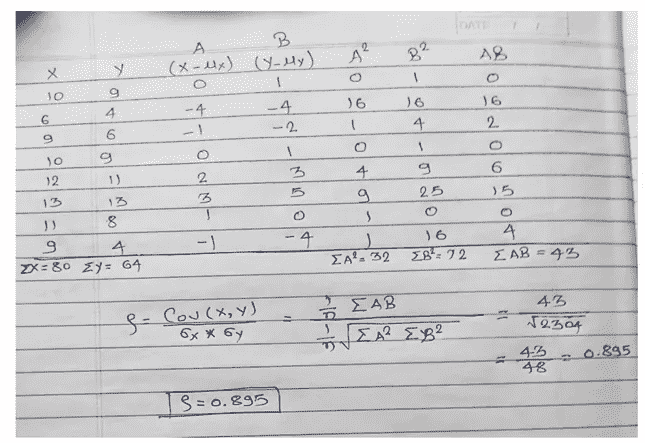**

****缺点:****

**1)只有当特征之间的关系是线性的时，皮尔逊相关系数才会起作用。使用皮尔逊相关系数无法找出特征之间的非线性关系。查看下图及其解释。**

**假设我们有两个特征 X 和 Y，我们将找出它们之间不同的可能关系。**

****第 1 行**:在这一行中，ρ反映关系的方向和强度。当点位于直线上时，我们得到ρ=+1，-1，强度随着点远离直线而降低。**

****第 2 行**:在这一行中，不管正负关系的斜率如何，ρ的值都是相同的**

****第 3 行**:在这一行中，ρ的值= 0，因为如果特征之间存在非线性关系，ρ就没有用了。**

**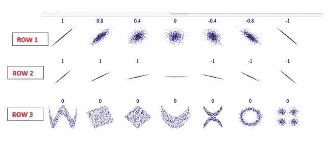**

****2.2)斯皮尔曼秩相关系数:****

**它将克服皮尔逊相关系数的缺点。这里我们将计算秩而不是协方差。斯皮尔曼等级相关系数的计算公式为**

**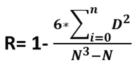**

**在哪里，**

**n→数据点数**

**D →两个特征等级之间的差异(D = rX — rY)**

****计算示例:****

**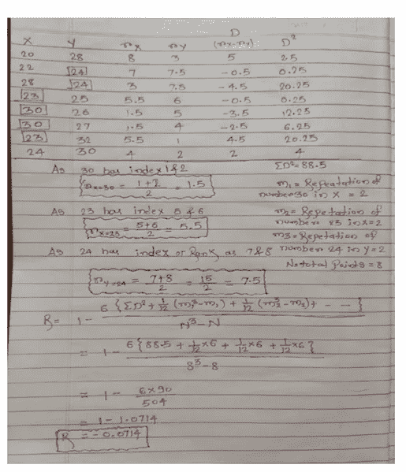**

**Spearman 的秩相关系数在本质上是稳健的，并且对异常值也不太敏感。查看下图并参考[链接](https://en.wikipedia.org/wiki/Spearman%27s_rank_correlation_coefficient)了解更多详情。**

**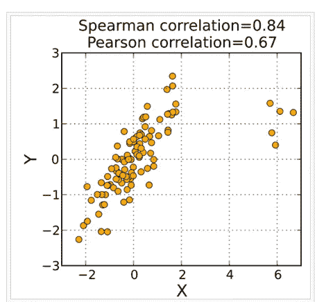**

# **3)因果关系:**

**现在是最后一部分，非常简单。因果关系是我们在日常生活中会遇到的术语。例如在夏天，冰淇淋和柠檬的需求增加。那么我们不能说，随着冰淇淋需求的增加，对柠檬的需求也在增加。这种关系是完全不相关的，这种关系是由于夏天而发生的，因为在夏天对冰淇淋和柠檬苦素的需求增加了。所以，简单地说，因果关系是由于第三个特征的干扰而形成的两个特征之间的关系。它不是在任何地方都适用**

# **4)总结:**

**1)协方差有助于找出特征之间的关系，即，或者是负关系或者是正关系，但是我们在这里不能得到量值，所以我们不能比较两个特征之间的协方差。**

**2)相关性最有用，因为它既给出方向又给出幅度。如果两个特征之间的关系是线性的，那么我们可以使用皮尔逊相关系数和斯皮尔曼等级相关系数，如果是非线性的，那么我们可以使用斯皮尔曼等级相关系数**

**3)因果关系是两个特征之间由于第三个特征的干扰而形成的关系形式。并不总是如此。**

# **5)简介:**

**感谢阅读！请鼓掌感谢我的辛勤工作。我总是乐于接受建设性的反馈——如果你对这个分析有后续想法，请在下面评论或通过 LinkedIn 联系[。](https://www.linkedin.com/in/shubham-dhawas-3ba232b7)**

# **6)参考资料:**

**1)[https://en . Wikipedia . org/wiki/Pearson _ correlation _ coefficient](https://en.wikipedia.org/wiki/Pearson_correlation_coefficient)**

**[2)](https://en.wikipedia.org/wiki/Spearman%27s_rank_correlation_coefficient)[https://en . Wikipedia . org/wiki/Spearman % 27s _ rank _ correlation _ coefficient](https://en.wikipedia.org/wiki/Spearman%27s_rank_correlation_coefficient)**