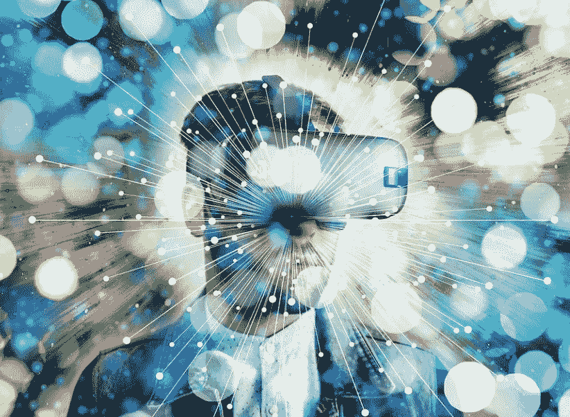

# 为什么我们永远不会在虚拟现实中全职工作

> 原文：<https://medium.com/nerd-for-tech/why-well-never-be-full-time-in-virtual-reality-9024475707c1?source=collection_archive---------1----------------------->

图片由[皮克斯拜](https://pixabay.com/?utm_source=link-attribution&utm_medium=referral&utm_campaign=image&utm_content=4685055)的 Gerd Altmann 提供

根据 Meta 和元宇宙 uhm 的其他支持者的说法，我们将在那个空间戴着耳机度过我们的日子。我们也会喜欢它的。但 VR 头戴设备是未来，那是我们将生活的地方。只是它不是，我们也不会是。然而，我们将会更多地使用它们，并以许多有趣的方式使用它们。只是不是全职的。很可能不是每天。这归结为两个基本原因:社会文化和生物学。

VR 和 AR 已经有一些强大的使用案例和好处。今天，虚拟现实主要是作为玩游戏的新方式。身临其境，乐趣无穷。但虚拟现实将成为许多工业、医疗和其他商业应用的关键技术。医生将能够进行手术培训，会议将具有物理和虚拟元素，工程师将能够探索 3D 结构，如桥梁和建筑物，并在特定环境中进行测试，城市规划者和建筑师将探索物理世界的想法。还有很多。增强现实(AR)眼镜和智能手机应用程序也将被类似地使用。而不是作为生活和工作的全职工具。

**社会文化问题**

超过 90%的人际交流是非语言的。疫情教会了我们这种局限性。一旦限制开始解除，我们没有取消会议、音乐会、活动或决定它们应该保持虚拟。我们奔向真实世界的体验。当然，我们希望花更少的时间在办公室，但我们也希望与现实世界中的同事保持联系。

世界上所有的文化都是在彼此身体接触的几十万年中进化而来的。触摸，听觉，视觉，嗅觉，体验，学习。看着对方，站在对方中间。VR 头显再好，软件再好，也代替不了这些核心的人的元素。它可以代替一段时间，但不能取代。VR 永远是模拟。人类在物质世界中体验生活。

在许多文化中，舞蹈、服饰、生活事件和音乐在我们如何驾驭我们的世界和彼此的关系中扮演着至关重要的角色。数字模拟只是表面的模拟，它们没有伴随着这些文化元素成长的重量和价值。在虚拟世界中，我们无法品尝家庭或社区的菜肴，或闻到它或围绕该事件的气味、景象和声音。它是无菌的。

**生物现实**

最近一些非常有趣的[科学研究](https://www.healthline.com/health/touch-starved#benefits-of-touch)已经在 touch 周围展开。人情味。实际上，相互触摸不仅对精神和情感健康很重要，对我们实际的身体健康也很重要。触摸可以降低血压和心率。触摸可以减少神经系统问题，同时也刺激我们的催产素和天然抗抑郁药血清素。别忘了多巴胺。触摸是人类最基本、最原始的一面。这是我们与其他动物如狮子、鲸鱼甚至蜜蜂共享的东西。

科学[显示](https://www.psychologytoday.com/ca/blog/everyone-top/202108/the-vital-importance-human-touch)当人类出生的第一个小时有皮肤与皮肤的接触时，新生儿的体温、心率和呼吸会降低，也会哭泣。在任何虚拟现实中，触摸在物理上都是不可能的。戴手套甚至穿防弹衣都不能弥补这一点。

我们也用我们的听觉、视觉和嗅觉不断地评估我们周围的世界。我们的边缘系统在其他情绪反应中评估战斗或逃跑。

我们也寻求物质世界的体验来放松或挑战我们。你可能在一个虚拟的海滩上，但你仍然坐在沙发上，脚趾间没有沙子。你可以登上虚拟的珠穆朗玛峰，但当你的狗或猫认为你做这些奇怪的动作时，你仍然在你的客厅里舒适温暖。

**了解虚拟现实&增强现实适合哪里**

因此，我们已经确定，VR 或 AR 都不可能连续几个小时真正成为日常常数。有些人可能一天花几个小时沉浸在数字体验中；游戏玩家，那些在工业应用中使用数字双胞胎的人，一些在医疗领域。那么 AR 和 VR 在哪里契合呢？

正如我们在开始时所讨论的，两者都非常适合游戏之外的许多用途。但是这两者都不能代替我们的物质世界经验，也不能代替我们在这个世界生活和导航的要求。像任何 OS(操作系统)一样，它们有自己的位置和用途。每一种都有其局限性和优点。都是以地点/时间为中心的。我们与技术的互动正在从键盘发展到屏幕、语音，或许还有更多手势。