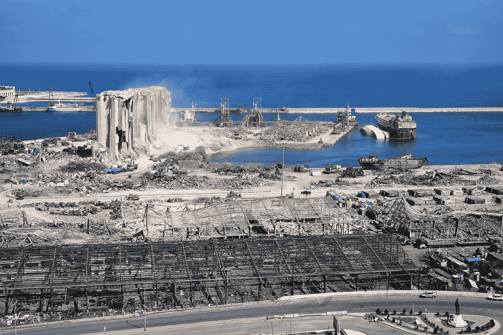

# 为什么作者应该总是承认信息差距。

> 原文：<https://medium.com/nerd-for-tech/why-writers-should-always-acknowledge-informational-gaps-9bff92531fa7?source=collection_archive---------11----------------------->

恼人的差距无处不在，作者从不承认它们。这让我发疯。

这里有一个来自维基百科的例子。这篇文章[https://en.wikipedia.org/wiki/2020_Beirut_explosion](https://en.wikipedia.org/wiki/2020_Beirut_explosion)说:

> 谷物升降机大部分被毁， [[135]](https://en.wikipedia.org/wiki/2020_Beirut_explosion#cite_note-guardian.live.2020.08.04-143) 加剧了新冠肺炎疫情和金融危机造成的粮食短缺。[【136】](https://en.wikipedia.org/wiki/2020_Beirut_explosion#cite_note-144)约一万五千吨(14800 长吨；16，500 短吨)的粮食损失，使该国的粮食储备不足一个月。[【132】](https://en.wikipedia.org/wiki/2020_Beirut_explosion#cite_note-AJE_05-08-140)

首先，让我澄清“谷物升降机”是指谷物储存设施。顺便说一句，在我的书中，它并没有“大部分被摧毁”,因为这座建筑仍然屹立不倒。

我觉得非常恼人的信息缺口是没有任何剩余粮食数量的指示，以吨为单位。我想知道这个国家的粮食在爆炸中损失了百分之多少。我想大多数读者都会有同感。请在评论或推特上告诉我你的想法。

另一种看问题的方式是，我想知道在爆炸发生前，国家储备了多少个月的粮食。

事实上，我不知道 15000 吨被销毁的粮食意味着什么。我也不知道储备一个月的粮食意味着什么。将两者放在一起会产生一种信息完整的错觉，或者说有足够的背景。

问题是缺乏背景。这就好像读者应该知道黎巴嫩在爆炸前有多少粮食，或者这些粮食如果没有丢失的话可以维持多久。

“这只是维基百科。你还指望什么？”，我在这里你哭了。不仅仅是维基百科。点击编号为 132 的引文，我看到了半岛电视台的这篇文章:

 [## 贝鲁特爆炸死亡人数升至 135 人，5000 人受伤

### 黎巴嫩内阁宣布首都进入为期两周的紧急状态，并移交安全控制权

www.aljazeera.com](https://www.aljazeera.com/news/2020/8/5/beirut-explosion-death-toll-rises-to-135-as-5000-wounded-live) 

所有的信息缺口都在那篇文章里。

最后，记者(或维基人)难道不能找出丢失的是哪种谷物吗？只说“谷物”有点含糊，不是吗？另一个诱人的缺口。

作者至少应该承认这种差距或含糊不清，比如说“不知道谷物升降机里到底是什么类型的谷物”。即使只是“某种谷物”而不仅仅是“谷物”，也是一种进步。在这种情况下，读者会感觉到作者对读者表现出了一些同情。

rashid khreiss 在 [Unsplash](https://unsplash.com?utm_source=medium&utm_medium=referral) 上的照片