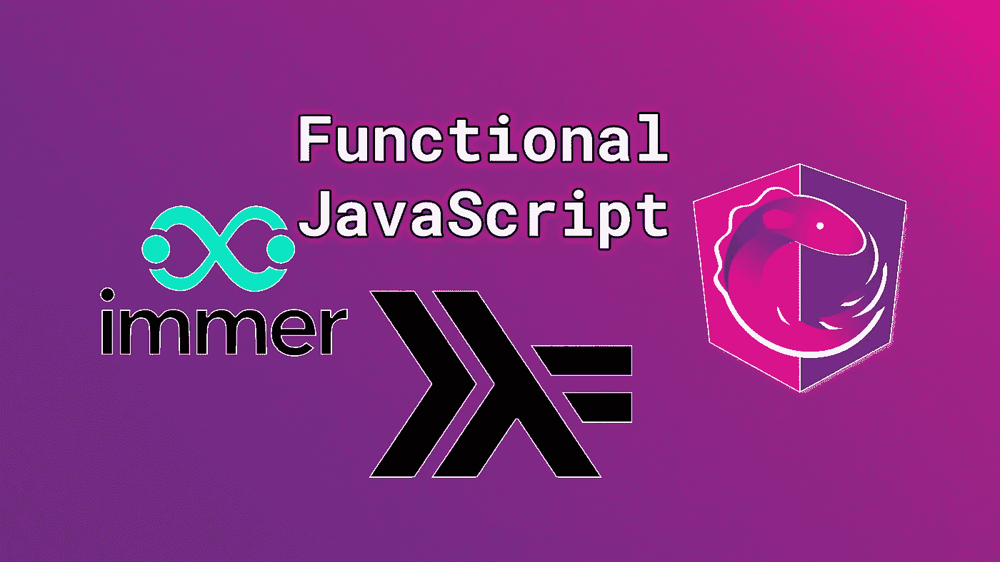

# 作为员工、团队领导或顾问，了解函数式编程对您有什么好处

> 原文：<https://medium.com/nerd-for-tech/why-you-benefit-from-knowing-functional-programming-as-employee-team-leader-or-consultant-1a1afb852aab?source=collection_archive---------13----------------------->

## 伴随着 immer，你对函数式 JavaScript 的精彩介绍。Js 和 rxjs

图片由[作者](http://www.arnoldcode.com)

JavaScript 中的函数式编程死了吗？自 ES2015 发布以来，OOP 标准就印在了 JavaScript 横幅上。对我来说，对弗雷德里克·凯莱基(作者…