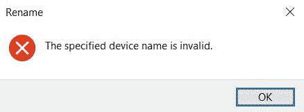

# 为什么在 Windows 中不能将文件命名为“CON”

> 原文：<https://medium.com/nerd-for-tech/why-you-cannot-name-a-file-con-in-windows-3980280a674d?source=collection_archive---------17----------------------->

❓，你知道吗，在 Windows 中你不能把一个文件命名为“Con”

如果你运行的是 Windows 系统，现在就试试吧。**进入文件浏览器- >创建一个新文件夹- >命名为“Con”**

成功了吗？现在用“PRN”、“奥克斯”或“NUL”试试。你得到了什么？

可能是这个⬇

系统不会让你这么做的。

Con 是一个英语单词，有几个像 Connor 这样的人名被昵称为“Con”。因此，如果你想在 Windows 上用他们的昵称保存其中一个人的照片，你将无法做到。

实际上，系统不会让你给一个文件或文件夹起名字`CON`、`AUX`、`PRN`、`LST`、`COM0`到`COM9`、`LPT0`到`LPT9`或者`NUL`。

# 但是为什么 Windows 不允许这样呢？

原因要追溯到 MS-DOS，它是 80 年代最古老的命令行之一。在 MS-DOS 中，上面提到的那些字都是**设备文件**的名称。

它们是让计算机上的程序与其他硬件如打印机、键盘和基本上任何你可以插入的东西进行交互的一种快捷而聪明的方式。不是每一个程序都必须学习与每一个可能的设备进行通信，这项工作交给了“设备驱动程序”。

这样做是为了让程序员不必担心每一种硬件设备如打印机是如何工作的。取而代之的是，他们可以重用已经拥有的从打印机读写文件的代码。他们只需将想要打印的内容保存到这个“设备文件”中。

这意味着，即使一台新的打印机推出了新的功能，如果制造商将捆绑一个新的驱动程序，所有的旧程序仍将工作，就像他们一直做的那样，驱动程序将处理脏东西。

# 向后兼容性🔁

如果你在 windows 终端输入“dir ”,你会在屏幕上看到当前目录或文件夹中的文件列表。

键入“dir”，在其后添加一个重定向符号(>)，最后提到一个文件名，然后将列表保存在该文件上，而不是显示在屏幕上。

但是，如果你试图将它保存到一个名为“LPT1”的文件中，系统会发现该文件名，而不是进入硬盘，你的列表将被发送到并行端口的设备驱动程序，即计算机背面标记为 LPT1 的端口。你插着打印机的地方。

因此，即使你知道并行端口或打印机是如何工作的，你也可以打印东西。

Windows 10 现在大概不用并口了但是这些保留字现在还存在的原因是因为**向后兼容**。

Windows 10 保留了 Windows 3.1 时代的代码，Windows 3.1 是以 MS-DOS 为基本创建的，Windows 95 也是如此。对于 Windows NT，这种情况没有发生，但微软仍然希望它与 Windows 95 兼容，Windows 10 仍然部分基于 Windows NT。因此，这些是 80 年代 MS-DOS 中的保留字，到 2021 年，它们仍然是 Windows 中的保留字

几乎没有人会再使用并行端口来连接打印机，但微软选择继续支持极其古老的软件和设备直到今天。

# 结论

在本文中，我们看到了为什么在 Windows 中不能将文件或文件夹命名为“Con”。

在 MS-DOS 的早期，电脑基本上是一个黑屏，除了文字什么都没有。所以一切都是通过写命令来实现的。对于一个程序来说，要与其它东西(如打印机)进行交互，必须使用一个文本文件或“设备文件”来编写一个命令，以便与驱动程序进行交互。

根据设备的不同，它有一个保留名称。例如，**打印机用来连接的并口有 LPT1、LPT2、LPT3、LPT4、LPT5、LPT6、LPT7、LPT8、LPT9** 。串行端口从 COM1 到 COM9 预留了 COM。“CON”代表控制台等。

直到今天，这些设备名称仍被保留，因此您无法使用它们创建可用的文件或文件夹。如果当时你试图创建一个名为 LPT1.txt 的文件，你要做的是将它发送到打印机或类似的东西，这就是它们被阻止的原因。

希望你今天学到了新东西！

感谢阅读:)

**喜欢你读的书吗？你可以给我买一辆 coffee☕来表达你的爱**

*原发布于*[*https://apoorvtyagi . tech*](https://apoorvtyagi.tech/why-you-cant-name-a-file-con-in-windows)*。*