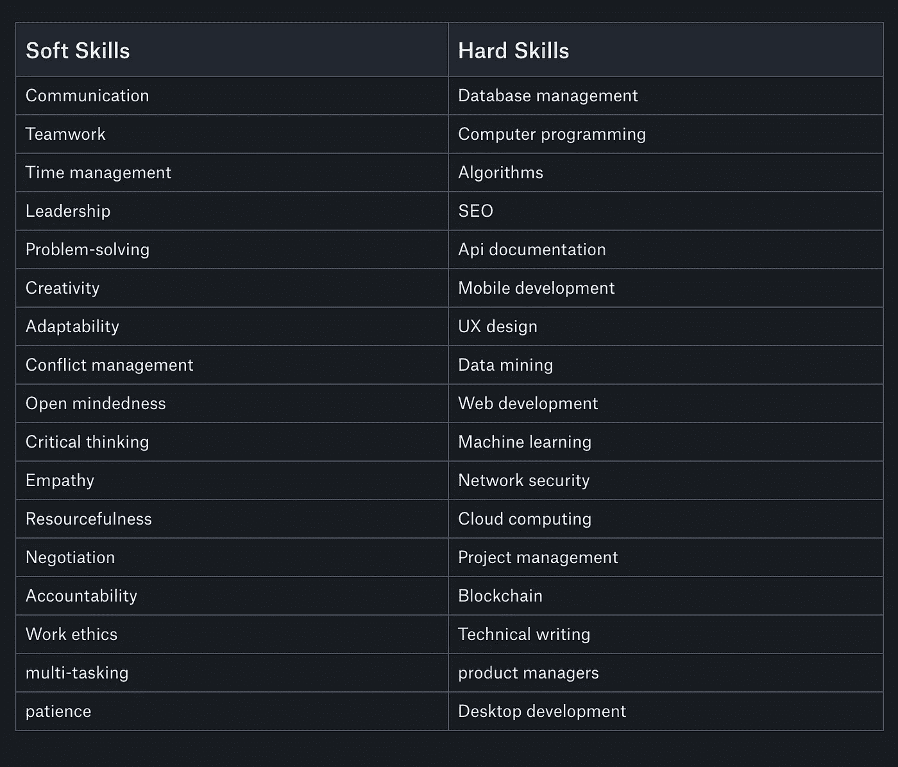

# 作为软件开发人员，你为什么需要软技能

> 原文：<https://medium.com/nerd-for-tech/why-you-need-soft-skills-as-a-software-developer-b3bc4f8ae071?source=collection_archive---------14----------------------->

软技能是你在职场中取得成功所需要的个人属性和特征。开发人员唯一的期望集中在技术技能上的日子已经一去不复返了。在今天的软件行业中，想要在工作场所取得成功，你需要的不仅仅是技术技能。

在您的各种工作中，您需要技术知识和能力来履行您在工作中的角色和职责。但是，让你脱颖而出成为一名高绩效者需要一些额外的品质，如有效沟通的能力，与他人合作的能力，以及更有效地管理时间的能力。这些是你在工作场所成功所需的一些软技能的例子。

# 什么是软技能？

软技能是与你如何工作相关的非技术性技能。软技能是帮助员工在职场上茁壮成长的性格特征或人格特质。软技能更多的是和你是谁有关(软技能)，而不是你知道什么(硬技能)，

# 软技能和硬技能的区别

软技能是决定你如何在工作场所茁壮成长的个人特质，而硬技能是通过经验、教育、培训等获得的技术知识或培训。硬技能也称技术技能，如计算机编程、图形设计、软件测试、UI/UX 设计等。与软技能相比更容易学习。

# 为什么软技能很重要？

软技能和硬技能(技术技能)一样重要，因为作为一名开发人员，你会想要加入一家新公司，谈判一份合同，寻找新客户，在团队中工作，向你的新同事提出一个想法，等等。我们在日常生活中使用软技能，因此发展这些软技能将使你能够加速你的职业生涯。

## 让我们看一个场景:

A 先生:有 5 年经验的软件开发人员，没有软技能

B 先生:有 5 年经验的软件开发人员，有良好的软件技能

作为招聘经理，你会聘用谁？

当然，B 先生，因为虽然他和 A 先生有相同的工作经验，但除了他的技术能力之外，他还有其他的东西。

软技能之所以重要有很多原因:

*   它让你脱颖而出，
*   它使你能够与你的团队合作，
*   它让你获得自信，
*   它有助于你培养领导素质，
*   未来的工作将依赖于软技能，
*   招聘人员非常需要软技能。

# 每个开发人员都应该具备的基本软技能

在这篇文章中，我将列出每个开发人员应该拥有或发展的一些基本软技能，以便能够在他们的工作场所茁壮成长。这些软技能包括:

# 通讯技能

沟通是每个开发人员都应该具备的最重要的软技能之一。你还应该记住，沟通是双向的，意味着你既要倾听，也要能够表达自己。

有效沟通的关键是倾听，当别人说话时不要打断，而是倾听，然后才附和你的想法。

无论开发人员是在现场还是远程工作，他们都应该能够与团队的其他成员交流，比如项目经理、设计师、工程经理等等。在某种程度上，开发人员也应该能够与最终用户沟通。开发人员需要能够通过电子邮件、电话、slack 频道等与所有平台有效沟通，如视频通话、面对面沟通。

你应该注意你说的话和你说话的方式会影响人们对你的感觉。

# 协力

> *“如果你想走得快，就一个人走。但如果你想走得远，就一起走——拉坦·塔塔"*

团队合作在工作场所是必不可少的。为了一个企业的发展和有效运作，人们必须相互合作以实现公司的目标。软件开发涉及团队合作。如果你是一家公司的开发人员，你需要与 UI/UX 设计师、项目经理一起工作，还需要与其他开发人员合作，以实现共同的目标或项目。如果你没有良好的团队合作技能，你可能很难与团队成员合作，从而阻碍项目的进展。

# 神入

设身处地为他人着想是描述感同身受的最佳方式。作为一名开发人员，我们花了大部分时间编写代码，却没有花时间去了解我们的用户、顾客和客户。了解人们的特点、信仰体系、能力会让你受益。您将能够调整以满足他们的需求，并在构建时将他们考虑在内。你不需要成为 UX 设计师或用户研究员就能表现出同理心。感同身受始于你是一个人，意识到他人的需求和愿望。

# 时间管理技巧

时间管理是每个开发人员必须具备的重要软技能。在压力下工作和赶上最后期限是开发人员每天面临的事情的一部分。试图同时做多件事并不是管理时间的有效方法，而且经常会导致你压力过大和混乱。时间管理是为特定任务管理时间的一种方式。这让你可以管理你的任务，从而尽可能地提高效率。作为一名开发人员，你必须有时间意识，学会如何区分任务的优先级，在任务变得紧急或截止日期到来之前完成它们。

# 耐心

软件开发是一个漫长的过程，需要耐心。从设计到实现，再到测试、部署、更新、修复 bug 等。这些活动大多需要时间，缺乏耐心会弊大于利。还有，学会如何对自己有耐心，对别人有耐心也会更容易。

# 解决问题的技巧

我们都知道软件开发就是解决复杂的问题。从实现一个设计到构建一个移动应用，修复错误等等。永远都是为了解决问题。作为一名开发人员，在你职业生涯的某个时刻，你会面临一个问题。这可能会定期、每周或偶尔发生，但这是不可避免的。你如何处理问题将对你的职业生涯和你工作的公司产生重大影响。

# 领导技能

在工作场所，雇主在开发人员身上寻找领导素质。他们想确定你是否能管理好局面，也能管理好员工。

# 适应性技能

技术在不断进步，你也应该如此。如果你回顾几十年前，你会发现很多事情都变了。软件开发人员也需要能够适应这样的情况。雇主会看重那些能够适应这种变化，并愿意通过培训或开展研究来学习的开发人员。

# 问责技巧

开发人员容易犯错误。有些可能会被忽视，而有些可能会影响项目。然而，承认自己的错误是每个开发人员必须具备的软技能。错误是必然会发生的，应该从中吸取教训，不要再犯

# 如何培养软技能

即使软技能不像技术技能那样容易学习，但它们肯定可以随着时间的推移得到发展和提高。发展软技能的第一步是认识到你需要提高的领域。这可以通过向信任的同事或朋友寻求反馈、个人反思、评估你的工作表现来实现。当你意识到自己的优点和缺点后，制定一个行动计划来改善你的缺点。

发展软技能有几种方法:

*   向信任的同事和朋友寻求反馈，
*   考虑参加在线软技能课程，这将帮助你学习在工作中有用的技能，
*   如果你想提高你的沟通技巧，你应该考虑公开演讲或者参加一个课程成为一个有效的公开演讲者，
*   观察那些与你有同样软技能的人，你想提高他们的软技能。如果你和他们有关系，向他们寻求建议和指导，
*   练习:所有的技能都需要练习，包括软技能。一旦你接受了培训，与朋友和家人一起练习你的新技能将会对你进入职场大有帮助。

# 总结

本文概述的所有软技能都是相辅相成的。例如，良好的沟通技巧可以帮助你轻松地与团队成员和客户合作。成为一名优秀的团队成员反过来可以帮助你更加自信，也有助于提高你的问责技能。此外，管理人员需要你发展自己的领导技能，并帮助你培养对他人的同情心。

另一个需要记住的要点是，软技能需要时间来培养。就像学习技术技能一样，可能需要几个月甚至几年。

在这一点上，我希望我已经说得足够清楚了，软技能是每个软件开发人员必须具备的有价值的技能。除了你的技术技能之外，一个拥有软技能的开发人员对工作的未来至关重要。

感谢阅读！

本文最初写于[工作中心](https://www.works-hub.com/learn/why-you-need-soft-skills-as-a-software-developer-b8c5b?utm_campaign=Automation%20-%20Candidate%20Emails&utm_medium=email&_hsmi=106671327&_hsenc=p2ANqtz--DGFE3lKovNb-0yoHdzoreS_EEcIeWKcvd2E_Eou8ZFBAd7t1Hwtv-hptW1OATItEQnjrrFefipbd6xdhQ6Wwf5LtQS_E437wHEHoAi0pf1RTwdCw&utm_content=106671327&utm_source=hs_email)