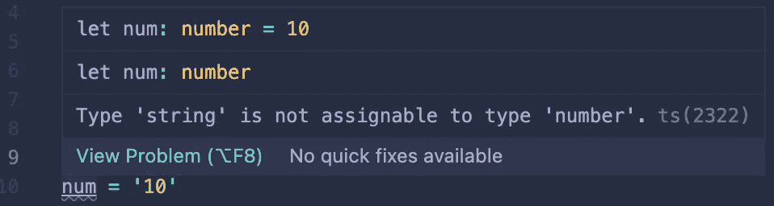
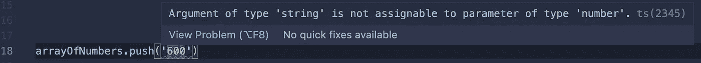
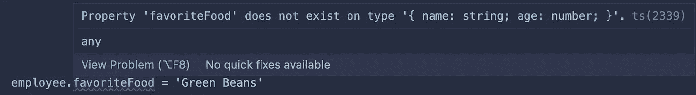
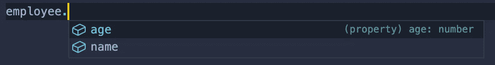
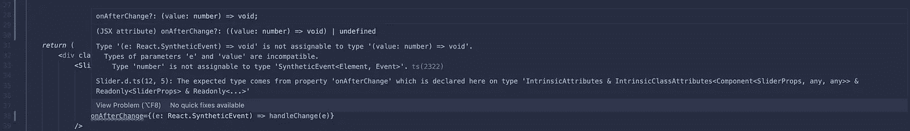

# 为什么你应该学习打字稿

> 原文：<https://medium.com/nerd-for-tech/why-you-should-learn-typescript-4808211c6cac?source=collection_archive---------4----------------------->

照片由[席琳·纳多](https://unsplash.com/@celinen?utm_source=medium&utm_medium=referral)在 [Unsplash](https://unsplash.com?utm_source=medium&utm_medium=referral) 拍摄

我已经在编码生态系统中漫游了一段时间，我有一个我反复听说过的技术列表，但是从来没有坐下来研究过。打字稿排在最前面，本周，我有机会喝了一杯苦艾酒。

我是一名 JavaScript/React 开发人员，我总是试图在空闲时间阅读文档和学习课程，以保持我的技能敏锐并与当前技术保持同步。我从 Udemy.com React 课程中选了一个常见的项目，并决定继续学习，但是使用 **NextJS** 和 **TypeScript** 来构建我的版本，而不是普通的 JavaScript/React。这给了我一个现实世界的游戏场来解决 **TypeScript** 的基础问题，我很快意识到它给我的工作流程带来的巨大好处。

我想向你展示我在学习基础知识时遇到的一些障碍，并分享一些“哦，见鬼，是的！”我拥有的时刻，并解释为什么我不想回到不使用**打字稿**的状态。

## **声明变量**

如果您对 TypeScript 完全不熟悉，它是 JavaScript 的超集，这意味着它的特性在很大程度上是可选的，并且所有有效的 JavaScript 都已经是有效的 TypeScript。也就是说，本质上，Typescript 允许你使用强类型变量，类似于 **C** 或 **Java。这意味着当你声明一个变量时，你也声明了这个变量应该包含什么类型的数据。**

声明变量的语法很简单，并且使用我们习惯于 JavaScript 的类型。

`<declarative> <variable name>: <type> = <data>`

Typescript 基本变量

在 TypeScript 中，一旦声明了变量，就不能更改其类型，也不能将不同类型的数据赋给该变量。如果我们试图将变量`num`赋给字符串`'10'`，TypeScript 将抛出一个错误。

错误类型错误

这里，编译器知道`num`应该是一个`number`类型，并说“嘿，我不能给它分配一个字符串`'10'`我回过头来想想我处理来自 DOM 元素的数据的所有时间，例如，编写 Redux 动作时，我从来不知道我得到的是数字字符串还是实际数字，并且总是需要手动将我的数据转换为我需要的类型，以满足隐藏的错误。当您的编译器自动为您检查数据类型时，这项繁琐的工作就变得不那么痛苦了。

我们也可以声明数组和对象。

类型后面带括号`[]`表示用指定数据类型填充的数组。对于我们这里的`arrayOfNumbers`,我们不能向数组中添加另一个不是数字数据类型的元素。

数字数组错误

这里的`employee`变量也是如此。我们告诉编译器，这个变量应该包含一个对象，并且只有一个`name`属性、一个`string`和一个`age`属性、一个`number`，除此之外别无其他。尝试添加另一个属性将会引发错误。

对象错误

与此同时，当需要引用我们的 employee 对象时，我们现在可以获得 intellisense 建议，告诉我们该对象包含了什么。

对象上的智能感知

希望您已经感觉到这些新错误有多有用。我花了一些时间来适应，但现在我只是本能地想知道，确切地说，变量是什么数据类型。TypeScript 在开发过程中，在构建之前为我们带来了这种保证。

## 接口

所以，我们可以在声明一个变量的时候明确我们的数据类型，但是当事情变得有点复杂的时候呢？大多数时候，我们希望使用数据库中的对象，该数据库可能包含许多数据类型和嵌套数据。我们如何处理更复杂的对象？

我们有一个来自 TypeScript 的新工具，叫做**接口**。现在你可能第一眼就觉得一个接口看起来很像一个类，你是对的，但是它们有一些明显的区别。

1.  一个类是一个逻辑代码块，旨在**可重用**并基于原型构建对象的实例。
2.  接口是我们代码的一个**契约**。可以检查和引用的一组规则，以确保对象中数据的完整性。接口不能创建对象，但是可以检查对象以确保它符合一组标准。

我将使用一个我目前正在做的项目中的例子。在这个项目中，我们将原始颜色数据组织成`Palette`对象。我创建了这个**接口**来检查我的调色板对象的正确性:

现在我可以在变量声明中引用这个`IsPalette`类型作为数据类型。如果某个对象的某个方面不符合这个契约的要求，TypeScript 会让我知道。让我们获取一些种子数据，并使用这个接口:

根据我导入的接口，任何与该模式的偏差都将引发错误，并且需要在代码编译之前进行纠正。

现在，我有一个关于未知数据的问题，或者一次一部分地构建对象，因为你需要精确地匹配接口以避免任何错误。我们有一些有用的工具来帮助我们。首先是`any`型。你可以用它来告诉编译器代码应该允许任何类型的变量被赋值。

我需要使用我已经建立的调色板，并通过一组辅助函数对它们进行一些调整，以创建一个新的、更漂亮的调色板。所以我创建了一个中间接口和一个最终接口来检查我的数据。

我需要让我的数据看起来像这样:

然而，我需要构建一个调色板，然后一点一点地添加`colors`数据。如果我使用这个接口作为数据类型，我会因为不完整的数据而得到错误。

所以我的`generatePalette`函数在这里接受了一个`starterPalette`参数，它的类型是`IsPalette`(我的原始接口)。然后，该函数返回一个类型为`IsChromaPalette`的对象，其中包含了我们在函数中添加的所有数据。我需要创建一个对象来构建，并使用`IsNewPalette`类型来验证初始信息，并使用`any`关键字打开`colors`属性。

同样，声明这些类型的额外工作的美妙之处在于，许多人为错误在开发的早期就被发现了。事实上，因为我使用的是 TypeScript，所以当我创建我的项目版本时，我发现了一些老师没有注意到的错误。

## DOM 交互

当我试图在我的项目中为颜色选择设置一个带有滑块的包时，我遇到了一个我起初不理解的错误。我最终意识到 TypeScript 错误确切地告诉了我需要做什么，并把我从后来的调试会话中解救了出来。

我知道这个新组件有一个`onAfterChange`属性，但是我不知道它的内部发生了什么，也不知道这个属性在回调中传递了什么。我假设这是一个标准的 React 合成事件，我也这样对待它，但是当它以这种方式设置时，我总是得到一个错误。

这又是错误的，因为我一直试图将来自`onAfterChange`的论点视为一个事件，但它绝对不是。尽管我当时并不知道，但错误消息告诉了我到底哪里出错了:

滑块误差

本质上，这告诉我们,`onAfterChange`属性试图将一个参数传递给一个类型为`number`的回调函数`value`,我因为期待一个`SyntheticEvent`而变得愚蠢。好了，现在我们知道我们期待一个类型为`number`的`value`参数，我们可以解决这个问题了！

好吧！没有错误，一切正常。我们知道我们将从`onAfterChange`接收到一个`number`，我们可以用它来直接设置我们的状态，这将选择组件上的颜色。

同样，我可以设法让代码在没有所有这些类型检查的情况下工作，但是在早期确定数据为我节省了大量的调试时间。

# 结论

我认为 TypeScript 最好的部分是它是可选的，并且是 JavaScript 的超集，这使得在您学习它们的时候很容易慢慢地实现它的特性，或者只在可以受益于类型检查的地方使用它。

就我个人而言，就当我皈依了。我会找借口在任何可能的地方使用 TypeScript，并通过不断谈论它有多棒来惹恼聚会上的人。

感谢您阅读本文，祝您编码愉快！！