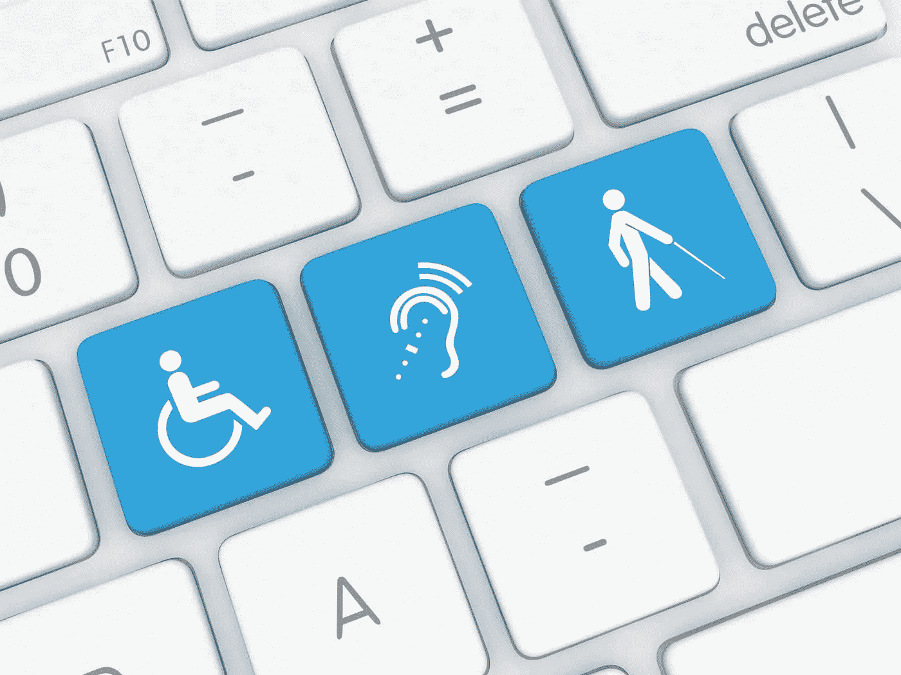
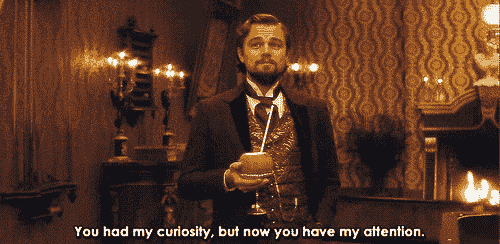
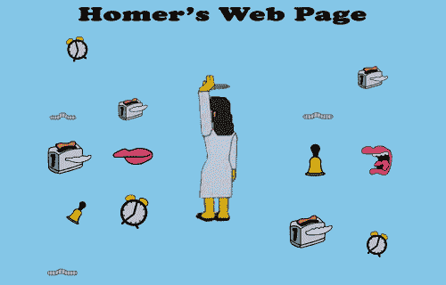
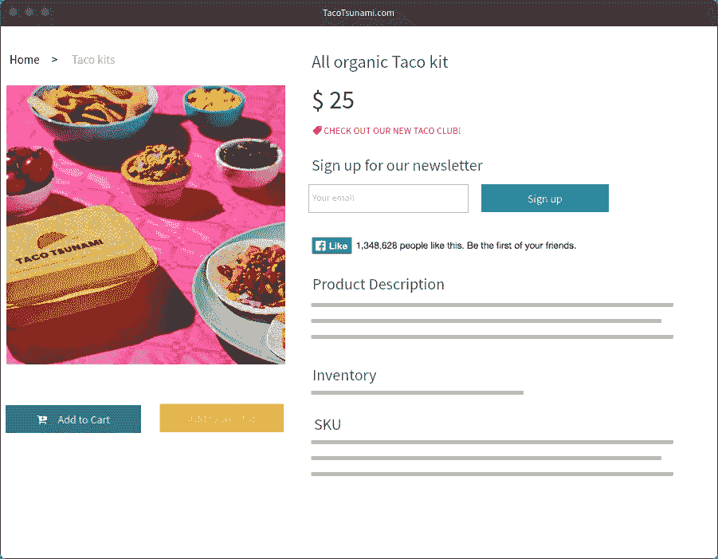
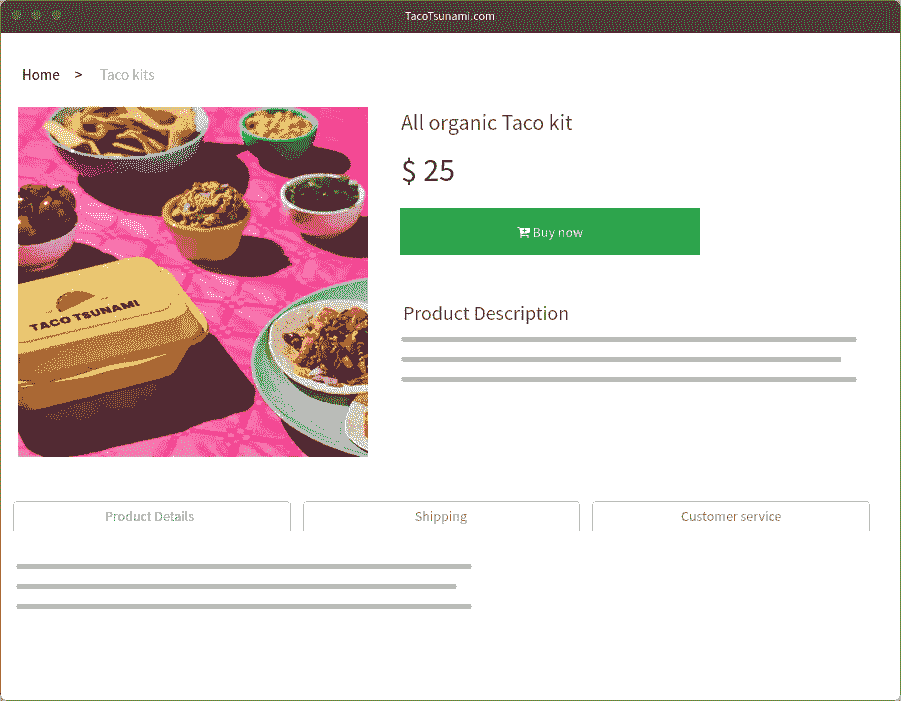

# 为什么你应该让你的网站具有可访问性

> 原文：<https://medium.com/nerd-for-tech/why-you-should-make-your-site-accessible-425e39b42626?source=collection_archive---------18----------------------->

创建网站的时候，很容易把所有用户都想成一样的。你经常忘记，不是所有的用户都能像自己一样轻松地浏览网站。这就是可访问性发挥作用的地方。

但是什么是可访问性呢？正如谷歌技术项目经理维克多·察兰(Victor Tsaran)所说，他也是一名盲人:

> “可访问性实际上是确保我们创建的内容和网站对有各种障碍或能力的人有用。”

*——谷歌技术项目经理维克多·察兰*

你可能会自动想到一个使用普通键盘、鼠标或触摸屏有困难的用户。是的，那可能是一种情况。但是可访问性也涵盖了所有人，从注意力难以集中的多动症患者，到试图在阳光直射下阅读屏幕的人。

当涉及到可访问性问题时，有许多类别，但是四个主要领域是:

*   视力(视力有限、视力低下或失明的人)。
*   运动/灵巧(有困难或不能使用鼠标/触摸屏的人)。
*   听觉(听力有困难或耳聋的人)。
*   认知(患有多动症、阅读障碍、自闭症等的人。).

你可能已经上气不接下气地想，“皮尤，对几个人来说，这不是很多工作吗？”。

是的。然而，所有人都应该能够访问网络，这就是为什么也有法律和政策的原因。你可以在这里查看贵国[的法律或政策](https://www.w3.org/WAI/policies/)。

现在，这并不全是大棒加胡萝卜。你的劳动成果也让用户受益，没有任何损害或残疾。

如果有人告诉我，让你的网站变得可访问对所有用户都有好处，那会怎么样？不仅如此，它还可以直接影响你的转化率和你的 SEO 排名。

听起来好得难以置信？让我解释一下。

比方说，你正在为视觉无障碍优化你的内容；你是做什么的？您可以通过以下方式使您的内容更容易理解:

*   确保你的正文有一个合适的字体大小(例如 16px)。
*   确保字体易读不扰民(抱歉，漫画 Sans)。
*   设置良好的行高(例如 150%)。
*   在段落之间留出足够的空白。
*   为文本选择正确的对比度(浅色背景上的浅色文本是不合适的)。

通过优化你的内容，你将增加[停留时间](https://backlinko.com/hub/seo/dwell-time)并减少[跳出率](https://backlinko.com/hub/seo/bounce-rate)和 [pogo sticking](https://backlinko.com/hub/seo/pogosticking) ，这些都是[谷歌排名因素](https://backlinko.com/google-ranking-factors)的一部分。

不认为好的排版很重要吗？看看你能否找到一个 2000 年代早期的旧网站。当时，字体和字号的选择是 11px Verdana。今天试着读一下这篇文章，之后你会适当地揉揉眼睛。

说到旧网站，还记得我们无法获得足够多的动画 gif、 [marquee-elements](https://developer.mozilla.org/en-US/docs/Web/HTML/Element/marquee#examples) 和俗气的背景图片吗？你知道为什么这种趋势最终消亡了吗？因为它们会分散注意力。

我还声称，让你的网站更容易访问可以直接影响你的转化率。怎么会？

当然，显而易见的答案是，实际访问和使用你的网站的用户越多，转化就越有可能发生。但这不是我想要的。让我们来看看认知可及性的优化。

认知可及性涵盖了许多主题，但一般来说，它是关于最小化干扰的。

为了最大限度地减少干扰，你应该找出你的页面的主要目标是什么，然后删除不必要的元素(“绒毛”)，这些元素会分散用户实现这个目标的注意力。

为了说明这一点，我创建了自己的电子商务商店 TacoTsunami.com，在那里我出售一种有机的一体化玉米卷套装。

我的主要目标？去卖我神奇的玉米卷套装！🌮

这是我现在的店。它转换得不是很好。这是因为这里发生了很多事情:

*   我想出售我的玉米卷套件(“添加到购物车”-按钮)。
*   如果他们现在不想买，我希望他们至少留着以后再买(“添加到愿望清单”-按钮)。
*   我想让每个人都知道我们新的，很棒的俱乐部！(“看看我们新的玉米卷俱乐部！”-正文)
*   我想让他们注册我们的免费简讯(“注册我们的简讯”-框)
*   我也想让他们在脸书上喜欢这个产品，这样他们所有的朋友都可以看到它！(“喜欢”按钮)

这是五个不同的“行动号召”——在一个页面上！😱

这很混乱，而且会分散用户对我们真正目标的注意力——销售我们棒极了的玉米卷套装。

现在让我们试着像这样去掉所有的绒毛:

我们希望用户采取什么行动是毫无疑问的。消除干扰不仅能让你的网站更容易被有认知障碍的人访问，还能提高你的转化率。

正如维克多所说:

> “改善有认知障碍的用户的体验，会让其他人的体验更好。”

*——谷歌技术项目经理维克多·察兰*

同意吗，维克多👍

# ♿使用 Alertdesk 来跟踪你的网页的可访问性

Alertdesk 每天自动检查您的页面的可访问性，无论是从移动还是桌面角度。

我们的可访问性报告帮助您了解需要解决哪些问题以及如何解决。

[立即使用 Alertdesk 跟踪您的可访问性。免费试用我们 14 天。](https://www.alertdesk.com/?utm_source=medium&utm_medium=organic&utm_campaign=article&utm_content=why-you-should-make-your-site-accessible)