# 为什么在 JavaScript 中应该使用数组方法而不是循环？

> 原文：<https://medium.com/nerd-for-tech/why-you-should-use-array-functions-instead-of-loops-in-javascript-c47e2eafa775?source=collection_archive---------6----------------------->

在 JavaScript 项目中，数组是最常用的数据结构之一。如果您是初学者，很可能您已经使用传统的 for 循环处理过数组。你可能会问为什么要使用方法而不是循环？答案很简单。它让你的代码看起来很干净，让你不用为大量的数组操作编写通用的逻辑。让我们看看代码，了解一些常用方法的工作原理。

> 数组方法是应用于我们的数组时可以创建、操作和执行删除操作的函数。

# 添加和删除项目

## 1.推送(项目 1，项目 2，…，项目 n)

push()方法在数组末尾添加零个或多个项，并返回数组的新长度。

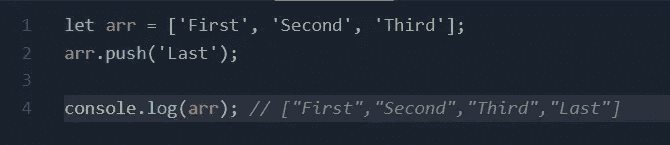

## 2.流行()

pop()方法移除数组的最后一项并返回移除的项。

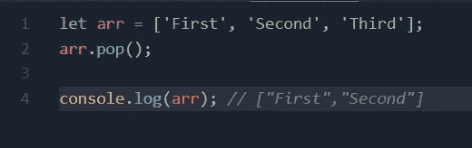

## 3.shift()

方法的作用是:从数组前面移除一个元素，并返回被移除的元素。

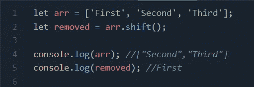

## 4.未发货(项目 1，项目 2，…，项目 n)

unshift()方法将该项添加到数组的前面，并将返回新的长度。

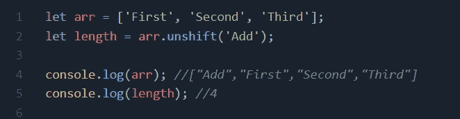

# 迭代数组项

## 1.forEach(回调(当前值) )

forEach()方法将对数组进行循环，并对每个数组项执行提供的函数。

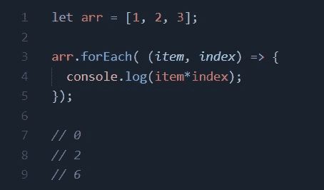

## 2.map(回调(当前值) )

map()方法对每个项目执行所提供的回调，并返回一个包含每个回调执行结果的新数组。

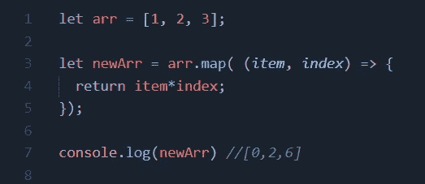

## 3.reduce(回调(累加器，当前值) )

该方法对每个项目执行一个提供的函数，并返回一个输出值。

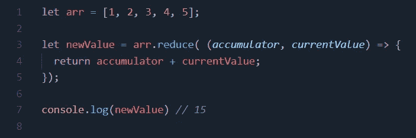

# 搜索数组项目

## 1.过滤器(回调(项目) )

该方法返回一个新数组，其中所有元素都通过了由所提供的函数定义的条件。

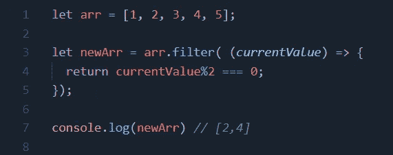

## 2.findIndex(回调(项目) )

该方法返回通过所提供条件的第一项的索引，否则返回-1。

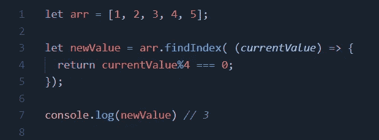

# 更改数组项目

## 1.拼接(开始，删除计数，项目 1，…，项目 n)

splice 方法修改(添加/删除)数组项，并返回一个包含已删除项的新数组。它可以执行多种操作，因此可以尝试不同的参数组合。它需要三个参数

**start** —数组将被改变的索引。

**deleteCount** —(可选)要从起始索引中删除的项目数

**物品，..，itemN** —(可选)在起始索引处添加的项目。如果没有提供，项目将被删除。

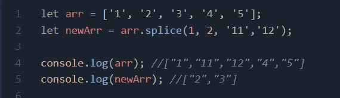

## 2.切片(开始，结束)

这个方法返回一个新数组，从索引开始到结束(结束索引除外)将所有项复制到这个数组中。

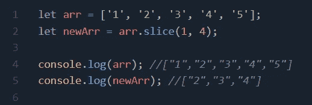

## 3.concat(项目 1，项目 2，…，项目 n)

此方法创建一个新数组，该数组包含原始数组中的值和作为参数提供的附加项。参数可以是数组或单个项。

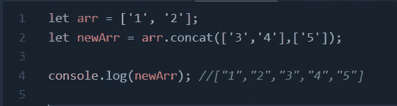

## 4.填充(值，开始，结束)

此方法通过用提供的值填充所有项来返回一个新数组。这有助于用默认值初始化数组。此方法更改原始数组。

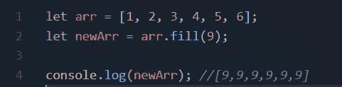

我已经介绍了一些日常最常用的方法。如果你有兴趣，可以在这里探索完整列表[。](https://developer.mozilla.org/en-US/docs/Web/JavaScript/Reference/Global_Objects/Array)

对于初学者来说，这看起来很难，也很难记住。但是一旦你开始使用它们，它会变得更容易，如果你忘记了什么，只要回到这里或使用其他方法提供的链接。

# 结论

数组方法使得使用它们变得容易，同时也保持了代码的整洁。我希望你今天能学到新东西。让我知道你是否喜欢这篇文章。

编码快乐！