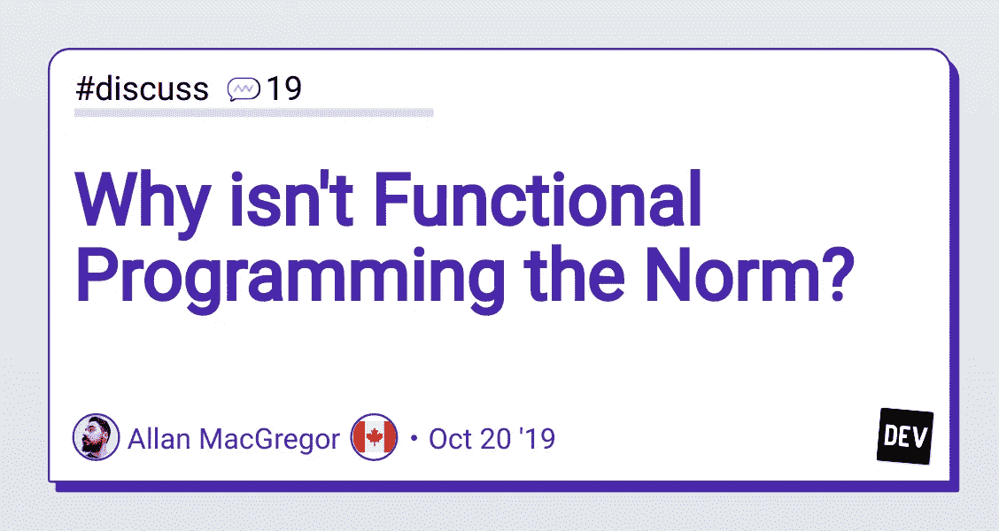

# 为什么你不了解函数式编程就不会成为软件主管，函数式编程不是编码的终极方式

> 原文：<https://medium.com/nerd-for-tech/why-you-wont-become-head-of-software-without-knowing-functional-programming-isn-t-the-ultimate-way-66c8b690c88c?source=collection_archive---------3----------------------->

## FP 是否会赢 OOP 以及何时会赢。

图片来自[开发社区](https://www.google.com/url?sa=i&url=https%3A%2F%2Fdev.to%2Fallanmacgregor%2Fwhy-isn-t-functional-programming-the-norm-4n9d&psig=AOvVaw3F1L5cQeH3HH3gSsDwqjgT&ust=1625729171055000&source=images&cd=vfe&ved=0CAoQjRxqFwoTCLjk-6G30PECFQAAAAAdAAAAABAD)，由[艾伦·麦格雷戈](https://dev.to/allanmacgregor)提问

在过去的几年里，我接触了很多函数式编程。我开始用 C 以命令式的方式编程，后来改用 Java 和 C#的面向对象编程。