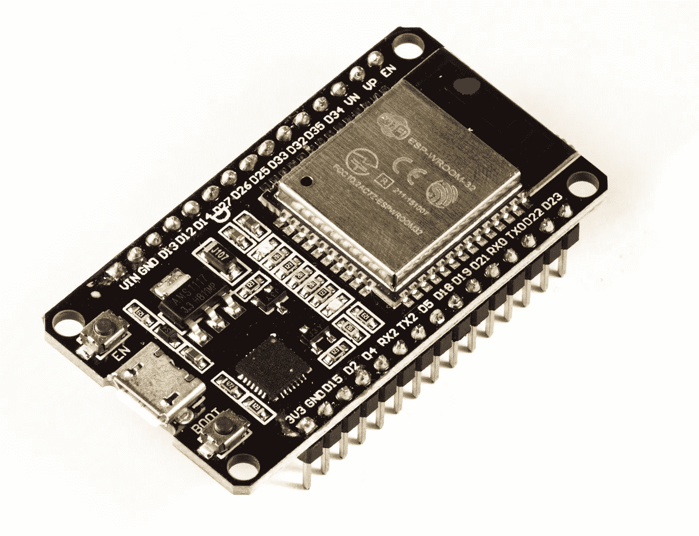

# 适用于 IOT 的 Wi-Fi 和蓝牙模块:ESP32，在印度购买

> 原文：<https://medium.com/nerd-for-tech/wi-fi-and-bluetooth-module-for-iot-esp32-de81c8e12e09?source=collection_archive---------9----------------------->

## ESP32 模块的完整细节，包括规格、价格、优缺点

ESP32 是一个集成 Wi-Fi 和双模蓝牙的芯片微控制器上的最小努力、低功耗框架的进步。ESP32 采用 Tensilica Xtensa LX6 微芯片，分为双核和单核两种，包括内置天线开关、射频巴伦、功率放大器、2.4 GHz 双模 Wi-Fi 和蓝牙芯片，采用 TSMC 40 纳米低功率技术，功率和射频特性最佳，安全可靠，可扩展至各种应用。支持三种模式:AP、STA、AP+STA。支持 Lua 程序，易于开发。功能强大，支持 LWIP 协议。

适用于 IOT 的 Wi-Fi 和蓝牙模块:ESP32

它的 SDK 固件用于编程，开源工具链基于 GCC 用于开发支持。它专为通用低功耗物联网传感器集线器、记录器、摄像机视频流、支持 Wi-Fi 和蓝牙的设备、家庭自动化和网状网络应用而设计，面向制造商、硬件工程师、软件工程师和解决方案提供商。

ESP32 由总部位于上海的中国机构 Espressif Systems 制造，由 TSMC 利用他们的 40 纳米工艺制造。它是 ESP8266 微控制器的替代产品。

# 规格:

## 处理器

*   CPU: Xtensa 双核(或单核)32 位 LX6 微处理器，工作频率 160 或 240 MHz，性能高达 600 [DMIPS](https://en.wikipedia.org/wiki/Dhrystone)
*   超低功耗(ULP)协处理器

## 记忆

*   520 KiB SRAM，448 KiB ROM

## 无线连接:

*   无线网络:802.11 宽带/宽带/无线
*   蓝牙:第 4.2 版 BR/EDR 和 BLE(与 Wi-Fi 共享无线电)

## 外围接口

*   多达 18 个通道的 12 位 SAR ADC
*   2 × 8 位 DAC
*   10 ×触摸传感器(电容感应 GPIOs)
*   4 × SPI
*   2 × I S 接口
*   2 × I C 接口
*   3 × UART
*   标清/SDIO/CE-ATA/MMC/eMMC 主机控制器
*   SDIO/SPI 从控制器
*   以太网 MAC 接口，支持专用 DMA 和 IEEE 1588 精确时间协议
*   CAN 总线 2.0
*   红外遥控器(TX/RX，最多 8 个频道)
*   电机 PWM
*   LED PWM(多达 16 个通道)
*   霍尔效应传感器
*   超低功耗模拟前置放大器

## 安全性

*   完全支持 IEEE 802.11 标准安全功能，包括 WFA、WPA/WPA2 和 WAPI
*   安全启动
*   闪存加密
*   1024 位 OTP，最高可为客户提供 768 位 OTP
*   加密硬件加速:AES、SHA-2、RSA、椭圆曲线加密(ECC)、随机数生成器(RNG)

## 动力管理

*   内部低压差调节器
*   RTC 的独立电源域
*   5 μA 深度睡眠电流
*   从 GPIO 中断、定时器、ADC 测量、电容式触摸传感器中断中唤醒

更多详情[点击这里](https://en.wikipedia.org/wiki/ESP32)或[这里](https://robokits.download/downloads/esp32_datasheet.pdf)。

## 在印度购买:

 [## SquadPixel Esp-32 Wifi、蓝牙、双核芯片开发板(ESP-WROOM-32)

### SquadPixel Esp-32 Wifi、蓝牙、双核芯片开发板(ESP-WROOM-32):亚马逊

amzn.to](https://amzn.to/3zJwDs0)  [## XCLUMA ESP32 ESP-32 ESP-32S ESP 32 开发板 CP2102 WiFi 蓝牙超低功耗…

### 购买 XCLUMA ESP32 ESP-32 ESP-32S ESP 32 开发板 CP2102 WiFi 蓝牙超低功耗双核…

amzn.to](https://amzn.to/3j0HuI6)  [## XCLUMA ESP32 ESP-32 ESP-32S ESP 32 开发板 CP2102 WiFi 蓝牙超低功耗…

### XCLUMA ESP32 ESP-32 ESP-32S ESP 32 开发板 CP2102 WiFi 蓝牙超低功耗双核(30…

amzn.to](https://amzn.to/3qfTOWq)