# 睁大激光雷达眼睛

> 原文：<https://medium.com/nerd-for-tech/wide-open-lidar-eyes-62079e0a4ebd?source=collection_archive---------0----------------------->

激光雷达和它们的“表亲”相机之间的一个主要区别是，我们在激光雷达的 3D 点云中获得了额外的维度。因此，在我以前的文章中，我分析了这个第三维度，既从[的角度分析了激光雷达应该“看到](/self-driving-cars/how-far-should-a-lidar-see-866b9debac7f?source=friends_link&sk=7bcb8c69bdd06a7504461bb58e3a2a94)多远，也分析了为什么在讨论距离性能时我们有一个[共同语言如此重要。](/nerd-for-tech/how-magically-increase-lidars-range-c990cd948873?source=friends_link&sk=845406065b31c4471e3bfcbb69237cab)

这一次，我想讨论激光雷达点云的水平维度，特别是 HFOV(水平视野)。

自从[威力登](https://velodynelidar.com/history/)在 2007 年展示了 HDL-64E，成为第一个商业化的、大规模生产的实时 3D 激光雷达以来，他们的大多数产品仍然是提供 360 度 HFOV 的旋转系统，也就是“旋转器”

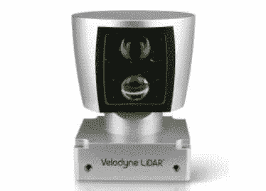

威力登 HDL-64E。来源:威力登激光雷达

同样的，其他很多公司，比如[驱逐者](https://ouster.com/products/)、 [Robosense](https://www.robosense.ai/en/rslidar/RS-Ruby) 、[何塞](https://www.hesaitech.com/en/Pandar40P)都是从 360 度系统开始的。因此，这些桶状系统成为自动测试车辆最知名的标识符之一。

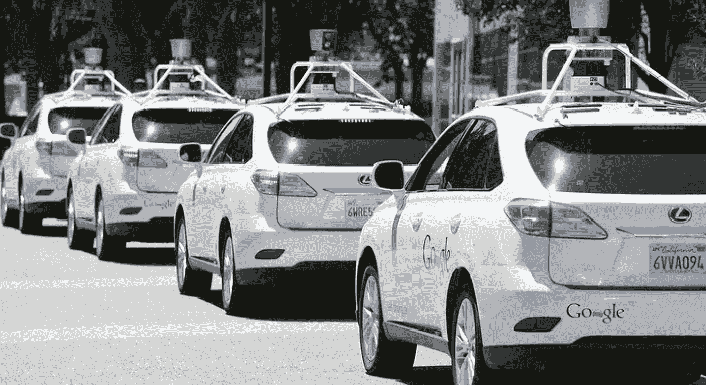

早期几代自动驾驶测试车辆。鸣谢:华尔街日报

然而，在过去几年中，我们看到大多数公司将机械扫描方法改为替代方法，主要是固态扫描技术，具有更窄的 FOV。

我将重复这一点:**大多数新系统的 HFOV 比早期的激光雷达要窄。**

此外，在目前公布的汽车激光雷达系统中，HFOV 值似乎存在相当大的差异，正如您在下图中看到的那样，我在图中展示了 88 种不同激光雷达系统或配置的 FOV 尺寸:

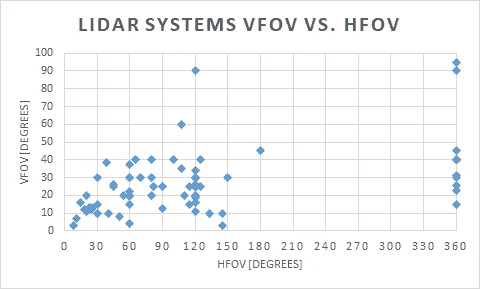

图表 1: HFOV 与 VFOV 分布

相应地，HFOV 和 VFOV 的中间值是 107 度和 25 度，而标准偏差值是 106 度和 16 度。

HFOV 值分布的另一种表示在下面的直方图中。与大多数供应商在 VFOV 数字上的一些一致形成对比的是，HFOV 值有显著的多样化:

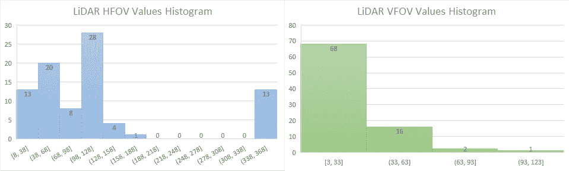

图表 2:激光雷达 FOV 值直方图

然而，当我们查看最近的 29 个设计项目时，根据[Yole dédevelopment](http://www.yole.fr/iso_album/illus_lidarfor_automotive_and_industrial_applications_designwins_yole_sept2021.jpg)的分析，其中 66%采用了机械扫描方法，包括旋转器。

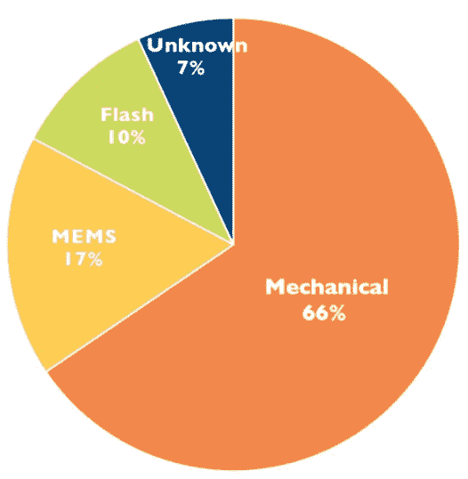

激光雷达设计赢得了迄今为止，由扫描技术分裂。学分:Yole dédevelop

因此，我提出两个问题:

1.  在大规模生产的消费类汽车应用中，我们的目标应该是回到更大的 360 度 HFOV 吗？
2.  如果激光雷达的 HFOV 可以窄于 360 度，“它的“眼睛”应该开多宽？换句话说，HFOV 的要求值是多少？

此外，我们应该如何定义激光雷达系统的 HFOV，这是另一个悬而未决的问题，但我将把它排除在本文的范围之外。

我将从第二个问题开始，因为它涉及到需求。接下来，我将检查 360 度系统是否符合这些要求。

# 激光雷达的“眼睛”应该有多宽？

要回答这个问题，我们首先需要定义适当的条件:

1.  车辆类型—私人车辆(消费车辆/乘用车)。
2.  激光雷达组件类型和位置—前视:在格栅处/挡风玻璃后面/屋顶位置。
3.  驱动域—见下文。
4.  场景定义—见下文。

# 驱动域选择

我们可以将汽车用例分为两大类:高速公路领域和城市领域。“高速公路领域”，我指的是高速[高速公路、高速公路、高速公路](https://en.wikipedia.org/wiki/Controlled-access_highway#Europe)等。“城市区域”是对公路的补充，包括城市、郊区、乡村道路和街道。

因此，在相关驾驶速度和车辆沿其路线可能遇到的潜在障碍种类方面，每个域中的条件显著不同。

例如，在城市区域，90 度交叉的情况非常普遍。因此，在城市区域中的 HFOV 要求将更高，以检测垂直接近的车辆。然而，这种情况与高速公路无关(根据[维也纳公约](https://en.wikipedia.org/wiki/Vienna_Convention_on_Road_Signs_and_Signals)的定义)，HFOV 的要求会低得多。相反，在高速公路上的行驶速度要高得多，这就需要比在市区更长的探测距离。

因此，通过分析这两个领域得出的产品需求会有所不同。有两个主要选项可以解决这个问题:

1.  在车辆中装配两种不同类型的系统，每个域一个。
2.  组装一个强大的系统。为了避免超出规格或低于规格，系统设计应包括两种类型的性能区域:城市区域的宽短程区域和高速公路区域的窄远程 ROI(感兴趣范围)区域。请参见下图中的示例:

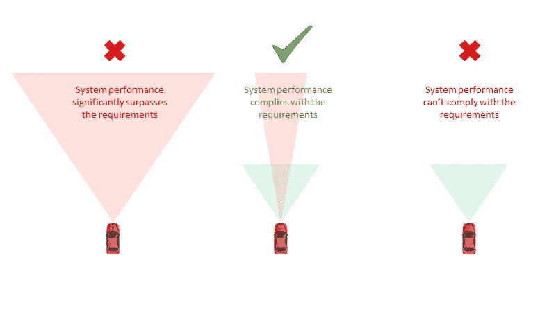

FOV 尺寸选项

每种选择的优点和缺点都是一篇全新文章的主题，所以我现在不讨论它们。出于营销原因，大多数数据表侧重于适用于城市领域的更广泛类型的 HFOV。因此，我也将分析这个用例，而不是更狭窄的 ROI 需求。

# 场景定义

正如我之前提到的，就 HFOV 而言，激光雷达系统最具挑战性的场景之一是交叉口。

当两辆车接近十字路口时，我们可以在它们之间画一个假想的三角形，称为“清晰视野三角形”，确保两辆车(或感知套件)都能看到对方。

具体来说，在无控制或让行控制交叉口的情况下，相关的畅通视距三角形被称为“进近视距三角形”平行的，在一个停止控制的十字路口使用了“偏离视线三角”AASHTO(美国州公路和运输官员协会)在其关于几何高速公路和街道的[政策(2018 年，第 7 版)](https://aashtojournal.org/2018/09/28/aashto-releases-7th-edition-of-its-highway-street-design-green-book/)中对这两者进行了定义，也被称为“绿皮书”或“道路设计的圣经”。

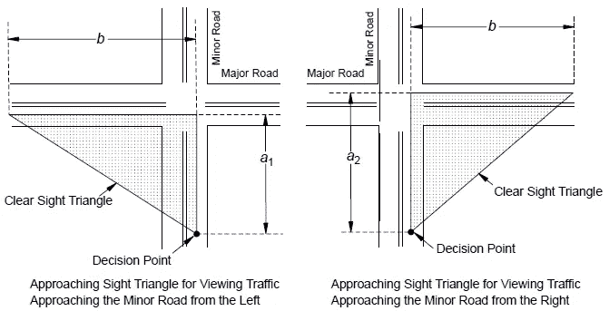

进近目视三角形(非控制或产量控制)。鸣谢:AASHTO

有十种不同的交叉场景，但我将只分析其中最极端的两种:

*   **在不受控制的十字路口左转**——此时，自我车辆的速度最高。
*   **在让行控制的十字路口左转**——在这种情况下，需要最长的清晰视线三角形腿，从而导致更大的视角，即使与停车控制的十字路口或交叉机动相比。

城市场景中的假设驾驶条件:

*   中挡行驶速度:100 公里/小时(一个足够高的估计值，基于[全球城市限速](https://en.wikipedia.org/wiki/Speed_limits_by_country)
*   主干道上需要穿越的车道数:4
*   道路坡度:-5%(道路倾斜度的测量值，[来源](https://www.civillead.com/road-gradient/))
*   路面:潮湿

# 在不受控制的十字路口左转

在这种类型的交叉路口中，车辆的驾驶员或感知算法应该能够在到达交叉路口之前有足够的时间来检测潜在的冲突车辆以停车。因此，我们需要计算进近目视三角形的边，然后计算它们之间的角度。

第一段对应于本车的停车距离。为了计算它，我使用了我在[“激光雷达应该“看”多远？”中提出并解释的相同公式](/self-driving-cars/how-far-should-a-lidar-see-866b9debac7f?source=friends_link&sk=7bcb8c69bdd06a7504461bb58e3a2a94):

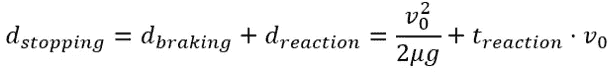

*   摩擦系数——对于潮湿的沥青路面，平均摩擦系数为 0.5(参见(“多远…”中的表格)。
*   初始速度——根据 AASHTO，现场观察表明，接近无控制交叉口的车辆通常会减速到其中间路段行驶速度的大约 50%。即使不存在潜在的冲突车辆，这种情况也会发生。我将对自我车辆使用这种统计估计，但我采取了一种更保守的估计，即对面汽车中的人类驾驶员仅减速 25%。因此，行驶速度相应地为 50 公里/小时和 75 公里/小时。
*   反应时间—算法的反应时间小于 200 毫秒。然而，我假设 2.5 秒的反应时间要长得多，以避免突然刹车和惊吓对面车辆的驾驶员，他们可能会看到一辆车在十字路口超速行驶，直到最后才开始刹车。

因此，使用上面的公式，我们可以计算出自我车辆在潮湿道路上的总停车距离为 54.4 米

为了找到畅通无阻三角形的另一条边，我需要计算对方车辆在我们的车辆停下来所需的相同时间内通过的距离。我知道第二辆车的速度，但我需要计算总的停车时间:

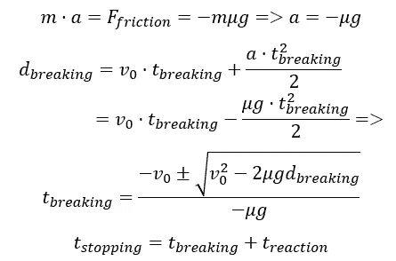

通过使用我上面假设的数字，停止持续时间是 5.3 秒。同时，对面车辆以 75km/h 通过 111.1m。

最后，我们有清晰可见三角形的两条边，并且可以使用简单的三角学计算出它们之间的角度是 64 度，这意味着整个所需的 **HFOV 是 128 度。**

这一结果涵盖了大多数相关用例，例如:

*   在不受控制的十字路口右转和交叉操作。
*   次要/主要/所有道路上有停车控制的交叉口。
*   有交通信号控制的交叉口。
*   环形路。
*   主干道左转。

但是，带有产量控制的交叉口我们需要单独分析。

# 在让行控制的交叉路口左转

为了使事情更简单、更简短，为了计算行程，在这种情况下，我使用“绿皮书”中介绍的经验法则

假设驾驶员转弯时不停车，转弯速度将降至 16 km/h，则次要道路沿线的路段长度应为 15m。

乘用车在坡度为 5%的四车道上左转所需的时间为 8.9 秒。你可以[联系我](http://www.linkedin.com/in/dima-sosnovsky)了解详细的计算方法或者查看“绿皮书”中的第 9.5.3 章

在这段时间间隔内，对方车辆行驶了 247.2 米，这意味着我们的视距三角形角度为 86.4 度，总的**所需 HFOV 几乎为 173 度**。

这是巨大的！

# 如何支撑如此庞大的 HFOV？

尽管实现 128 度的 HFOV 很有挑战性，但这是可行的。此外，如果我们再看一下统计数据，许多现有的系统已经达到了这个范围:

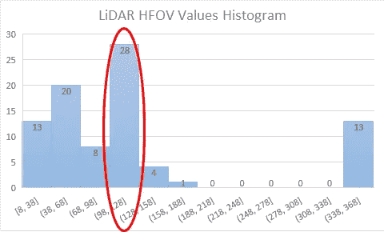

128 度的要求符合统计数据

然而，主要由于成本和效率的原因，173 度对于大多数扫描技术来说是不切实际的…除了机械扫描。

173 度的要求可能是自动测试车辆车顶上旋转“桶”变得如此独特的原因吗？

简短的回答是——不。下面是更长的答案。

# 解析“水桶”

尽管机械扫描系统拥有无与伦比的大 HFOV，但当我们考虑大规模生产消费车辆时，它有几个致命的缺点:

1.  **价格** —由于光学机械的复杂性，旋转器的组装、校准和校准成本高于其他技术。
2.  **可靠性** —由于旋转器包括一个巨大但脆弱的移动光学模块，它们对机械振动和冲击的可持续性很低。
3.  **设计—** 尽管 spinners 是测试车辆的标准配置，但消费者在他们的私家车中接受它们的可能性相当低。值得提醒的是，汽车制造商(OEM)中最先采用激光雷达传感器的是高端供应商，如宝马、奥迪和沃尔沃。在这些车辆中，圆滑的设计是所需组件的一部分。因此，这些原始设备制造商的目标是尽可能无缝地集成传感器，这在屋顶组装“桶”时是不可能的。

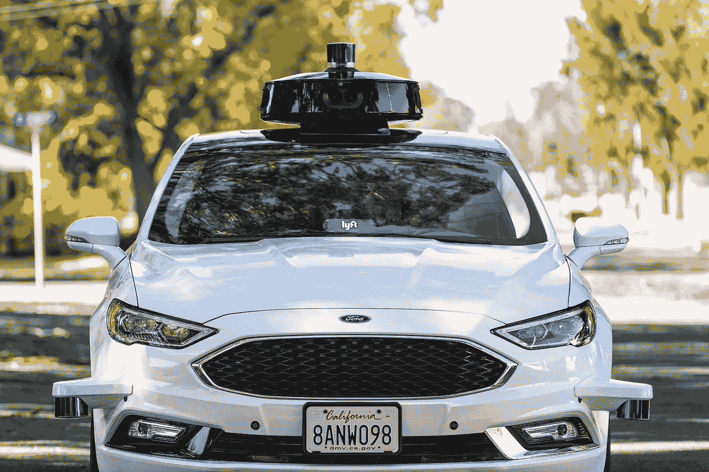

消费级汽车的不那么时尚的设计。鸣谢:Cnet 路演

最后，由于在车顶安装 360 度传感器是不可行的，所以需要沿着车辆周边进行无缝集成。但是，在这种情况下，大约一半的 FOV 被封锁了。

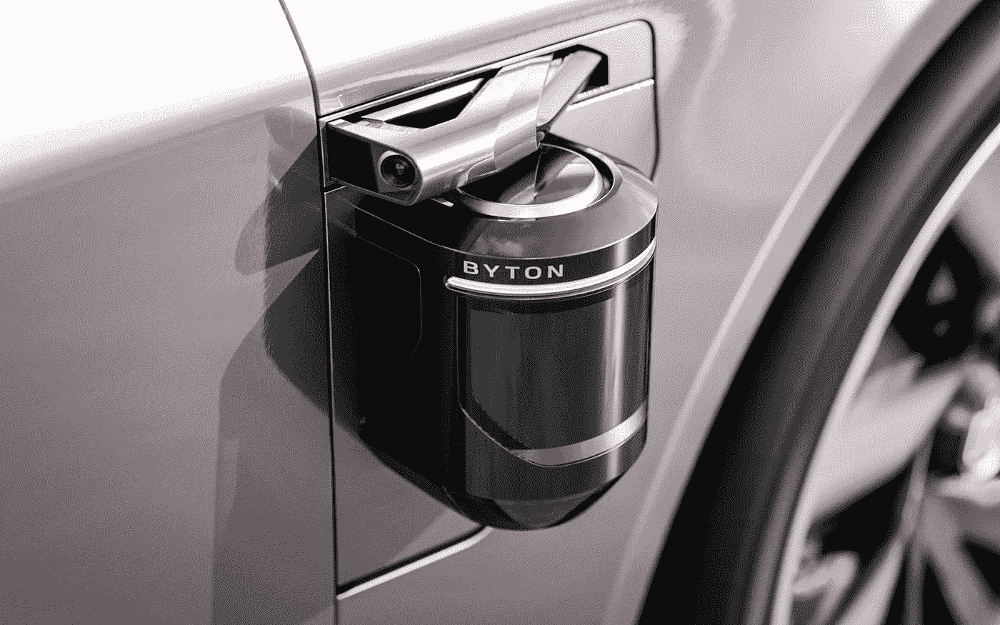

糟糕的是，激光雷达无法透视车身。学分:Slashgear.com

**因此，尽管符合 173 度 HFOV 要求，但机械扫描系统并不适合消费车辆。**

相反，应使用替代解决方案覆盖车辆周围环境，例如组装几个激光雷达系统的外壳，如下图所示:

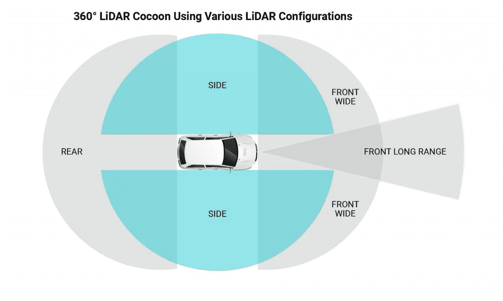

激光雷达在车辆中的装配配置示例。鸣谢:LeddarTech

注意:360 度传感器对于 [robotaxis](https://www.theverge.com/2021/9/6/22659306/vw-autonomous-id-buzz-reveal-argo-iaa) 或[自动驾驶卡车](https://www.prnewswire.com/news-releases/kodiak-robotics-unveils-its-next-generation-autonomous-truck-with-plans-to-more-than-double-its-self-driving-fleet-301386504.html)来说可能仍然是一个可行的选择，这些地方对价格、设计甚至振动(对于 robotaxis)的要求都比较宽松。

# 我们应该进一步分割 HFOV 吗？

如果我们认为茧是符合 173 度要求的可接受的解决方案，为什么我们不能将 FOV 分成更多的部分，使用更多的系统和更窄的 HFOV 呢？例如，使用两个 HFOV 为 64 度的系统，而不是一个 128 度的系统。

主要原因是效率。单个系统将比几个系统累积覆盖类似的 FOV 更有效，主要原因如下:

*   **价格** —通过减少系统数量来减少组件数量、缩短测试程序和削减运营开销，有助于降低成本。
*   **机械尺寸** —单一外壳和通用内部组件有助于减小尺寸。
*   **布线** —单一系统要求车内布线较少，这对原始设备制造商来说是个大问题。
*   **同步** —单个系统需要与车辆中的其他传感器同步。
*   **ROI 整合** —与位于角落的两个系统相比，使用单个前视系统整合车辆前方的 ROI 区域更加简单。此外，宽段和 ROI 段都可以在单个前视系统中实现，而当两个系统组装在角落时，最有可能需要第三个系统用于 ROI。
*   **最关键方向的最佳性能** —在许多系统中，FOV 边缘的角度或范围性能略低于中心，主要是光学原因。在车辆的拐角处装配两个系统意味着 FOV 的边缘覆盖了车辆的前部。

总之，最佳系统应符合大多数要求，但避免超出规格。就我们的问题而言，在我看来，车辆前部具有 128 度 HFOV 的单个系统将比两个各覆盖 64 度的系统更具成本效益。另一方面，三个 120-130 度覆盖车辆周围环境的系统比两个 180 度系统更好。这是由于与超宽 FOV 系统设计相关的价格、可靠性和设计问题。

# 摘要

在本文中，我介绍了分析汽车激光雷达水平视场(HFOV)要求的方法和主要考虑因素。根据我展示的使用案例，您可以看到**激光雷达 HFOV 的最实际要求是大约 128 度，特别是当使用固态扫描技术实现它时。**

你有什么意见或问题吗？你想看看图表 1 和图表 2 中系统的统计数据吗？[在 LinkedIn 上联系我](http://www.linkedin.com/in/dima-sosnovsky)！

*花絮事实:* [*光探测和测距技术在高速公路安全中的应用*](https://www.researchgate.net/publication/245560573_Application_of_Light_Detection_and_Ranging_Technology_to_Highway_Safety) *的作者在 2002 年使用激光雷达系统测试清晰的视线三角形，* ***两年前*** *第一次* [*DARPA 大挑战赛*](https://en.wikipedia.org/wiki/DARPA_Grand_Challenge#2005_Grand_Challenge) *，在任何人考虑使用它们进行自动驾驶之前。*

*免责声明:本文中执行的分析是高层次的，主要目的是呈现思维方式和原理计算。它不应该被认为是真正的产品设计。*