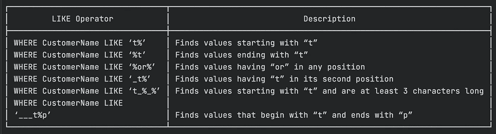
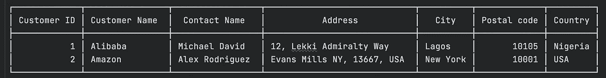

# 通配符和 MySql，天上人间的爱情故事

> 原文：<https://medium.com/nerd-for-tech/wildcards-and-mysql-love-story-made-in-heaven-9848b3a6c568?source=collection_archive---------4----------------------->

通配符是可以用来替换字符串中一个或多个字符的字符。为了增加结构化查询语言的结构，可以使用两个主要的通配符“_”和“%”。MySql 中的通配符为多变量数据过滤提供了一个轻松的选项，让我们深入了解一下


[阿里·卡扎尔](https://unsplash.com/@lureofadventure?utm_source=medium&utm_medium=referral)在 [Unsplash](https://unsplash.com?utm_source=medium&utm_medium=referral) 上的照片

## Like 运算符

LIKE 操作符允许在 MySql 中使用通配符。在 WHERE 子句中，LIKE 运算符用于在列中查找特定的模式。下面是 sql 中常用的通配符

```
┌────────┬────────────────────────────────────────────────────┐
│ Symbol │                    Description                     │
├────────┼────────────────────────────────────────────────────┤
│ %      │ Can symbolize or represent zero or more characters │
│ -      │ Stands for a single character                      │
│ [char] │ Character combinations and ranges to correspond    │
│ ^      │ Indicates the next value/range to be ignored       │
└────────┴────────────────────────────────────────────────────┘
```

通配符可以与多种模式结合使用，下面是一些例子。



## ***我们来练习一下***

下面是示例数据库，我们将使用它来了解有关通配符的更多信息



演示台

*以下 SQL 语句选择城市以字母“lag”开头的所有客户:*

```
SELECT * FROM Customers WHERE City LIKE ‘lag%’ ;
```

*下面的 SQL 查询选择城市包含模式“os”的所有客户:*

```
SELECT * FROM Customers  WHERE City LIKE ‘%os%’ ;
```

*下面的 SQL 查询选择城市以任意字符开头，后跟“agos”的所有客户*

```
SELECT * FROM Customers WHERE City LIKE “_agos” ;
```

*下面的 SQL 查询选择所有城市以“B”开头，然后是任意字符，“r”，然后是任意字符，最后是“in”的客户:*

```
SELECT * FROM Customers WHERE City LIKE ‘B_r_in’ ;
```

*从“Contacts”表中获取满足以下条件的所有行；*

1.“联系人姓名”必须以字母“a”或“m”或“c”开头

```
SELECT * FROM Contacts WHERE contact_name LIKE ‘[amc]%’;
```

2.“联系人姓名”不得以字母“a”、“m”或“c”开头，

```
SELECT * FROM Contacts WHERE contact_name LIKE ‘[^amc]%’;
```

> 注:`^`可以与`！“也一样，仍然做着同样的工作

通配符有助于我们过滤数据，并可以多种方式用于优化 SQL 性能，请分享您的想法，干杯！