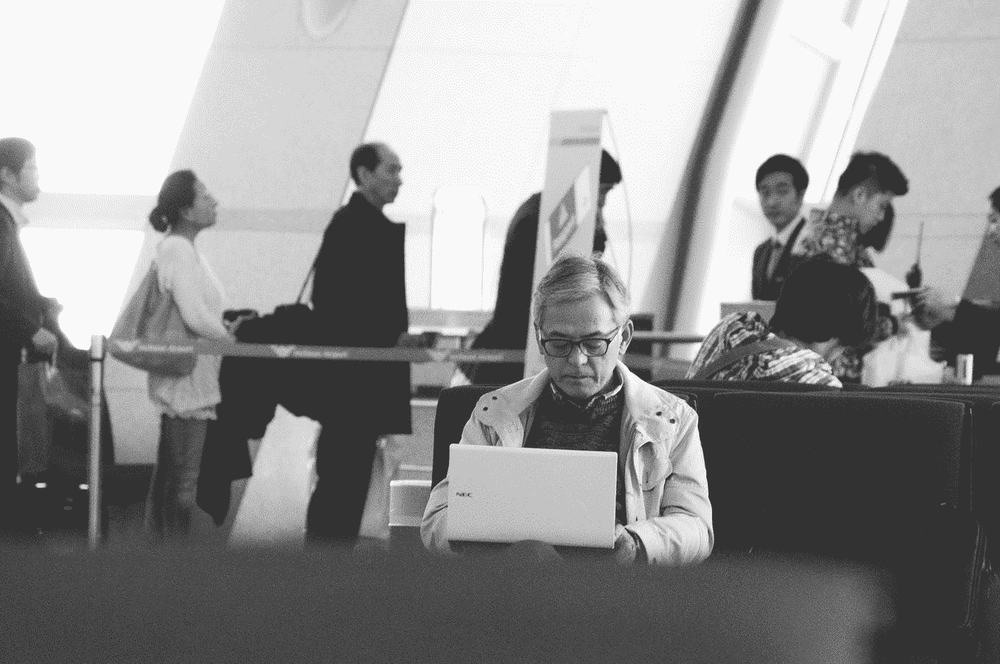

# 微软的一项新专利会带来数字僵尸时代吗

> 原文：<https://medium.com/nerd-for-tech/will-a-new-patent-from-microsoft-bring-the-era-of-digital-zombification-e64eb2b08875?source=collection_archive---------13----------------------->

## 新技术和与死者交流

普里西拉·杜·普里兹在 [Unsplash](https://unsplash.com?utm_source=medium&utm_medium=referral) 上的照片

为了利用人工智能(AI)创造个性，微软最近批准了一项[专利](https://pdfpiw.uspto.gov/.piw?PageNum=0&docid=10853717&IDKey=6E72242A6301&HomeUrl=http%3A%2F%2Fpatft.uspto.gov%2Fnetacgi%2Fnph-Parser%3FSect1%3DPTO2%2526Sect2%3DHITOFF%2526p%3D1%2526u%3D%25252Fnetahtml%25252FPTO%25252Fsearch-bool.html%2526r%3D31%2526f%3DG%2526l%3D50%2526co1%3DAND%2526d%3DPTXT%2526s1%3Dmicrosoft.ASNM.%2526OS%3DAN%2Fmicrosoft%2526RS%3DAN%2Fmicrosoft)，该专利可以使用你的数字遗骸(社交媒体、文本、电子邮件和其他个人数据)结合生成的图像和全息图来…