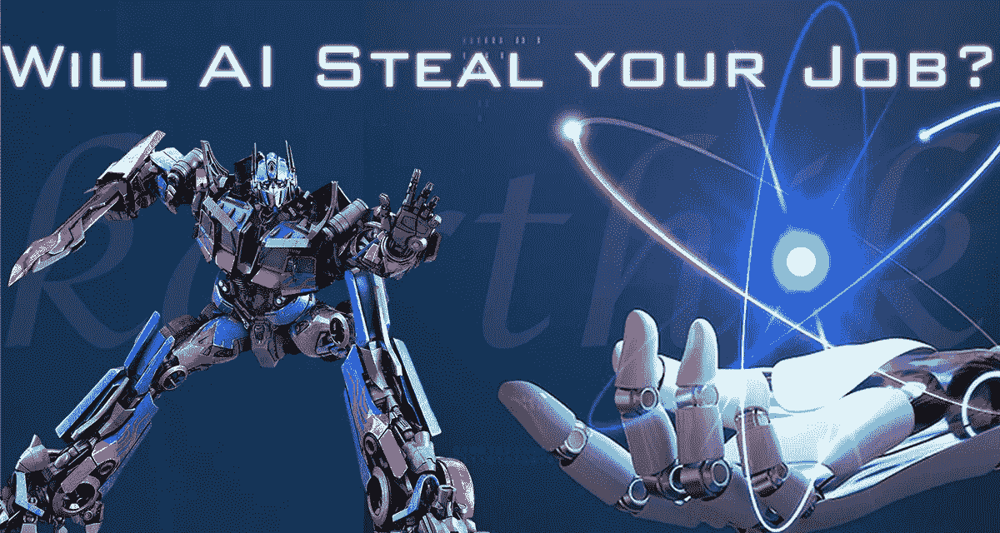
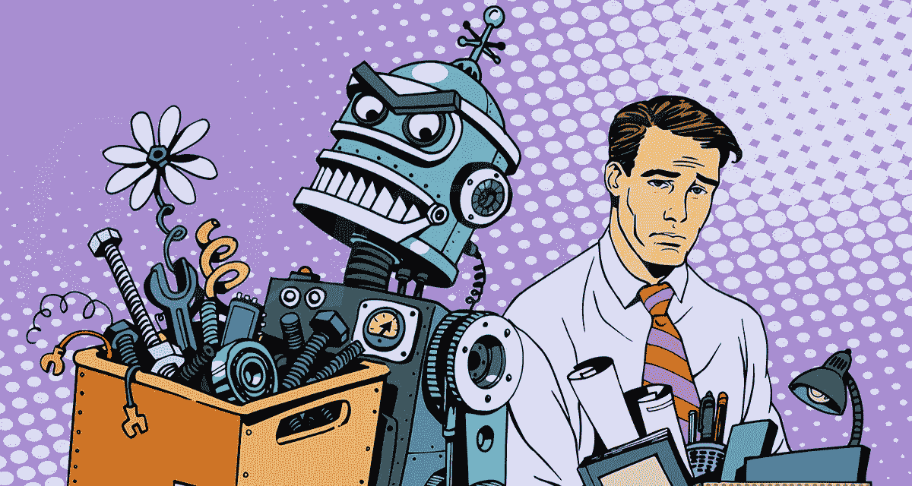
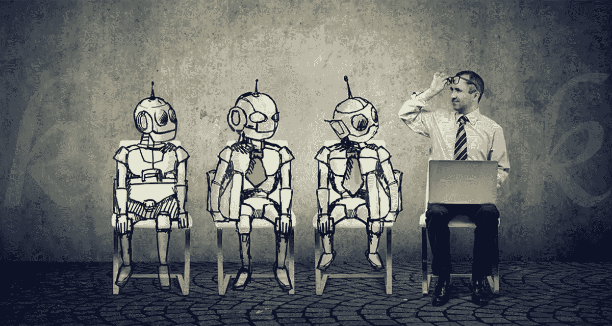
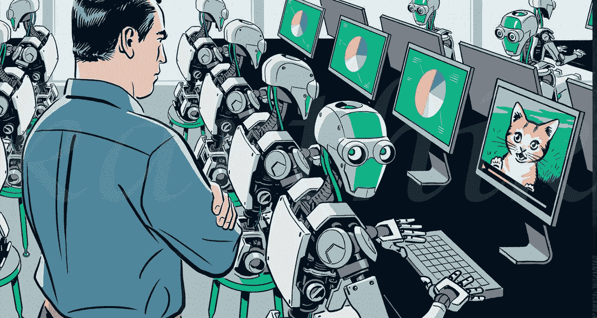
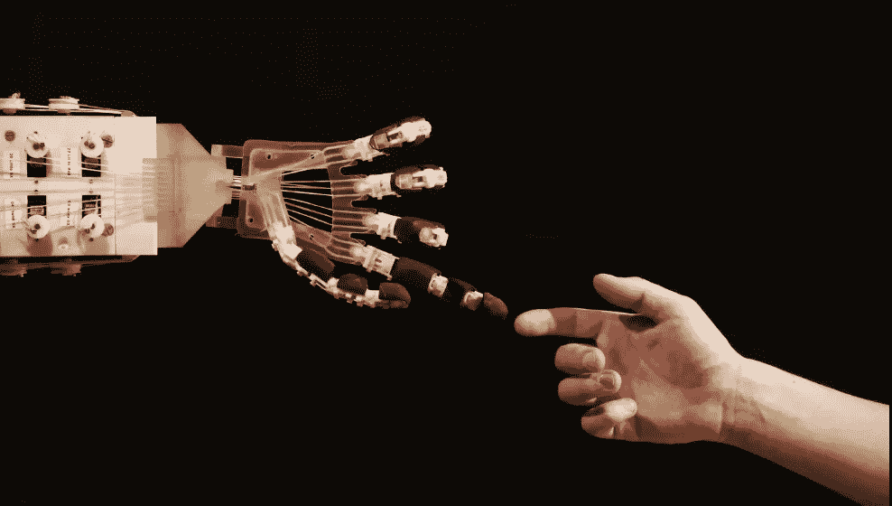

# AI 会抢你的饭碗吗？

> 原文：<https://medium.com/nerd-for-tech/will-ai-steal-your-job-e64a3971398?source=collection_archive---------1----------------------->

## 人工智能会取代设计师的角色吗？

AI 会抢你的饭碗吗？

## 设计就是以艺术、模型或数字资产的形式传递创意，以表达客户的感受和需求，满足客户的要求。

设计师是一个将自己的创意转化为理想原型，以满足客户需求的人。

人工智能(AI)一词是近来在各个领域广为人知的术语，在各行各业广受欢迎。机器学习的出现通过执行指令代码来完成特定任务，使人类生活变得简单。机器学习的这种动态潜力为人工智能统治整个行业的每个领域铺平了道路。同样，人工智能也在设计领域发挥着重要作用。许多开发人员接受并采用了深度学习的概念来产生他们最有效的设计。此外，这个人工智能比人类聪明得多。相比之下，人工智能比人工设计师花费最少的时间来生成所需的产品设计。这使得许多企业主将他们的注意力转向人工智能，这种情况肯定会用人工智能取代设计师。人工智能的崛起将对各行业的大量工人构成巨大威胁，他们的工作安全面临更高风险。

> 实践经验是了解机器人学所有跨学科方面的最佳途径——罗德尼·布鲁克斯

**人工智能如何影响设计领域？**

众多基于人工智能的设计软件的出现提高了公司的整体生产力。一个人要花一周多的时间来渲染一组 20 种不同的设计，但是一个人工智能工具可以在很短的时间内生成这些东西。这些是一个新兴设计师在他的人工智能职业生涯中可能面临的一些因素。在这个基于人工智能的设计软件的帮助下，你不需要成为 photoshop 或其他任何设计软件的专家来渲染你的设计原型。与该软件集成的特定机器人允许每个人只需点击一下就可以生成设计。这些人工智能使整个过程变得简单，可以在几分之一秒内得到想要的输出。这些单个人工智能可以完成 20 多个男人的全部工作。

你认为这个人工智能会取代设计师的工作吗？

**人工智能如何影响设计领域**

**AI-designer 的缺点？**

通过构建这组代码，你可以指示机器人(AI)交付你的设计原型的输出，但这甚至无法与人类思维产生的创造力相匹配。有了人工智能，你只需轻轻一点，就可以设计出数以千计的设计，但设计的质量将无法确定。很难改变或重新设计已经存在的人工智能生成的设计，因为它的内置算法不允许你在一生中重复使用同一张图像超过一次。

设计人工智能不会理解客户的需求。对于项目经理来说，向 ML embedded bot 解释产品的基本需求将是一项繁忙的任务。

尽管设计机器人很聪明，但我们不能指望他们有创造性的设计，他们会用默认的内置指令来生成产品设计。这将在产品设计的质量和数量之间产生巨大的差距。所以在目前的市场上，对熟练的设计师有巨大的需求。全球企业家还没有准备好依靠机器人来培养熟练的人类设计师。所以机器人不可能失业。

许多人工智能设计应用程序、软件和 discord 频道的出现使得设计过程变得简单，任何人都可以制作他们的设计。所以这将给即将到来的崭露头角的设计师带来激烈的竞争。

那么解决办法是什么呢？如何克服这种情况？

在任何行业，最重要的是技能发展。我建议所有的设计爱好者随着人工智能的提示更新他们的技能，以掌握他们的设计领域。想象一个同时具备手动和自动技术技能的人是必然的。希望与内置人工智能设计机器人合作的设计师将被视为不朽的设计师，他们的创造力和机器学习提示将使他们能够产生非凡的设计。

## 术语“人工智能会偷走每个人的工作”是真的！

即将到来的技术世界将依赖于自动化过程。机器人将在其中扮演重要角色。不需要恐慌，他们只会取代蓝领工作角色，但管理角色，如艺术总监、prompt embedder(开发人员)和其他白领工作对设计工程师开放。你只需要更新你的技术技能和创造性的设计知识。其他操作工作可以由人工智能自动化，但创造性的设计工作无法与人类的完美相匹配。

**人类 vs 机器人:**

人工智能机器人在行业内兴起的主要目的是减少人力资源的使用。除此之外，机器人不可能比人类更好。人类是地球上唯一拥有六种感官、领导力和广泛解决问题能力的生物。

我们不能指望一台被感知的机器有这样的品质。

例如:骑师对于赢得一场赛马是多么重要，同样，需要一个人类设计师/开发人员来处理这样强大的人工智能。

**人类 vs 机器人**

机器人是为执行汽车重复性操作任务而制造的。设计工程师需要通过提示给机器人输入创造性的设计思想，以产生动态的设计元素。设计师的经验很重要，他们的整体经验对项目的成功起着至关重要的作用。

> 机器人必须服从人类给它的命令，除非这些命令与第一定律相冲突——艾萨克·阿西莫夫

**结论—博客成果:**

我们已经得出了我们博客的结果。人工智能使用的增加将提高组织的整体生产力。同时，没有设计师的监控，很难实现这样的动态生产。要在不升级的情况下完成一个成功的项目，需要一个有 6 种感觉的人脑。

设计师和 AIs 之间的技术协调

设计师和人工智能之间的技术协调将有助于项目取得巨大成功。在即将到来的世界里，机器人将帮助我们完成不可思议的事情。创造性的头脑和巨大的力量将使我们的未来更加强大。因此，我对这场辩论的最后一个想法是，人工智能机器不会取代或窃取或抢走或接管设计师的工作，而是两者将共同努力，开创未来的技术世界。