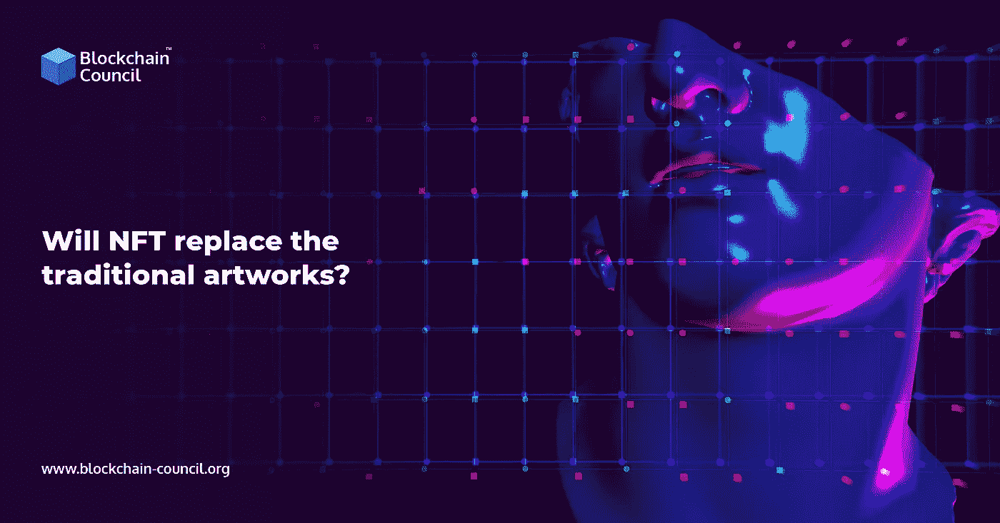

# NFT 会取代传统艺术品吗？

> 原文：<https://medium.com/nerd-for-tech/will-nft-replace-the-traditional-artworks-ac3088f28587?source=collection_archive---------2----------------------->

不可替代的代币艺术品，或 NFT 艺术，已被证明是现代艺术家在获得网上人气的同时获得加密货币奖励的一种奇妙方式。

另一方面，NFT 艺术的兴起引发了一场讨论。NFT 真的是艺术品吗？它们与古典艺术的世界有什么共同之处？未来是否有望进一步升值？我们来看看非传统艺术和它们与艺术世界的关系，以及它们是如何被估价的。

阅读更多-[2021 年 NFT 五大钱包 2022 年盘点](https://www.blockchain-council.org/nft/top-5-nft-wallets-of-2021-to-check-in-2022/)

NFT 是非常罕见的数字代币，只限量发行。近年来，这个词无疑已经成为最流行的流行语之一。这在很大程度上是因为它非常有利可图。

部分原因是 NFT 世界承诺将创造力与尖端的区块链技术相结合，这种说法迅速传播开来。 [NFT 项目](https://www.blockchain-council.org/blockchain/top-nft-projects-you-must-know-in-2021/)并不是一个新概念，但它们的受欢迎程度已经见证了它们被各种行业所采用，从娱乐到体育。

非功能性交易在 NFT 市场进行，这是一个专门的平台。其中一些令牌，如游戏 NFT，在生态系统中有一个用例。其他的则因其所谓的艺术价值和大量粉丝的支持而被高价出售。

# **NFT 有能力打压艺术品市场吗？**

NFT 似乎解决了艺术市场背景下的一个现实问题。数字文件，因此也是数字艺术，通常可以被自由复制、下载和再分发。NFT 增加了两个关键特征:它们通过证明所有权增加了一层真实性，它们通过将每个数字艺术品的所有者数量限制在一个或几个来产生稀缺性。这种所有权证明和稀缺性创造的结合使得数字艺术可以像非数字艺术作品一样被收集和交换。

NFTs 也可能在其他方面对艺术产业造成破坏。首先，它们可能会导致艺术品交易和定义方式的转变。数字艺术家可以通过一个平台直接卖给收藏家，绕过画廊和经销商。这可以解释为什么拍卖行如此渴望进入这个行业，以确保他们不被忽视。

了解更多- [什么是 NFT 市场，你如何创建自己的市场？](https://www.blockchain-council.org/nft/nft-marketplace/)

第二，NFT 合约可能包括一项自动功能，让艺术家在任何转售交易中分得一杯羹。这对艺术家极为有利，因为他们过去并不总是从出售自己的作品中获益。

# **结束**

包括皮普尔在内的许多其他人认为这是一个泡沫。有几个重要的问题或风险，潜在的 NFT 买家应该知道。首先，不清楚当前的市场活动有多少是由收藏家(他们对潜在的艺术品或物品真正感兴趣)与投机者和密码爱好者(他们只是想推高价格)推动的。一些人认为 NFT 的大部分交易都是一场闹剧，但是那些购买的人也在跟着他们一起笑。他们很清楚在一条微博或一张数码照片上花这么多钱是荒谬的，但这很有趣。这种情况与加密货币有相似之处:尽管一开始只是一个笑话，但 Dogecoin 的价值最近已经飙升。

NFT 培训正在兴起。立即报名参加 [NFT 课程](https://www.blockchain-council.org/certifications/certified-nft-expert/)并开始学习。