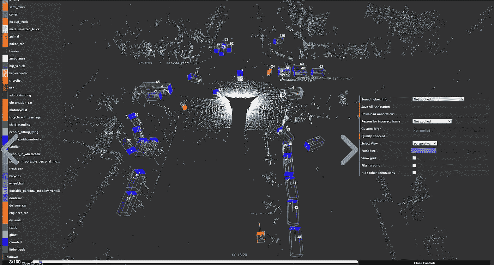

# 今年会是自动驾驶行业的转折点吗？

> 原文：<https://medium.com/nerd-for-tech/will-this-year-be-a-turning-point-for-the-autonomous-driving-industry-75ddac7b0e1f?source=collection_archive---------4----------------------->

字节桥 3D 点云标注服务

2022 年，世界各地的汽车制造商开始积极致力于自动驾驶项目。今年 4 月 20 日，全球领先的自动驾驶全栈解决方案提供商之一 DeepRoute 宣布，搭载 DeepRoute-Driver 2.0 产品的 30 台 L4 级自动驾驶单元正式投入 RoboTaxi 运营。据报道，预计到 2024 年，搭载 DeepRoute L4 级自动驾驶解决方案的车辆将开始量产，并大规模进入市场。

去年 6 月，中国科技巨头百度和中国汽车巨头 BAIC 旗下领先的可再生能源汽车公司 ARCFOX 旗下的自动驾驶平台百度阿波罗(Baidu Apollo)正式发布了新一代大规模生产的共享无人驾驶汽车阿波罗月球(Apollo Moon)，预计将在三年内登陆 1000 辆共享无人驾驶汽车。

此外，奥迪还推出了三款 SPHERE 系列车型，具备先进的 L4 自动驾驶能力，将于 2025 年左右成为量产车型。为了实现量产目标，厂商建立了合资企业、自动驾驶技术研究所等。，招募人才，投入大量 R&D 资金进行自动驾驶算法培训。

例如，传统一级汽车供应商 Aptiv 与韩国现代汽车成立自动驾驶合资公司，整合自动驾驶初创企业 NuTonomy 的相关资源，目的是开发 L4 和 L5 自动驾驶技术。新合资公司总部位于美国波士顿，将于 2022 年为 RoboTaxi 供应商、车队运营商和汽车制造商提供大规模生产的自动驾驶系统。

随着对自动驾驶的关注度越来越高，相关行业也在快速响应。具有代表性的激光雷达制造商 Innovusion 最近开发了一款大型汽车级 1550nm 激光雷达。据说，当年产量达到 10 万台时，激光雷达的价格将降至 1000 美元左右。

[专业自动驾驶数据标注提供商 ByteBridge](https://tinyurl.com/2bvbp7k7) 近日宣布，他们为自动驾驶初创团队提供咨询服务。自动驾驶算法训练和驾驶安全直接关系到训练数据的质量。另外，[数据标注](https://tinyurl.com/2bvbp7k7)通常会占用相对较高的 R & D 成本。早期的良好数据收集和标记方案在成本节约和算法训练效率方面起着关键作用。[字节桥](https://tinyurl.com/2bvbp7k7)表示相关标注需求明显增加，将继续积极响应市场需求。

数据显示，2022 年全球自动驾驶市场规模将达到 1629 亿美元，同比增长约 14%。预计 2030 年全球自动驾驶市场规模将达到 32197 亿美元。在自动驾驶数据标签方面，预计到 2028 年，美国自动驾驶数据标签市场将增长 35%。至于自动驾驶设备，预计 2030 年全球激光雷达市场将超过 100 亿美元。

在产量方面，全球自动驾驶汽车市场预计将从 2021 年的 2030 万辆增长到 2030 年的 6240 万辆，CAGR 为 13.3%。到 2030 年，高级自主车(L3、L4)销量将占乘用车总量的 50%。

2022 年能否成为自动驾驶行业的转折点取决于几个因素:第一是技术层面上的驾驶安全，第二是实现量产并充分降低成本，第三是自动驾驶的正式合法化。自动驾驶技术的发展除了行车安全、成本、法规之外，还需要整个生态系统的成熟。自动驾驶需要主机厂、自动驾驶技术公司、传感器制造商、数据服务提供商等多个行业的共同推动和发展。

如果您需要数据标注和采集服务，请查看 [bytebridge.io](https://tinyurl.com/2bvbp7k7) ，**有明确的定价(含人工成本)。**