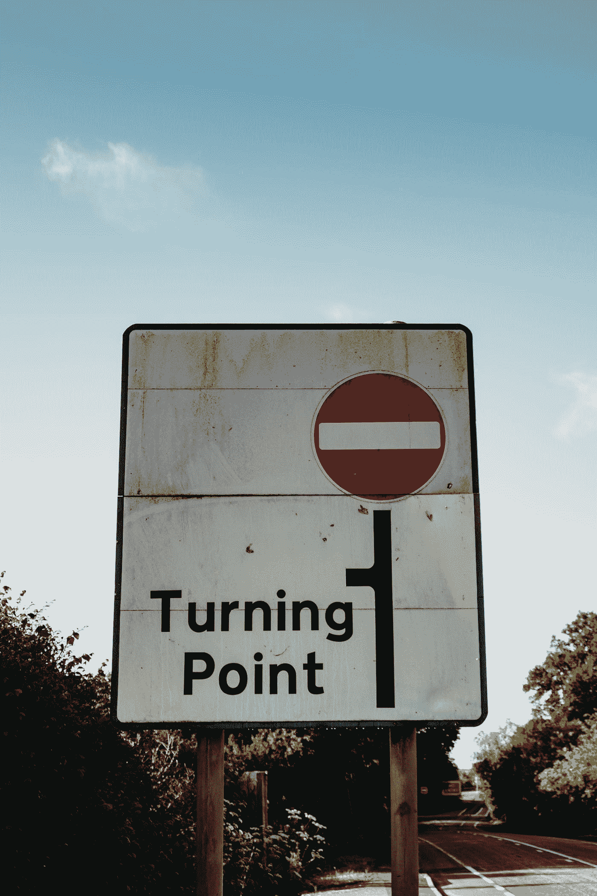

# 我们会恢复正常吗？或者说，这是新常态？如果有，明天会有新的新常态吗？

> 原文：<https://medium.com/nerd-for-tech/will-we-ever-return-to-normal-6dc87b5d101b?source=collection_archive---------17----------------------->

罗杰·布拉德肖在 [Unsplash](https://unsplash.com?utm_source=medium&utm_medium=referral) 上拍摄的照片

疫情给我们所有人留下了不可磨灭的伤疤。从我们的工作模式到我们的生活安排，没有一个生活领域是未被触及的。无论是经济、情感、心理还是生理，疫情的影响挥之不去。我们中的一些人失去了亲人。其他人因不知道这场噩梦何时结束而痛苦。无论是普通人还是世界上最有权力的男人和女人，Covid 都是一个伟大的平等者。此外，我们无法确定何时才能恢复“正常”的生活，更重要的是，这是否是一种新的常态，在这种新的常态中，我们不知道 Delta 和 Kappa 变体是否会再次肆虐。

随着美国和一些国家回到封锁前的生活和工作模式，一些专家坚持认为一切如常。是吗？真的吗？当伤痕累累的美国人大批辞掉工作，当他们坚持永久或混合工作模式时，可以肯定的是，疫情已经影响了他们的思想，并“改变”了他们对后 Covid 经济时代专业人士和工人的看法。当我们庆祝疫苗接种率之类的东西时，我们也面临着威胁新生复苏的病毒的疫苗抗性突变，如果我们可以称之为复苏的话。

就好像人类已经习惯了生活在一个永久的地狱边缘，我们从一个禁闭到另一个禁闭，并沉迷于恐惧色情，这使我们容易受到智能手机上的末日滚动的影响。你有没有注意到我们的大脑是如何“本能地”寻找坏消息的，甚至当我们遇到一些好消息时，我们会立即开始在这些报道中寻找漏洞和缺陷。这是因为我们过度换气的媒体，其报道近乎歇斯底里，其持续不断的悲观和厄运鼓声让我们成为僵尸，去寻找下一场人类愚蠢的盛宴。

那么，这是新的常态吗？如果是这样的话，在另一个变种使它成为新的新常态之前，它会一直是新常态吗？没有太多的身体活动，我们仍然粘在我们的小工具和数字设备上，以至于我们被当前的病毒感染，忘记了为什么我们不能放弃长期目标。简而言之，当下的震惊已经来临，在这种情况下，即时满足的诱惑使我们除了眼前的时刻之外，什么也看不见。否则，为什么我们会在某一天在脸书上收到成百上千的好友请求，而第二天又被取消好友。我们是否变得如此狭隘，以至于重要的是我们的自我按摩，而不是更多，让我们任由数字上帝的摆布。

有人可能会说，就黑天鹅事件的建模和预测而言，我们已经迷失了方向。如果不是，为什么科学、金融以及商业领域的顶尖人才都无法确定未来会怎样。或者这是始于 2008 年大衰退的长周期不确定性的顶点。还记得我们被告知这是我们所知的世界末日。虽然人类确实从崩溃中恢复了，尽管以一种非常不均衡的方式，但看起来疫情是真正的麦考伊，因此是正常的“结束”。

我可能错了。鉴于当今时代的陌生，谁知道有一天我们会不会醒来，意识到正常就在眼前。或者，新常态，或者我们管它叫什么。如果人们相信仙女和魔杖，我们的问题可能会消失。或者，一些杰出的科学家可能会给我们寻找的“突破”。当然，只要不产生特朗普或 Bolsarano，救世主式的思维是没问题的。另一方面，我们可能会“征服”冠状病毒，就像我们战胜疾病和贫困一样。所以，恢复正常还是有希望的。

然而，令人恼火的是疫情引起人们关注的严重不公平和不平等现象。富人越来越富，穷人越来越穷，这绝对不正常。如果我们回到这种在获得医疗保健和教育方面的正常化，而不是排除剥夺人的尊严和贫困，我们就有社会动荡的风险。因此，如果我们要庆祝新常态，是时候解决这些问题了。

最后，当我们每天早上醒来，不知道这一天的不确定性会如何发展时，我们需要一个新的社会契约，以免将人类联系在一起并防止社会破裂的粘合剂和社会结构崩溃。如果我们要带着新的目标走出这一黑暗的历史阶段，并满怀希望地迎来新的复兴，那么没有什么比在国家和公民之间缔结新的契约更紧迫的了。