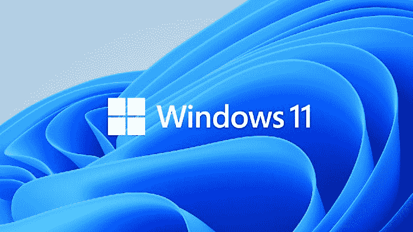
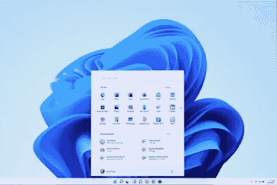
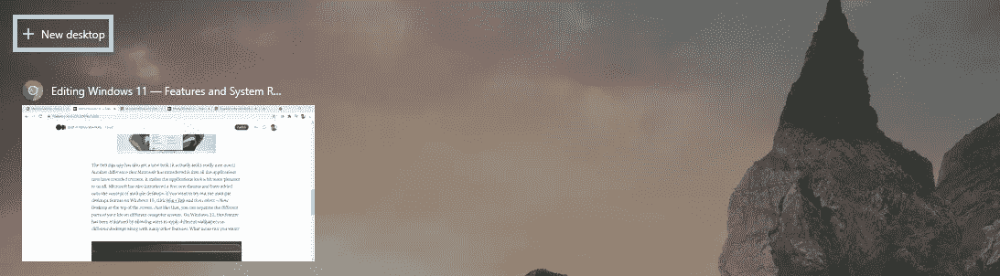
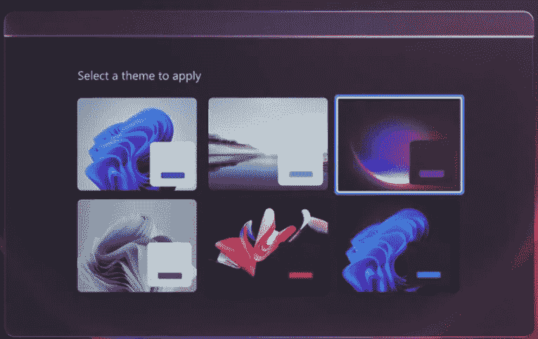
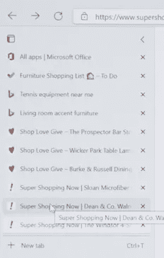
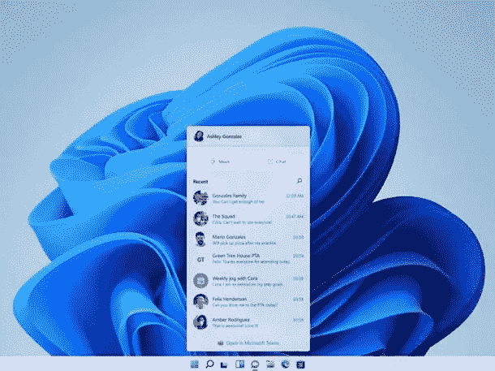
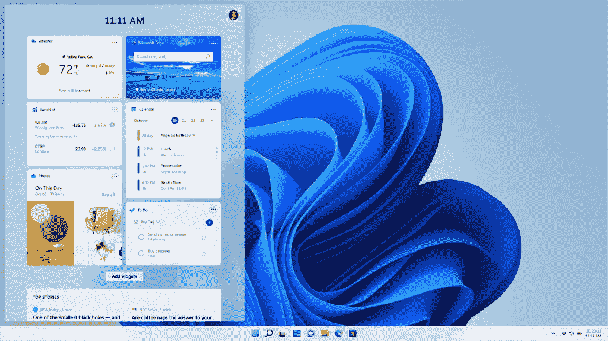
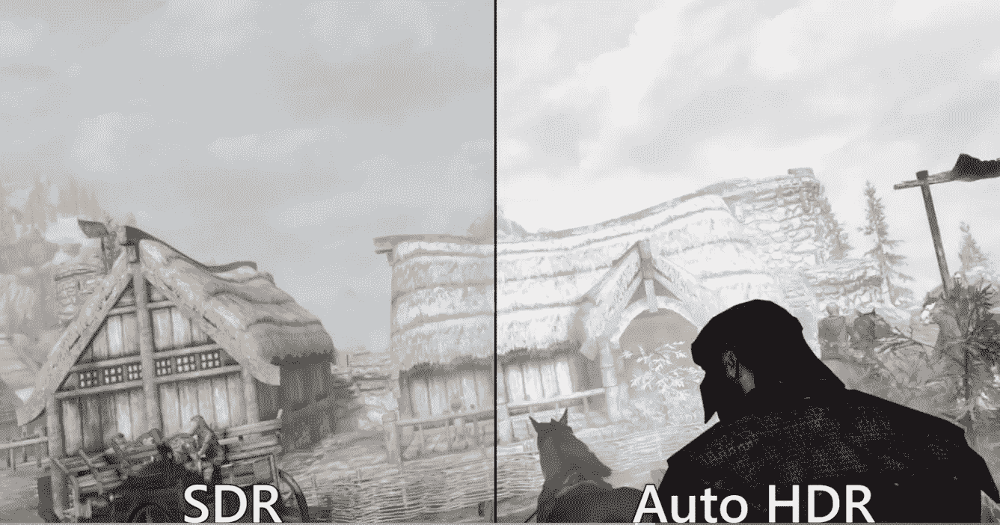
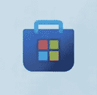

# Windows 11 —功能和系统要求:功能

> 原文：<https://medium.com/nerd-for-tech/windows-11-features-and-system-requirements-the-features-22b3a04f4cd1?source=collection_archive---------22----------------------->

## 关于最新的微软软件你所需要知道的

未来就在这里。女士们先生们，隆重推出 Windows 11，这是微软人生新篇章的开始。经过漫长的 6 年，微软终于发布了新的操作系统 Windows 10 的继任者。这个新的操作系统对我来说有点切中要害，因为我一生基本上都是 Windows 用户。尽管 Windows 11 要到 2021 年底才会发布供公众使用，但微软在 6 月 24 日的活动中描述了新版 Windows 的所有新功能。我真的为这次发布感到兴奋，我带着很高的期望参加了那个活动。我没有失望。在这[套两篇文章](https://srivishnuvusirikala.medium.com/windows-11-features-and-system-requirements-the-requirements-869164dd2b97)中，我将向你介绍 Windows 11 的新功能，以及如何检查你的系统是否与之兼容。

Windows 11 有一系列新功能，为开发者、游戏玩家和普通人创造了更好的用户界面。从庞大的微软商店到 PC 上精彩的游戏体验，Windows 11 应有尽有。对于那些错过了[活动](https://www.microsoft.com/en-us/windows/event?icid=mscom_marcom_H1b_Windowsliveevent)或者只是想了解新操作系统的人来说，这是你可以了解 Windows 11 所有新功能的地方。

# 设计:

当你比较 Windows 10 和 11 时，你可以**看到**设计是主要的区别。除了一个新的标志，在 Windows 11 上，从左下角开始的传统任务栏现在已经转移到了中心。所以，当你点击开始按钮时，开始菜单会出现在屏幕的中央，而不是在边上。开始菜单现在也移除了 Windows 10 著名的动态磁贴。

设置应用程序也有了新的外观(它现在看起来真的很好看！).微软引入的另一个不同是，现在所有的应用程序都有圆角。它让应用程序看起来对我们所有人来说都更好一些。微软也引入了一些新的主题，并加入了多桌面的概念。如果你想在 Windows 10 上尝试多桌面功能，请单击“Win+Tab ”,然后选择屏幕顶部的“+新桌面”。

就像那样，你可以在不同的电脑屏幕上分开你生活的不同部分。在 Windows 11 上，该功能得到了增强，允许用户在不同的桌面上应用不同的壁纸以及许多其他功能。你还想要什么？

# 多任务处理:

想象一下这个场景:你正在手机上查看一个 word 文档，你想切换到笔记本电脑上编辑。Windows 11 可以帮你做到这一点。只需两次点击，您就可以在笔记本电脑上继续工作。单击“开始”菜单，您将在“推荐”部分看到您的文档，您可以单击该部分从您离开的地方继续。为了使用方便，你曾经遇到过在屏幕上排列多个窗口的问题吗？还原和调整窗口的大小有时会很烦人。不再是了。通过 Windows 11 上新的 Snap Layouts 功能，您可以还原到任何您想要的大小，并按照您想要的方式无缝排列其他窗口，以提高工作效率。

如果您正在使用显示器，并且需要离开笔记本电脑一会儿，Windows 11 会自动将显示器屏幕上的应用程序调整到笔记本电脑屏幕的大小。当您重新连接到显示器时，相同的应用程序会再次打开。这称为快照组。您可以选择一次恢复单个应用程序，甚至项目。它们都在你的任务栏上。难以置信吧？在浏览器上，如果你打开了多个标签，你真的看不到所有标签显示了什么。引入垂直制表符。通过切换到垂直布局，您现在可以很容易地看到所有选项卡显示的内容。

# 微软团队:

在这个疫情，我们见不到任何人。一切在线。Windows 11 现在让这变得更容易。微软团队是微软自己的交流应用。团队现在已经集成到 Windows 中，就在任务栏的中间。只需点击一下，你就可以和任何人联系。

与人联系从未如此简单，Windows 11 现在可以帮助您轻松地与您所爱的人保持联系。

# Windows 小部件:

这是微软在 Windows 11 上推出的一个全新功能。一个完全个性化的订阅源，在一秒钟内为您提供最重要的信息。无论何时，只要你想，把它从你的屏幕旁边拉出来就可以得到一些信息，而不会丢失你之前正在做的事情。您也可以通过任务栏上的按钮来访问它。

天气、新闻，应有尽有。完全个性化，只需轻轻一点，就在你面前。这些小部件适合您，尤其是新闻小部件，只是为了提供吸引用户的精选内容。

# 适应性、灵活性和多功能性:

对于 2 合 1 笔记本电脑，有时很难在平板电脑模式下使用，因为图标都挤在一起了。但是有了 Windows 11，图标会自动展开，所以**你**不需要再去适应了。不是**你**适应 Windows， **Windows** 适应你。现在用笔编辑是一种全新的感觉。触摸键盘现在已经得到了增强，更像是手机或平板电脑的键盘。Windows 11 也有一个出色的语音转文本软件，和你手机上的一样好，如果不是更好的话。Windows widgets 也有助于让你更少依赖手机来查看天气或新闻，因为它更容易。现在 Windows 11 上的电影好看多了。你可以在微软商店中观看许多不同的电影，如果你想要更大的视角，可以轻松地将它们投影到电视屏幕上。这正是 Windows 11 现在适应你的方式。

# 游戏体验:

谁不喜欢游戏，我说的对吗？虽然全球许多人更喜欢使用 PlayStation 和 Xbox 等游戏机，但仍有许多人在个人电脑上玩游戏。Windows 11 对他们来说是完美的游戏操作系统。除了增强的桌面功能，Windows 11 还在游戏领域提供了很多功能。Windows 11 提供了卓越的图形、更快的速度和多样化的游戏。Windows 11 使用自动 HDR 为用户提供出色的图形，带来完美的游戏体验。有了自动 HDR，游戏看起来比以往任何时候都更好。

你可以清楚地看到这里的不同。Windows 11 现在将 Xbox 和 S 系列上已经存在的直接存储概念引入了 PC。游戏现在加载速度比以往任何时候都快，而不会降低 CPU 的速度。这些惊人的速度，加上 Xbox game pass 上呈现的各种游戏，提供了任何人都可能要求的最佳游戏体验。Xbox game pass 让您只需象征性的月费就可以玩这么多游戏。你可以和世界各地的人无缝地在线玩这些游戏。这些游戏也可以在 Xbox app 上轻松买到。

# 微软商店:

微软商店在 Windows 11 上彻底改变了。我是说完全。现在可以通过微软商店获得电影，这样任何人都可以观看。忘记打开浏览器，在多个网站上搜索一部电影。微软商店为你准备了一切。由于在亚马逊应用商店的帮助下，Android 应用程序集成到了 PC 上，该商店现在还提供了更广泛的应用程序选择。将 Android 手机上几乎所有你喜欢的应用程序直接下载到你的电脑上。简直不可思议。微软商店也为开发者提供了一个完美的平台来托管他们的内容供公众使用。微软托管他们的应用程序不收任何费用。这使得开发人员可以将他们开发的任何技术直接带到商店，而不会丢失任何东西。微软商店现在为开发者和用户提供了最新、最安全、最好的平台。

这就是 Windows 11！一个全新的操作系统，建立在以前的 Windows 10 上，为您所有用户提供一个出色的平台。这个新的操作系统简直太棒了。在[下一篇文章](https://srivishnuvusirikala.medium.com/windows-11-features-and-system-requirements-the-requirements-869164dd2b97)中，我们将看看你的电脑需要支持 Windows 11 的系统要求。