# Windows 11 —功能和系统要求:要求

> 原文：<https://medium.com/nerd-for-tech/windows-11-features-and-system-requirements-the-requirements-869164dd2b97?source=collection_archive---------13----------------------->

## 要使用最新的微软软件，您只需在系统上安装

在[之前的文章](https://srivishnuvusirikala.medium.com/windows-11-features-and-system-requirements-the-features-22b3a04f4cd1)中，我已经向你介绍了 Windows 11 的新功能。这些功能简直太好了！看到这些功能后，我立即去检查我的电脑是否满足在我的系统上支持 Windows 11 的必要系统要求。令我沮丧的是，事实并非如此。然而，我仍然保留一丝希望，我将仍然能够在我的系统上运行它，我将在后面解释。现在，让我们看看如何检查您的系统是否兼容。好了，我们开始吧！

现在有两种方法可以检查您的系统需求:

# 方法 1:

现在，如果你愿意下载一个软件，让它为你做所有有趣的事情，微软已经为你创建了一个应用程序。它被称为 PC 健康检查应用程序，可以在微软网站上免费下载。你可以在[这里](https://www.microsoft.com/en-us/windows/windows-11?icid=mscom_marcom_H1a_Windows11)访问他们的网站，并从那里下载应用程序，或者你可以在这里下载应用程序[。](https://aka.ms/GetPCHealthCheckApp)

下载并运行该应用程序后，您将看到如下屏幕:

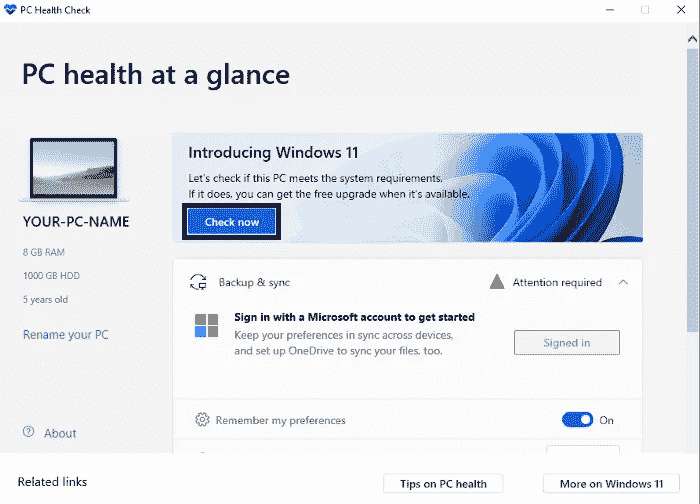

点击“立即检查”按钮，如上图所示，几秒钟后，你就会知道你的电脑是否与 Windows 11 兼容。如果兼容，您将会收到如下弹出窗口:

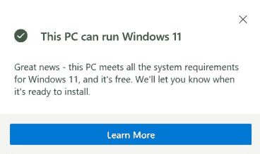

否则，您可能会看到一个不同的弹出窗口，如下所示:

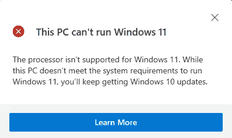

正如你可能已经注意到的，如果你的系统不兼容，应用程序不会为你提供太多关于为什么你的系统不兼容的信息。如果你想知道原因，你必须再次手动检查一切。至少你得到了提醒，这才是最重要的。所以这就是你如何使用该应用程序检查你的 PC 是否与 Windows 11 兼容。现在，如果你不想下载应用程序，并希望手动检查这一切，你也可以这样做。

*注意:微软现在已经从他们的网站上删除了 PC Health 应用程序下载，因为他们正在慢慢修改该软件，以便与第 7 代及以下的英特尔处理器兼容。他们会修改软件，然后很快发布。*

# 方法二:

在微软网站上，他们列出了您的系统运行 Windows 11 所需的基本系统要求。这些是要求:

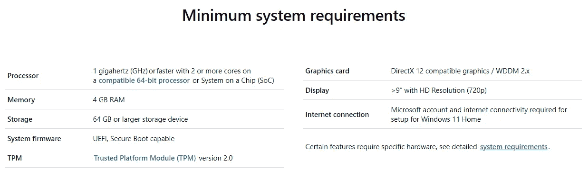

让我们看看如何逐一检查所有这些:

## 处理器:

现在，要检查您的处理器是否可以运行 Windows 11，您必须遵循以下步骤:

1.  开放系统信息
2.  如果系统摘要尚未打开，请转到它
3.  转到处理器

在屏幕上，您现在可以看到您电脑的详细信息:

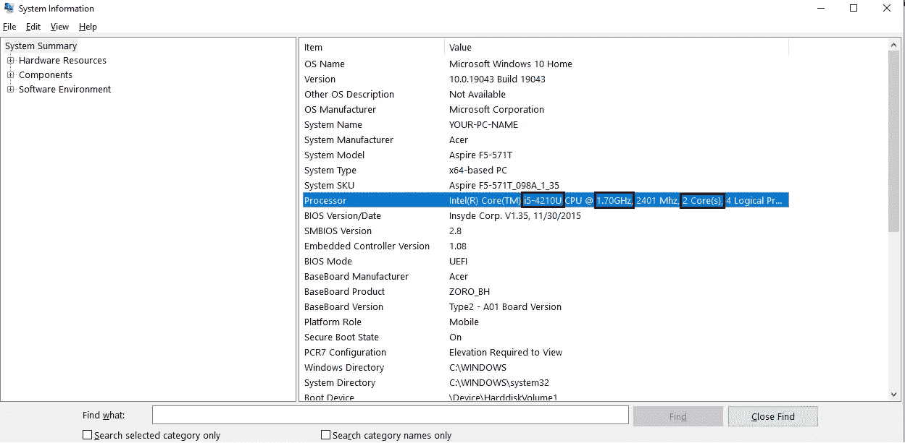

每台电脑的具体细节会有所不同(当然),但我们需要看到的是处理器，如上图所示。第一个列出的字母数字代码是您的处理器版本，类型是英特尔(R)核心(在我的笔记本电脑上)或您的笔记本电脑上的同等产品。所以，复制代码，然后访问这个网站。

*注意:这个网站基本上是微软网站上“兼容 64 位处理器”的链接。这也暗示了 Windows 11 无法在 32 位系统上运行。*

向下滚动到 Windows 11，选择您使用的处理器。因为我的笔记本电脑配有英特尔处理器，所以我会使用它。

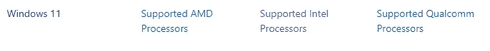

因此，单击您的处理器的链接后，您将被重定向到一个包含大量兼容处理器列表的页面。手动浏览它们会很困难，所以单击 Ctrl+F 并粘贴您之前复制的代码。如果你得到一个结果，那么你的处理器是兼容的。然而，如果你没有得到结果，不要灰心，还有机会。

对于英特尔处理器，Windows 11 仅支持第 8 代及更高版本的处理器。Windows 11 仍将在较低版本上运行，但速度会非常慢。因此，不建议升级到 Windows 11，但如果你仍然想这样做，没有人会阻止你。对于处理器，还有一点更多的标准，我们现在来看看。

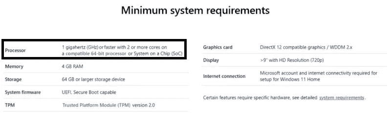

下图中也概述了这些其他标准:

第二个列出的数字是处理器的速度，第三个是处理器上的内核数量。对此的最低要求是应该≥ 1 GHz 和≥ 2 核。如果您的处理器满足所有这三个要求，您的处理器可以支持 Windows 11。现在让我们进入下一个需求。

## 内存:

Windows 11 至少需要 4 GB 内存，以便操作系统在您的系统上运行。为了检查这一点，我们将继续使用“系统信息”。在底部的“查找内容”框中，键入“内存”,您将得到一些结果:

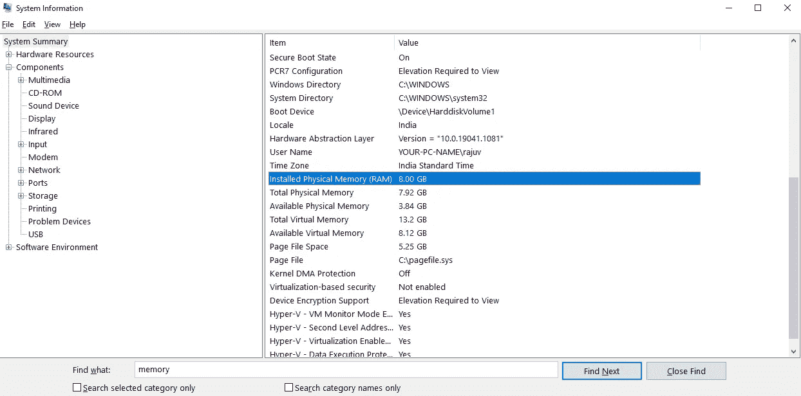

突出显示的值是系统中“已安装物理内存(RAM)”标题下的 RAM。如果该值≥ 4 GB，您的 RAM 将能够支持 Windows 11。

## 存储:

Windows 11 要求你至少有 64 GB 的存储设备。要对此进行检查，请遵循以下步骤:

1.  打开设置
2.  转到系统
3.  去仓库

现在你会看到一个类似这样的窗口:

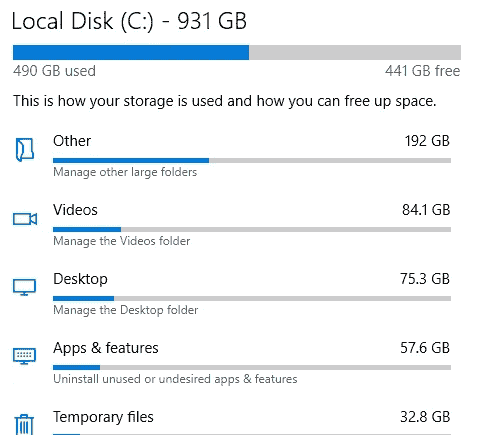

只要你总共有 64 GB(确保你也有至少 64 GB 的空闲空间，有额外的空间也无妨)，你的系统将能够容纳 Windows 11。

## 系统固件:

要检查系统固件，我们将再次返回“系统信息”应用程序。您将在“BIOS 模式”下看到固件版本:

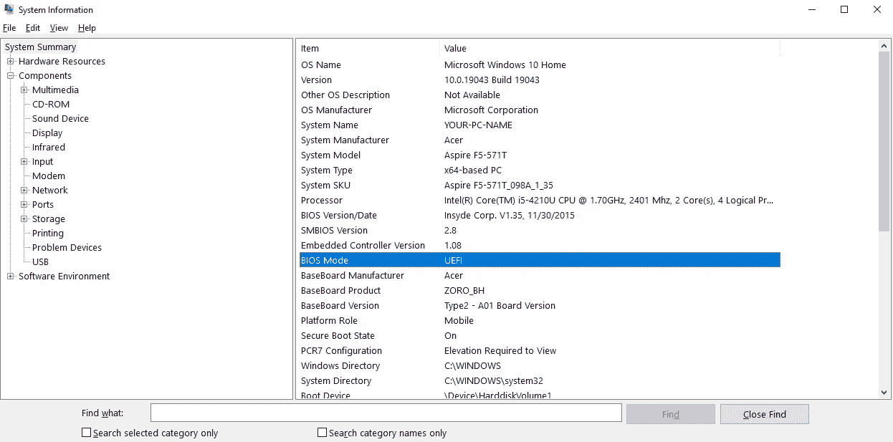

要检查它是否能够安全引导，请向下几行转到“安全引导状态”:

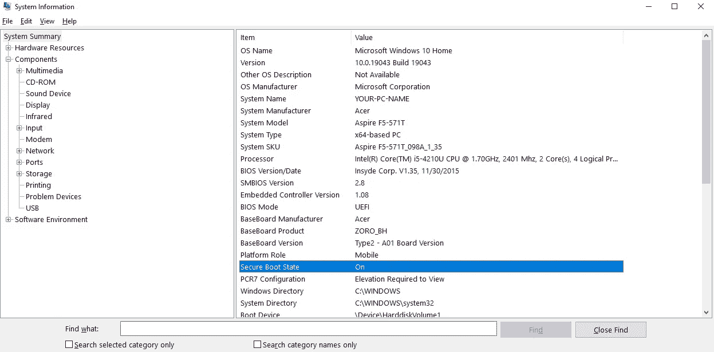

如果您看到 BIOS 模式为 UEFI，安全引导状态为 On，则您的系统固件将能够支持 Windows 11。

## TPM:

要检查 TPM 版本，请按照下列步骤操作:

1.  用 Win+R 打开 Windows 运行
2.  键入 tpm.msc 并单击确定

您可能会看到如下所示的窗口，但如果您没有看到，只需单击“本地计算机上的 TPM 管理”,您将会看到以下窗口:

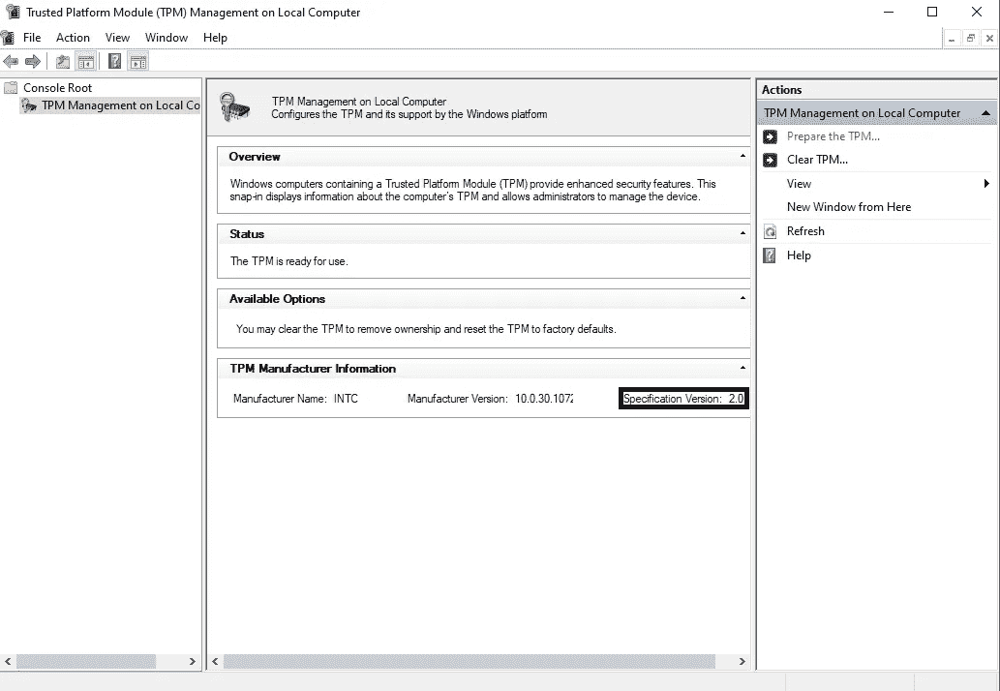

规格版本，即上图中的轮廓部分，是版本，如果您希望您的系统运行 Windows 11，它必须是 2.0。

## 显卡:

这个有点复杂，因为可能有许多不同的显卡。我会告诉你如何找到显卡，但之后你必须自己检查你的显卡是否符合特定的标准。要找到图形卡，您必须再次使用“系统信息”。只需在底部的“查找内容”框中键入“图形”,您将看到如下内容:

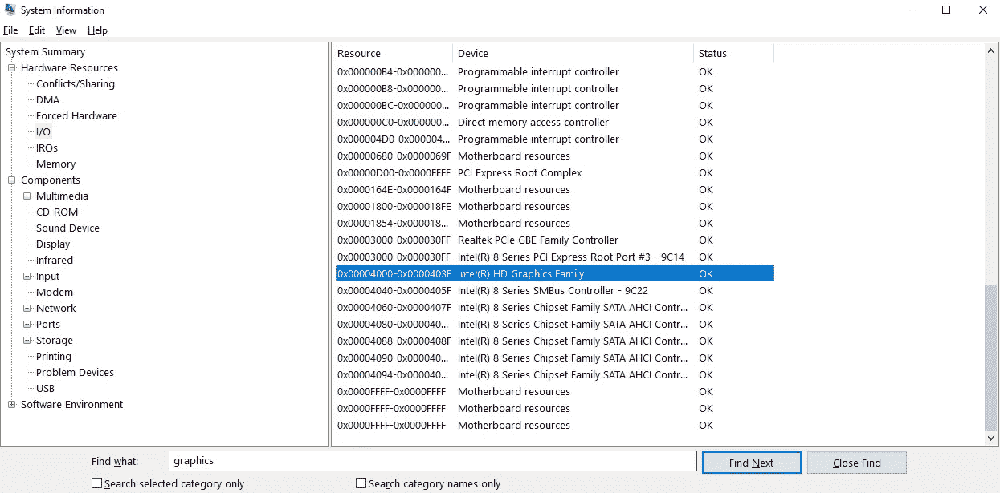

如果你想浪费时间手动搜索它，它在“硬件资源”文件夹下的“I/O”子文件夹中。在这里，我的是兼容 DirectX 显卡的英特尔高清显卡系列。如果你的显卡也兼容，那么 Windows 11 也可以。

## 显示:

这是我们要考虑的最后一个要求，因为稳定的互联网连接掌握在您的手中。最后一次回到“系统信息”。在“查找内容”框中键入“分辨率”,您将看到如下图像:

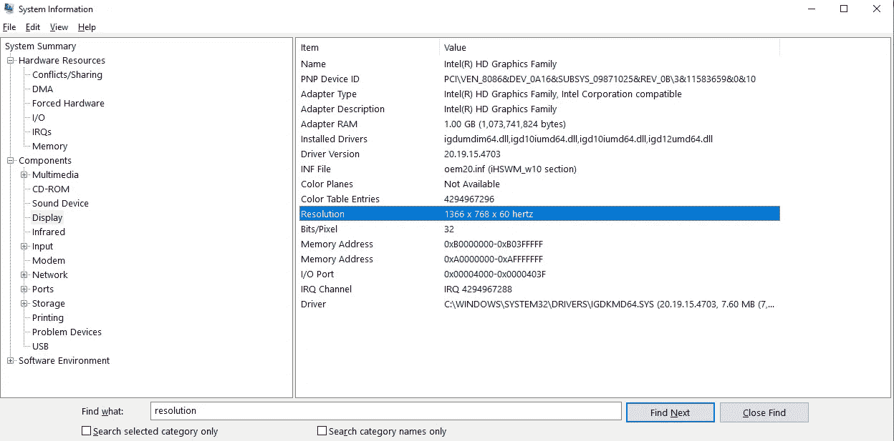

要手动转到那里，它在“组件”文件夹中的“显示”下。如果两个值都≥ 720，那么对于 Windows 11 来说分辨率还是不错的。如果不是，您可以通过以下步骤进行更改:

1.  打开设置
2.  转到系统
3.  转到显示器，向下滚动到“显示分辨率”

点击那里的下拉菜单，你可以改变分辨率。

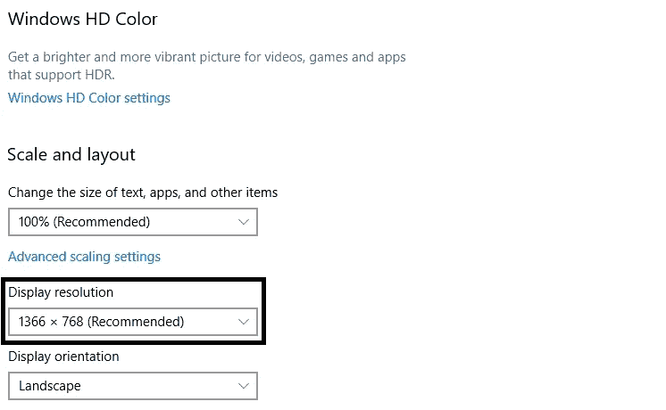

# 更新:

Windows 11 的这一重大更新计划于 2021 年底至 2022 年进行。如果你想知道如何在 Windows 11 发布时更新到它，这是如何做到的:

1.  打开设置
2.  转到更新和安全
3.  转到 Windows Update

当 Windows 11 发布时，点击“检查更新”按钮:

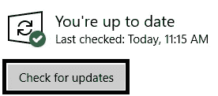

在它完成检查后，你会看到类似“Windows 11 功能更新”的内容。点击那个就能更新到 Windows 11 了。对于当前的 Windows 10 用户来说，这是一次完全免费的升级。

这就是你如何使用应用程序和手动检查 Windows 11 的系统要求。这两篇文章就完成了。我希望你现在已经明白了 Windows 11 是怎么回事，以及你的电脑需要什么来支持 Windows 11。如果你想看 Windows 11 的功能，点击[这里](https://srivishnuvusirikala.medium.com/windows-11-features-and-system-requirements-the-features-22b3a04f4cd1)。