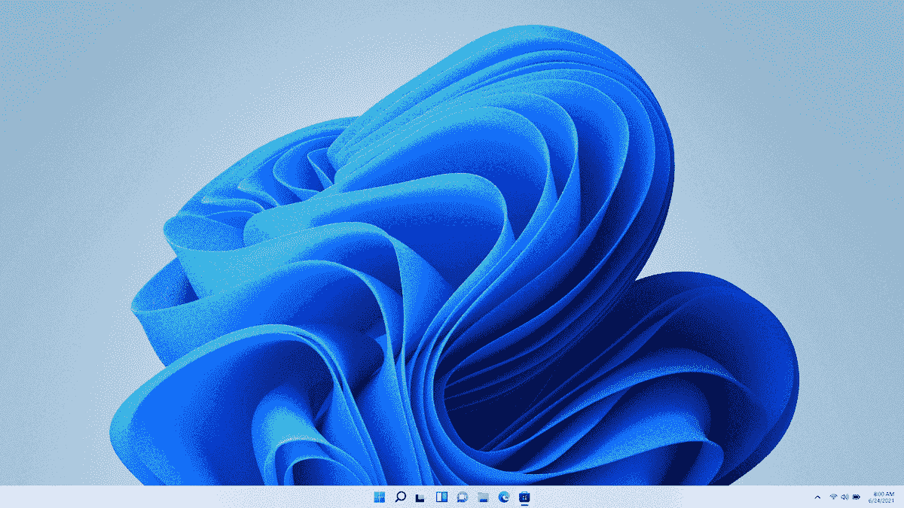
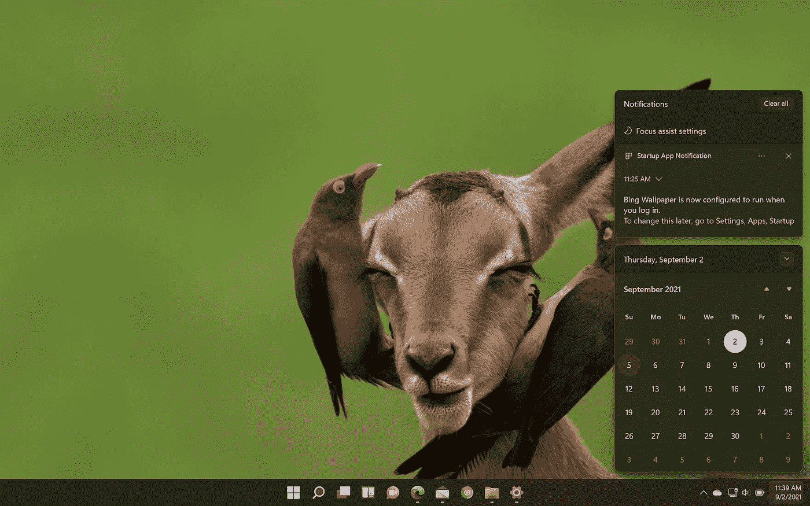
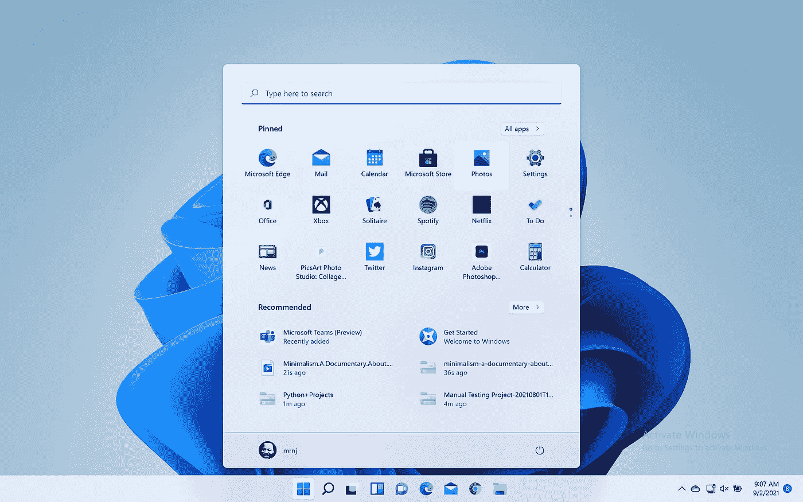
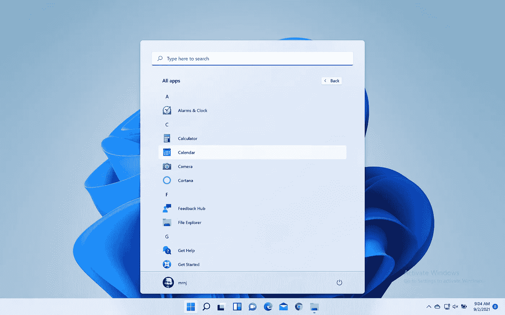
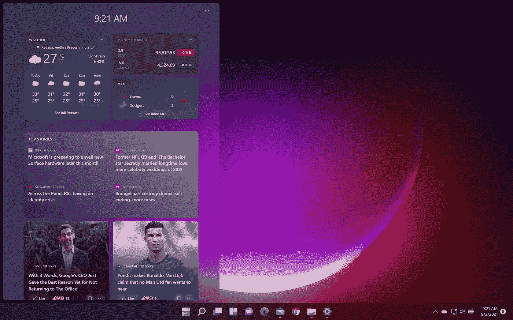
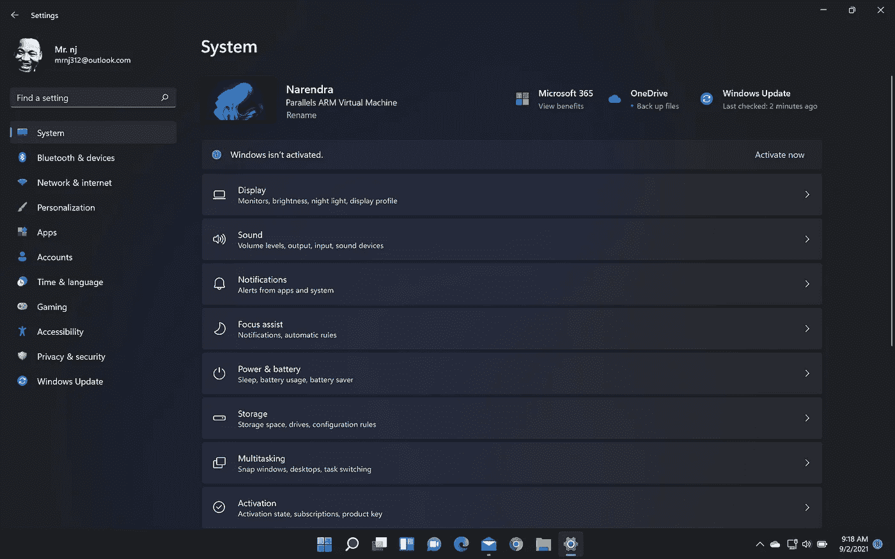

# Windows 11😲:少校，少校走了。！

> 原文：<https://medium.com/nerd-for-tech/windows-11-the-major-major-go-3488459cff45?source=collection_archive---------7----------------------->

> “如果你不抓住新的机会，你就无法生存。”— **塞特亚·纳德拉**

在过去的几年里，我一直是 Windows Insider 预览版的用户。在切换到 Mac os 之前，我对 windows insider 更新的兴奋是无与伦比的。这并不令人惊讶，因为它只是改进了一些错误并增加了一些新功能。这是 Windows 11 的升级版，将带来最大的不同。的确，Windows 11 不是一次普通的更新。反而是终极蜕变。

上周，我安装了 windows insider 预览版的最新更新 parallels 17(一个虚拟机),并一直维护着它，我想分享一下我的经验。更新一安装，就显示出了设计的许多美。同理，三星买了分辨率带一个 UI，Windows 11 也会差不多。在整篇文章中，我将主要关注与简单和极简界面相关的用户体验。

## 改进和变化

主屏幕— [微软](https://insider.windows.com/en-us/insidewindows11)

只要看看桌面，它的小图标看起来很优雅。与大图标只占据左侧的旧任务栏相比，这更有意义，尽管用户有选项，但它们没有被经常使用。对于普通用户来说，长时间使用这款台式机也更有吸引力。

通知栏— [微软](https://insider.windows.com/en-us/insidewindows11)

日历窗口在这里与通知面板是分开的，实际上，当使用它时，这一点点差别是非常显著的。我们可以关闭不需要的面板，它还提供了一种更简单的方式来组织通知，而不是将它们一个接一个地堆叠起来。再说一遍，它是关于美丽、优雅和简单的。他们的目标是让一切尽可能整洁干净。此外，Windows 11 中的壁纸也非常酷，是的，微软做了一个大的飞跃。

开始— [微软](https://insider.windows.com/en-us/insidewindows11)

我喜欢开始面板的外观，在左边，你可以看到用户的个人资料图片，在右边，有一个电源按钮图标，让我们重新启动，睡眠和关闭电脑。改进后的用户界面让用户更容易跟踪他们最常用的应用程序，将它们固定在顶部，而不是滚动。然而，搜索照常工作。特别是图标看起来非常有吸引力。

右键单击选项— [微软](https://insider.windows.com/en-us/insidewindows11)

正如你所看到的，右键选项被很好的安排在图标旁边。此外，他们保留了在菜单底部显示更多选项的选项。有意义的原因是，平均来说，用户倾向于选择最受欢迎的。在图片中似乎没有复制或粘贴选项，而是有一个复制图标，我突出悬停。当您选择一条要复制的信息时，粘贴图标将变为可用。这说明了微软如何努力为其用户提供更复杂和无缝的体验。

搜索栏— [微软](https://insider.windows.com/en-us/insidewindows11)

垂直滚动搜索栏没有变化，它按字母顺序显示应用程序。这对用户来说已经足够了，放在标题左边右边的图标说明了一切。然而，所有的应用程序面板似乎都在中心对齐，这非常有趣，因为它为通知提供了更多的空间。

Widgets — [微软](https://insider.windows.com/en-us/insidewindows11)

Windows 11 中提供了小部件，可以根据用户的需求进行定制。这些对于总结我们需要关注的话题很有用。你可以在这里获得所有必要的信息，如股市、体育新闻、天气、待办任务等。无论如何，这会让用户觉得他们在为自己的提要使用便笺条。

设置面板— [微软](https://insider.windows.com/en-us/insidewindows11)

看看黑暗模式下的图像，是的，设置面板看起来也很吸引人。由于我没有正式的 Windows 许可证，我可以使用的功能有限。然而，每个选项的填充和边距都很好。当用户喜欢时，尝试新的东西是值得的。除了壁纸，他们还增加了一些新的，会随着时间的变化而变化。到目前为止，这个内部预览给我留下了深刻的印象。

我会在下一篇文章里分享我用了一个月后的很多经验。我没有提到性能或电池的原因是，它是在 Mac os 中的 VM 上运行的，所以评论性能是没有意义的。尽管只给 windows 11 分配了 4GB 的内存，但我没有注意到电池泄漏或任何性能问题。最后，我要感谢所有为创造如此壮观的产品做出巨大贡献的团队成员。**为 windows 用户干杯😊**

> 感谢我所有亲爱的读者，请随时留下反馈或建议&虚拟鼓掌不会让你筋疲力尽😇— [纳伦德拉·贾纳帕提](https://linkedin.com/in/narendraj3)