# SQL 中的 Windows 函数

> 原文：<https://medium.com/nerd-for-tech/windows-functions-in-sql-9bf03127d867?source=collection_archive---------2----------------------->

**分区依据:**

SELECT 雇员标识，年(雇用日期)，部门标识，薪金，

总计超过()的金额，

作为 dept_sal 的总和(薪金)(按 department_id 划分)

来自员工

ORDER BY employee_id、year(聘用日期)、department_id、薪金；

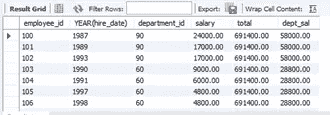

分组依据的替代

**Row_number()**

SELECT 名字，聘用日期，薪金 FROM 雇员 ORDER BY 薪金。

SELECT 名字，雇用日期，薪金，

ROW_NUMBER()超过()作为薪金 _ 级别

来自员工；

默认情况下，整个数据的等级

SELECT 名字，雇用日期，薪金，

ROW _ NUMBER()OVER(ORDER BY salary)AS salary _ rank

来自员工；

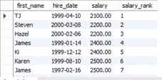

条目的薪金级别

SELECT 名字，雇用日期，薪金，部门标识，

ROW_NUMBER() OVER(按部门标识划分)AS salary_rank

来自员工；

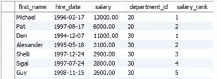

按部门标识级别分组

**具有 row_number()的唯一行**

创建表 temp1(

id INT，

name VARCHAR(10)不为空

);

插入到 temp1(id，name)

值(1，' A ')，

(2，' B ')，

(3，' C ')，

(4，‘D’)；

SELECT * FROM temp1

SELECT 雇员标识，薪金，部门标识，

ROW _ NUMBER()OVER(PARTITION BY department _ id，salary ORDER BY salary)作为 row_num

来自员工；

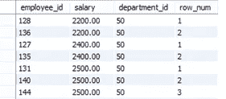

按特定顺序分组

**Rank()**

SELECT 名字，雇用日期，薪金，

排名()超过(按薪金排序)作为薪金 _ 排名

来自员工；

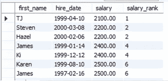

完整数据等级

SELECT 名字，雇用日期，薪金，

RANK()over(PARTITION BY YEAR(hire _ date)ORDER BY salary)作为 salary_rank

来自员工；

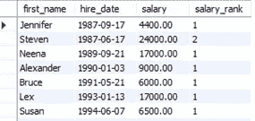

按等级分组

**Dense_rank()**

SELECT 名字，雇用日期，薪金，

DENSE_RANK()超过(按薪金排序)salry_rank

来自员工；

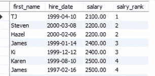

最佳排名

SELECT 名字，雇用日期，薪金，

DENSE _ RANK()OVER(PARTITION BY YEAR(hire _ date)ORDER BY salry _ RANK)

来自员工；

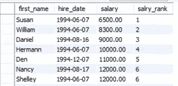

按排名分组

**Percent_rank()**

SELECT 名字，雇用日期，薪金，

PERCENT_RANK()超过(按薪金排序)salry_rank

来自员工；

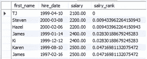

完整数据集(0–1)%

SELECT 名字，雇用日期，部门标识，薪金，

PERCENT _ RANK()OVER(PARTITION BY department _ id ORDER BY salry _ RANK)

来自员工；

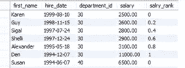

组内百分比

**累计距离()**

SELECT 名字，雇用日期，薪金，

DIST CUME()以上(按薪金排序)累计

来自员工；

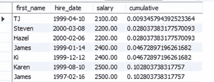

SELECT 名字，雇用日期，部门标识，薪金，

CUME_DIST()以上(按部门分区 _id 按薪金排序)累计

来自员工；

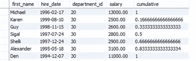

**滞后()**

SELECT 姓氏，名字，部门标识，雇用日期，

LAG(first_name，1，“无正文”)OVER(按部门 id 分区

按雇佣日期排序)前一雇佣日期

来自员工

ORDER BY 部门标识、聘用日期、姓氏、名字。

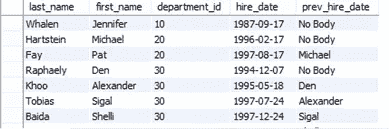

**铅()**

SELECT 姓氏，名字，部门标识，雇用日期，

LAG(hire_date，1，null) OVER(按部门标识划分

按雇佣日期排序)前一雇佣日期，

销售线索(聘用日期，1，空)超过(按部门标识划分

按雇佣日期排序)在雇佣日期之后

来自员工

ORDER BY 部门标识、聘用日期、姓氏、名字。

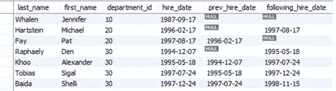

**first_value()**

SELECT 名字，雇员 id，薪金，

FIRST_VALUE(名字)OVER(按薪金排序)

来自员工

按工资排序；

然后提取第一个名字

SELECT 名字，雇员标识，薪金，部门标识，

FIRST_VALUE(first_name) OVER(按部门 id 分区，按薪金排序)

来自员工

按部门排序 _id，薪资；

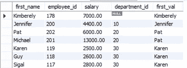

GRUOP wise 名字

**last_value()**

SELECT 名字，雇员标识，薪金，部门标识，

姓氏(名字)超过(按薪金排序)

来自员工

按工资排序；

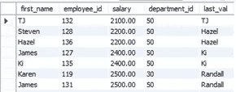

SELECT 名字，雇员标识，薪金，部门标识，

姓氏值(名字)超过(按部门 id 划分，按薪金范围排序介于

无界前置 AND

无界追随)

来自员工

按部门排序 _id，薪资；

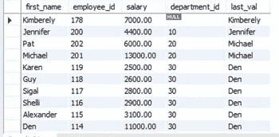

**第 n _ value()**

SELECT 名字，雇员 id，薪金，

n _ VALUE(first _ name，3)超过(按薪金排序)

来自员工

按工资排序；

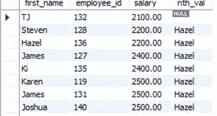

SELECT 名字，雇员标识，薪金，部门标识，

n _ VALUE(first _ name，3) OVER(按部门 id 分区，按薪金排序)

来自员工

按部门排序 _id，薪资；

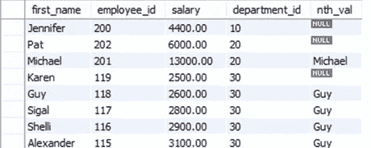

**ntile() —** 这将把数据集分成几个部分。

SELECT 名字，雇员 id，薪金，

NTILE(3)以上(按工资排序)

从员工按工资排序；

SELECT 名字，雇员标识，薪金，部门标识，

NTILE(3) OVER(按部门划分 _id 按薪金排序)

来自员工

按部门排序 _id，薪资；

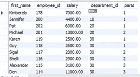

**信息模式:**

SELECT 约束名称，

唯一约束名称，

MATCH_OPTION

更新规则，

删除规则，

表名，

引用的表名

来自 INFORMATION_SCHEMA。参考约束

其中 CONSTRAINT _ SCHEMA = ' HR