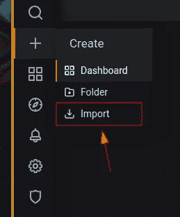
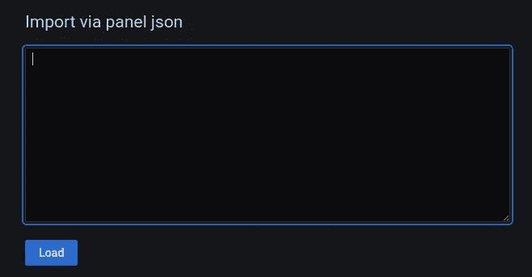
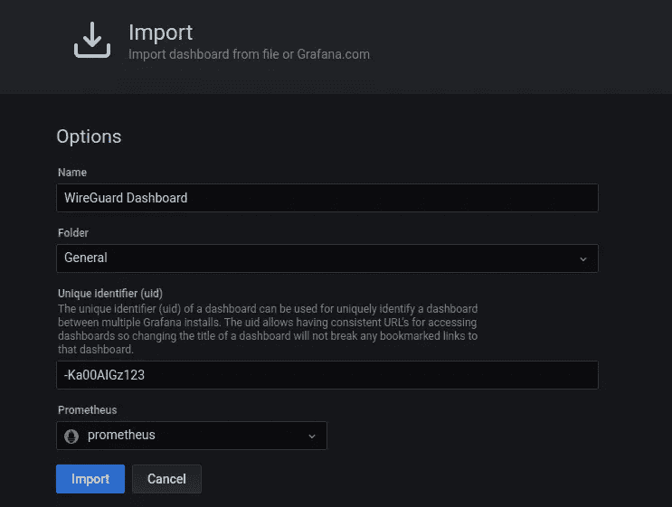
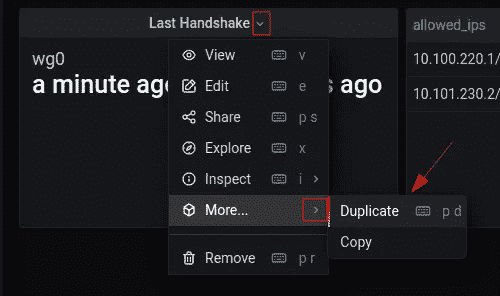
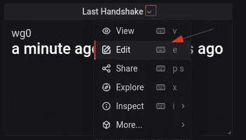
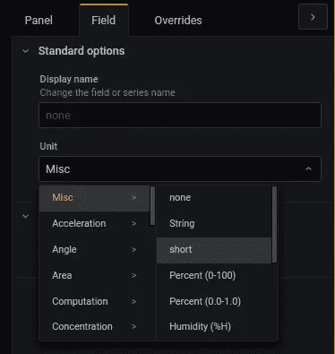
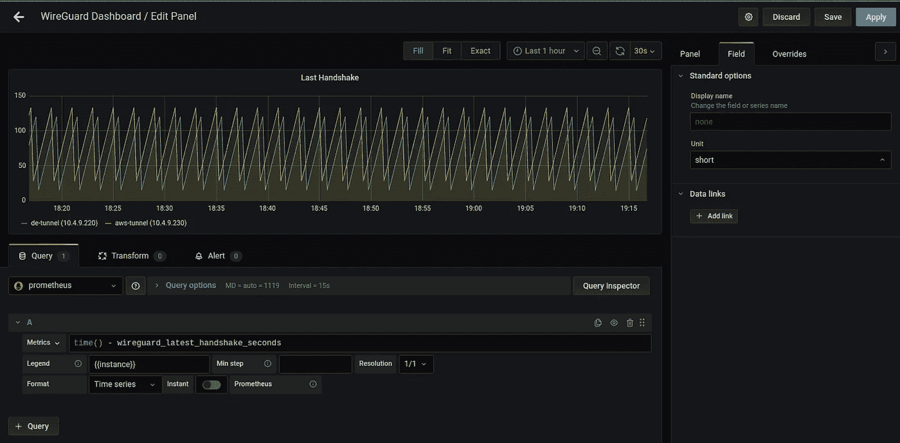
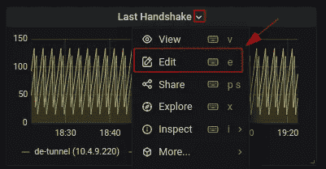
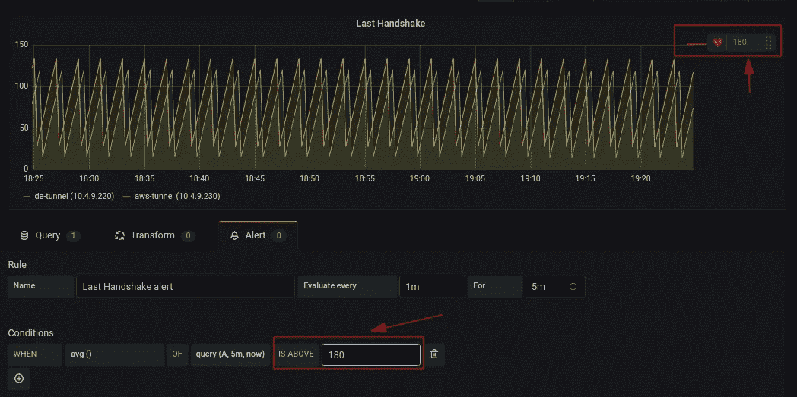
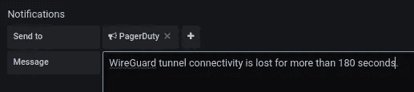

# WireGuard VPN 的监控和警报

> 原文：<https://medium.com/nerd-for-tech/wireguard-vpn-monitoring-alerting-e1e1d1eaaa4e?source=collection_archive---------0----------------------->


# 介绍

WireGuard 是 Jason A. Donenfeld 开发的一款快速、现代、安全的 VPN 隧道软件。它的目标是比 IPsec 更快、更简单、更精简、更有用，或者比 OpenVPN 性能更好。

> Wireguard 是“艺术品”——莱纳斯·托沃兹

当您的 WireGuard VPN 隧道为关键服务供电时，监控 VPN 隧道的健康状况并设置警报非常重要。

在本文中，我们将设置 Prometheus WireGuard exporter、Grafana 仪表板和警报管理器。

# WireGuard 普罗米修斯出口商

首先，我们将在 WireGuard 实例上安装 WireGuard Prometheus exporter。基本上，导出器以普罗米修斯理解的格式公开`wg show all dump`结果。

导出器是用 Rust 编写的，无论是在内存还是 CPU 使用方面，它对服务器资源的占用都非常少。

目前，还没有为导出程序预先构建的二进制文件。因此，我们必须建造它。因为它是用 Rust 编写的，所以相当简单。

**注意:**使用的是`yum`，你可以任意选择包管理器。

## 1.建立和安装 wireguard 普罗米修斯出口商

```
$ yum install cargo  # RedHat-based
$ cargo install prometheus_wireguard_exporter
$ install -m755 /root/.cargo/bin/prometheus_wireguard_exporter /usr/local/bin/
$ yum remove cargo
```

## 2.为导出程序安装 systemd 服务

**注意:**如果您使用定制的 WireGuard 配置，请指定替代`/etc/wireguard/wg0.conf`

```
$ cat <<EOF  > /etc/systemd/system/prometheus-wireguard-exporter.service
[Unit]
Description=Prometheus WireGuard Exporter
Wants=network-online.target
After=network-online.target

[Service]
User=root
Group=root
Type=simple
ExecStart=/usr/local/bin/prometheus_wireguard_exporter -n /etc/wireguard/wg0.conf

[Install]
WantedBy=multi-user.target
EOF
```

并通过运行以下命令启用导出器服务:

```
$ systemctl enable --now prometheus-wireguard-exporter.service
```

## 3.验证导出器服务正在运行

```
$ curl localhost:9586/metrics
```

# 配置普罗米修斯

接下来，我们将配置 Prometheus 来收集 Wireguard 导出器指标。

将以下 scape 配置作业添加到`/etc/prometheus/prometheus.yaml`

```
- job_name: wireguard-exporter
    static_configs:
    - labels:
        instance: my-wireguard-tunnel
      targets:
      - IP_OF_EXPORTER:9586
```

并重新加载普罗米修斯服务

```
$ systemctl reload prometheus
```

# Wireguard Grafana 仪表板

1.  登录您的 Grafana 用户界面
2.  下载以下 JSON 文件并将 dashboard 作为 JSON 文件导入

[https://github . com/tuladhar/wire guard-connectivity-monitoring/blob/main/wire guard-grafana-dashboard . JSON](https://github.com/tuladhar/wireguard-connectivity-monitoring/blob/main/wireguard-grafana-dashboard.json)



图:导入仪表板按钮屏幕



图:从文件导入屏幕

3.最后，点击导入。



图:导入仪表板屏幕

现在，复制“最后一次握手”面板并定制它，这样我们就可以在它上面创建警报。

1.  创建“上次握手”的复制面板



图:复制上次握手”面板

2.编辑复制面板



3.将指标修改为以下内容:

```
time() - wireguard_latest_handshake_seconds
```

3.将图例设置为`{{instance}}`

4.关闭`Instant`指标。

3.从面板选项卡中选择图形可视化

4.从`Field`选项卡，将单位从`From Now`更改为`short`



图:单位变更屏幕

5.最后，单击保存



图:定制面板

# 警报管理器

现在，让我们创建 WireGuard 连接丢失时的警报。

1.  编辑面板



图:编辑面板屏幕

2.单击“警报”选项卡，然后单击“创建警报”


图:创建警报屏幕

3.将条件设置为`WHEN avg() OF query(A, 1m, now) IS ABOVE 180`

**注意:**警报阈值栏应该出现在仪表板中。



图:警报条件屏幕

4.创建寻呼机工作警报或时差警报



图:发送到屏幕

5.最后点击“保存”

**注意:**通常情况下，WireGuard 每 2 分钟发送一次健康检查，因此保持 3 分钟(即 180 秒)作为警报阈值是安全的。

# 结论

除了 WireGuard 隧道监控之外，监控 WireGuard 隧道实例也很重要，这不在本文讨论范围之内。

我希望这篇文章对您有所帮助——保持安全👋

# 参考

*   [https://github.com/MindFlavor/prometheus_wireguard_exporter](https://github.com/MindFlavor/prometheus_wireguard_exporter)
*   [https://github . com/tuladhar/wire guard-连接-监控](https://github.com/tuladhar/wireguard-connectivity-monitoring)