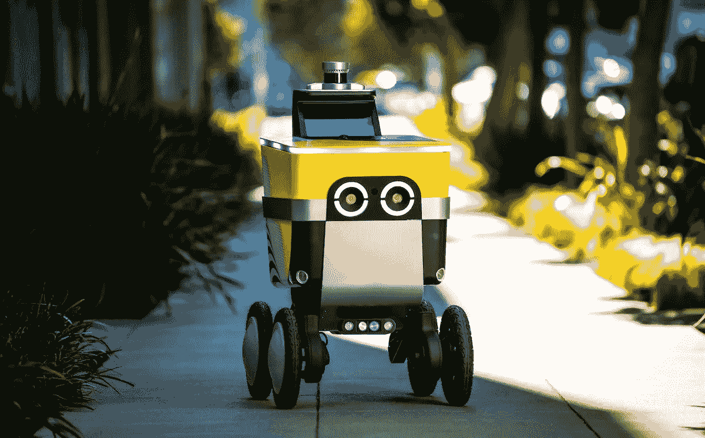

# 凭借 L4 级自动驾驶能力，优步的送货机器人已经开始“工作”

> 原文：<https://medium.com/nerd-for-tech/with-l4-level-autonomous-driving-capabilities-ubers-delivery-robot-has-begun-to-work-4f768ec9fd7f?source=collection_archive---------1----------------------->

## 下一代送货机器人

机器人更有能力独立行动，而汽车行业却在自动驾驶的技术和法规方面苦苦挣扎。

优步旗下 Postmates 的机器人部门 Serve Robotics 发布了其下一代送货机器人，可以在没有人类干预的情况下运行。

这些完全自主的机器人已经完成了他们的第一次送货任务，成功地在指定区域内导航。自动驾驶机器人是五年研发的成果，代表着送货服务的重大进步。为了创造具有 L4 级自动驾驶的下一代机器人，Serve Robotics 研究了自主紧急制动、车辆防撞和故障安全机械制动等功能。

该公司最新的服务机器人设计成类似未来的购物车，长 30 英寸(76 厘米)，宽 21 英寸(53 厘米)，高 40 英寸(101.6 厘米)。它有 50 磅(23 公斤)的存储容量，在它的“眼睛”(实际上是摄像头)的帮助下，它可以在四个轮子上四处移动。在激光雷达和超声波等主动传感器的配合下，机器人可以安全地在繁忙的城市人行道上行驶。

Serve 的技术突破是在众多关键技术合作伙伴的支持下取得的，包括英伟达和奥斯特。机器人实时感知其不同环境所需的人工智能计算平台由英伟达捷成提供，而机器的自动驾驶能力则由奥斯特的 3D 激光雷达传感器实现。

Serve Robotics 首席执行官 Ali Kashani 表示:“我很自豪 Serve Robotics 已经实现了 4 级自动驾驶，通过大幅减少潜在的人为错误，进一步增强了公共安全。这一里程碑式的成就标志着机器人分娩的巨大潜力。"

该公司的机器人已经在洛杉矶成功完成了数万次送货。最近，它的新机器人还成功地执行了第一次几乎完全自主交付的 L4 级任务，在指定区域内自主导航。今年，Serve Robotics 还将逐步扩大其地理覆盖范围，开始推广其新的机器人车队。

## 需要高质量的标签数据

随着 AI 商业化进程的加快，以及辅助驾驶、客服聊天机器人等 AI 技术在各行各业的应用，人们对特殊场景下数据质量的期望越来越高。高质量的标签数据将是人工智能公司的核心竞争力之一。

如果说之前的算法模型使用的一般数据集是粗粮，那么算法模型目前需要的是定制的营养餐。如果公司想要进一步提高某些模型的商业化，他们必须逐步从通用数据集向前发展，以创建独特的数据集。

## ***结束***

将您的数据标注任务外包给[字节桥](https://tinyurl.com/ytbzr2ye)，您可以更便宜、更快速地获得高质量的 ML 训练数据集！

*   无需信用卡的免费试用:您可以快速获得样品结果，检查输出，并直接向我们的项目经理反馈。
*   100%人工验证
*   透明和标准定价:[有明确的定价](https://www.bytebridge.io/#/?module=price)(包含人工成本)

## 为什么不试一试？

资料来源:https://www.robot-china.com/news/202201/17/69497.html