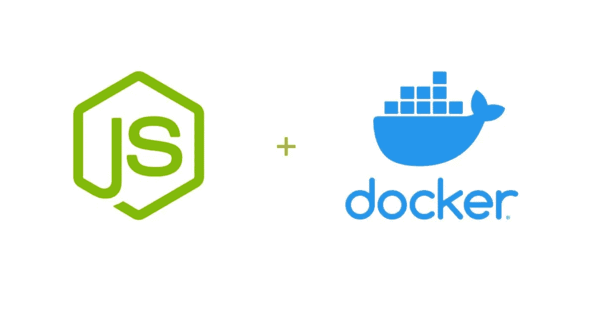
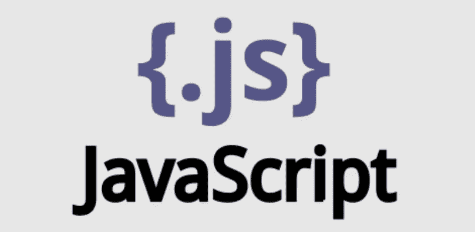
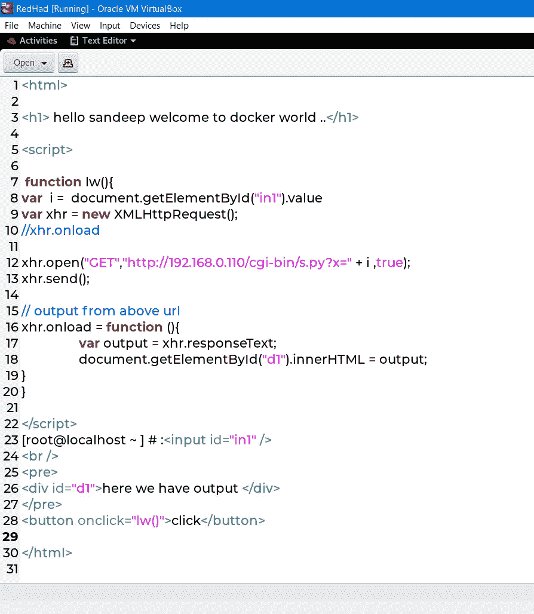
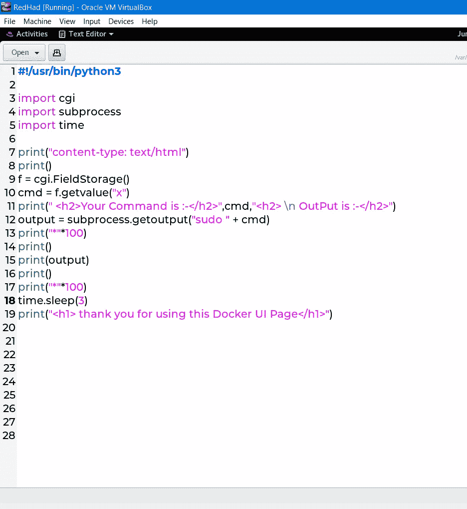
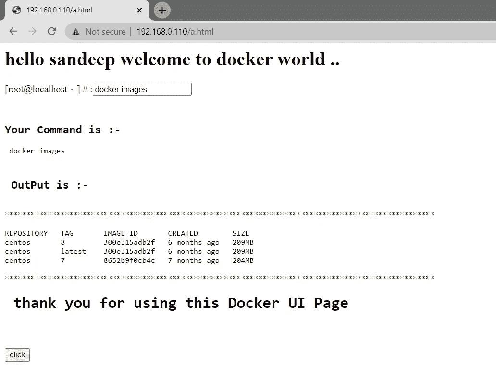
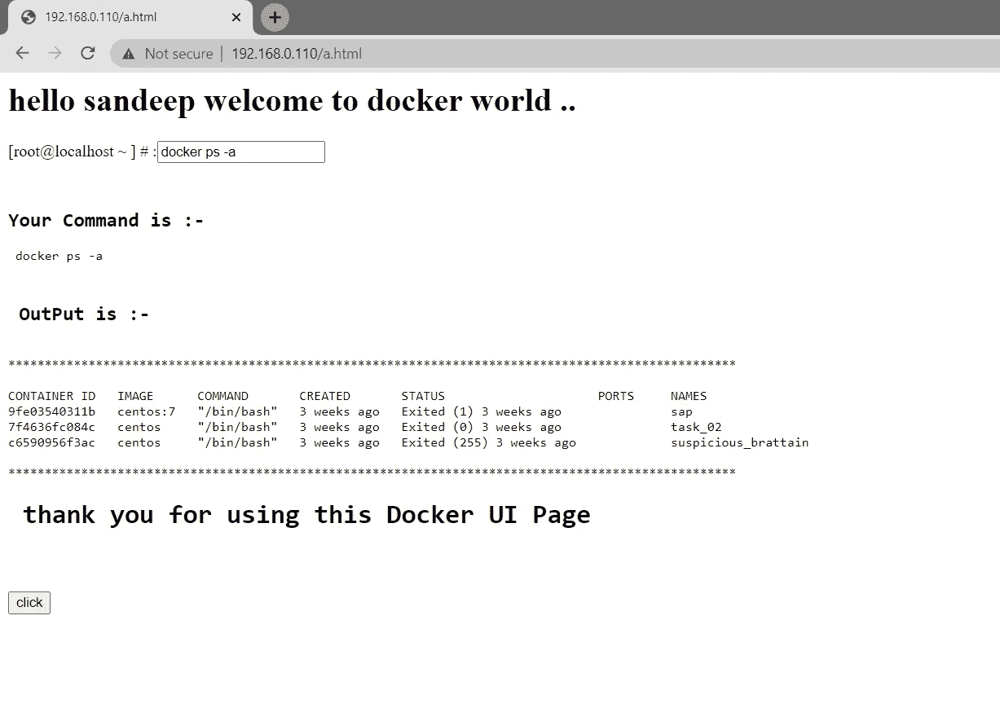

# 借助 JS 实现码头集装箱化的 Web 应用

> 原文：<https://medium.com/nerd-for-tech/wl-date-15-06-2021-task-07-329996d19c9a?source=collection_archive---------16----------------------->

## WL 日期 2021 年 6 月 15 日任务-07

这个任务由 ***桑迪普*库马尔·帕特尔**完成

# JavaScript 与 Docker 的集成

# Java Script 语言

**JavaScript** 是一种轻量级、解释型**编程**语言。它是为创建以网络为中心的应用程序而设计的。它是 Java 的补充，并与 Java 集成在一起。JavaScript 非常容易实现，因为它集成了 HTML。它是开放的和跨平台的。

JavaScript 是一种动态的计算机编程语言。它是轻量级的，最常用来作为 web 页面的一部分，其实现允许客户端脚本与用户交互并制作动态页面。它是一种具有面向对象能力的解释型编程语言。

JavaScript 最初被称为 **LiveScript，**但是 Netscape 把它的名字改成了 JavaScript，可能是因为 Java 引起了人们的兴奋。JavaScript 于 1995 年首次出现在网景 2.0 中，名为 **LiveScript** 。该语言的通用核心已经嵌入到 Netscape、Internet Explorer 和其他 web 浏览器中。

# 客户端 JavaScript

客户端 JavaScript 是这种语言最常见的形式。脚本应该包含在 HTML 文档中或被 HTML 文档引用，以便浏览器解释代码。

这意味着网页不必是静态的 HTML，而是可以包含与用户交互、控制浏览器和动态创建 HTML 内容的程序。

JavaScript 客户端机制提供了许多优于传统 CGI 服务器端脚本的优势。例如，您可以使用 JavaScript 来检查用户是否在表单字段中输入了有效的电子邮件地址。

# Docker 平台

Docker 是一个开发、发布和运行应用程序的开放平台。Docker 使您能够将应用程序从基础设施中分离出来，这样您就可以快速交付软件。使用 Docker，您可以像管理应用程序一样管理基础设施。通过利用 Docker 快速交付、测试和部署代码的方法，您可以显著减少编写代码和在生产中运行代码之间的延迟。

Docker 帮助开发人员构建轻量级和可移植的软件容器，简化应用程序的开发、测试和部署

# Docker 是什么？

Docker 是一个开源项目，可以轻松创建容器和基于容器的应用程序。Docker 最初是为 Linux 开发的，现在也可以在 Windows 和 MacOS 上运行。为了理解 Docker 是如何工作的，让我们来看看一些可以用来创建 Docker 容器化应用程序的组件。

# Dockerfile 文件

每个 Docker 容器都以一个*Docker 文件*开始。Dockerfile 是一个用易于理解的语法编写的文本文件，其中包括构建 Docker *映像*的指令(稍后会详细介绍)。Dockerfile 指定了作为容器基础的操作系统，以及语言、环境变量、文件位置、网络端口和它需要的其他组件——当然，还有一旦我们运行了容器，它实际上会做什么。

# Docker 图像

一旦您编写了 Docker 文件，您就可以调用 Docker `build`实用程序来基于该 Docker 文件创建一个*图像*。Docker 文件是告诉`build`如何制作映像的一组指令，而 Docker 映像是一个可移植的文件，包含容器将运行哪些软件组件以及如何运行的规范。因为 docker 文件可能会包含关于从在线存储库中获取一些软件包的说明，所以您应该注意明确指定正确的版本，否则您的 docker 文件可能会根据调用它的时间产生不一致的图像。但是一旦图像被创建

## 任务描述📄

**⚙️任务 7.1 -**

📌在这项任务中，你必须通过展示自己的创造力和 UI/UX 设计技能，为 Docker(提供用户平台即服务(PaaS)的伟大容器化工具之一)创建一个 Web 应用程序，以使 WebPortal 用户友好。

📌这个应用程序将帮助用户运行所有的 docker 命令，如:

👉docker 图像

👉docker ps

👉码头运行

👉码头工人 rm -f

👉码头经理

# 前端代码

## sandeep.html

这是 HTML 和 JavaScript 的示例代码

# 后端代码-

后台我们用的是 python 脚本语言

## 后端. py-

# 最终产出-

这些是文本框中的一些示例快照，我们使用所有类型的 docker 命令，就像 ok show image、PS 命令、RM 命令、run 命令，我们提供所有类型的命令，因为所有的输出都来自 Linux 系统

# 谢谢你