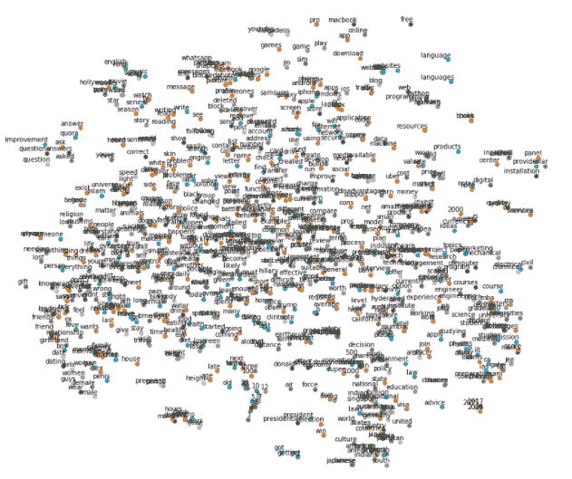
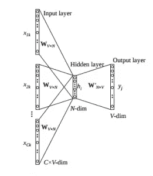
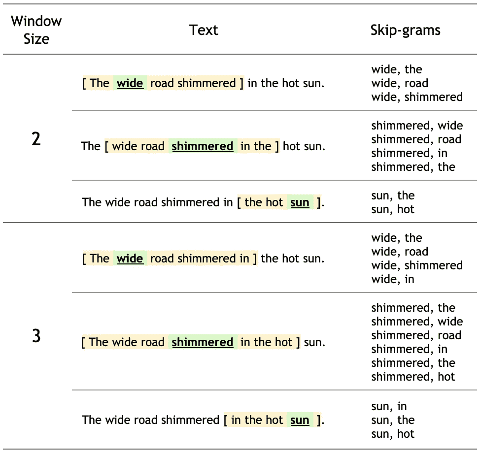
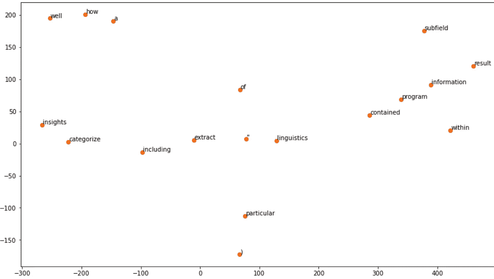

# 单词嵌入:文本分析:NLP:第 2 部分:Word2Vec 背后的直觉

> 原文：<https://medium.com/nerd-for-tech/word-embedding-text-analysis-nlp-part-2-intuition-behind-word2vec-3057031710da?source=collection_archive---------9----------------------->

大型非结构化文本数据高级技术



在我的上一篇文章[Word Embedding:Text Analysis:NLP:Part-1](/analytics-vidhya/word-embedding-text-analysis-nlp-part-1-c6c3f161e69f)中，我们讨论了像 OneHotEncoding 和 TF-IDF 这样的将文本数据转换成数字数据的技术。通过这种方法，我们可以很容易地将文本数据转换成机器可以理解的矢量格式，但这种方法的局限性。

1.  句子中单词的语义信息不能被存储，因为它占用了文档中单词的权重。
2.  由于这种方法根据文档计算任何单词的权重，所以不能确定该单词在特定类别中的相关性。

例如，如果我们正在处理语音、图像或大型文本数据序列，传统方法(如具有一个热编码值的单词包或 TF-IDF)将导致大量稀疏度量，这将导致 ML 模型的过度拟合。而且，它不能存储单词之间的语义信息。为了解决这些问题并处理长序列，我们将讨论更高级的单词嵌入方法，如基于深度学习技术的 **Word2Vec** 、 **GloVe** 和 **FastText** 。让我们来看看上面提到的嵌入技术。

# **Word2Vec**

Word2Vec 是谷歌在 2013 年发布的，用深度学习技术以密集的矢量形式表示单词。这是一种无监督的网络，它对从大量文本数据中创建为词汇表的单词进行训练，并将在向量空间中为每个单词生成嵌入。在这里，向量的维度是可以控制的，这是 BOW 和 TF-IDF 在将文本转换为高维度量时遇到的问题。

Word2Vec 是一种使用两种不同深度学习架构生成嵌入的方法，这两种架构是: **Skip Gram 和 Continuous Bag Of Words (CBOW)**

**连续单词包(CBOW)模型**

这种方法将单词的上下文作为输入，并试图根据上下文来预测单词。我们举个例子*“男生在学 NLP”。*我们可以借助 context_window 来预测单词 target _ word“boy”。如果我们取 2 的上下文窗口，组合将是这样的[the，is] ad 在神经网络的帮助下，可以预测目标单词。



该架构是单层的，输入和目标是一个热编码。输入-隐藏层和隐藏-输出层之间有两个权重。输入乘以输入隐藏权重，隐藏乘以隐藏输出权重，得到输出。计算目标值和预测值之间的误差，并在反向传播中更新权重。线性激活函数用于

# 跳格模型

Skip gram 模型实际上以与 CBOW 模型相反的模式工作，它试图根据给定的目标单词来预测上下文单词。skip-gram 模型的输入向量类似于 CBOW 模型。区别在于目标变量，因为我们要预测两边的上下文向量。关于目标变量，分别计算误差向量，并从中获得最终误差，该最终误差将被反向传播用于权重更新。为了表示单词的向量，在训练之后取输入和隐藏层之间的权重。


这是跳格模型的体系结构。输入向量的维数为 1xV，隐藏层的维数为 VxN，输出层的维数为 1xV。我们有输入向量、隐藏激活函数和隐藏层权重，在此帮助下，我们将获得 2 个上下文单词的输出(因为我们预测 2 个上下文单词)。该输出被发送到 softmax 层以转换成概率。误差是用实际的目标字减去我们从输出中得到的 softmax 值来计算的。最后，对所有向量进行逐元素求和以获得最终的误差向量，该误差向量将被传播回去以更新权重。

跳过文法模式是在 n-grams 上训练的，允许跳过令牌，如下图所示。单词的上下文通过一对`(target_word, context_word)`来表示，其中`context_word`出现在`target_word`的相邻上下文中。

考虑 8 个单词的句子

> ***宽阔的马路在烈日下闪闪发光。***

上下文可以由句子的所有 8 个单词的窗口大小来定义，并且窗口大小表示被认为是上下文单词的目标单词任一侧的单词跨度。在下面的例子中，我们可以看到窗口大小为 2。



跳格模型也使用了负抽样，我们可以在上面的图中看到。在第一行中，窗口大小为 2 的句子中没有出现[宽，闪烁]对。

# 用 Gensim 实现 Word2Vec 模型

借助 pytorch、Tesnsorflow 以及预训练的库，我们可以实现 Word2Vec 模型。在这里，我们将尝试使用 Gensim 库实现 Word2Vec。Gensim 是高效的和可扩展的，易于实现 Word2Vec 模型。我们将采用一个小语料库，然后我们将标记数据，并使用给定的参数，我们将建立 Word2Vec 模型。

```
from gensim.models import word2vec
import nltkraw_text = """Natural language processing (NLP) is a subfield of linguistics, computer science, and artificial intelligence concerned with the interactions between computers and human language, in particular how to program computers to process and analyze large amounts of natural language data. The result is a computer capable of "understanding" the contents of documents, including the contextual nuances of the language within them. The technology can then accurately extract information and insights contained in the documents as well as categorize and organize the documents themselves.""".split()# tokenize sentences in corpus
wpt = nltk.WordPunctTokenizer()
tokenized_corpus = [wpt.tokenize(document) for document in raw_text]# Set values for various parameters
feature_size = 100    # Word vector dimensionality  
window_context = 30          # Context window size                                                                                    
min_word_count = 1   # Minimum word count                        
sample = 1e-3   # Downsample setting for frequent wordsw2v_model = word2vec.Word2Vec(tokenized_corpus, size=feature_size, 
                          window=window_context, min_count=min_word_count,
                          sample=sample, iter=100)
# view similar words based on gensim's model
similar_words = {search_term: [item[0] for item in w2v_model.wv.most_similar([search_term], topn=5)]
                  for search_term in ['extract','information','insights']}
similar_words ##Output {'extract': ['linguistics', '"', 'of', 'including', 'a'],
 'information': ['program', 'within', 'subfield', 'result', 'contained'],
 'insights': ['well', ')', 'how', 'categorize', 'particular']}
```

这里，我们可以看到我们使用了如下参数

特征大小:嵌入向量的维数

窗口:上下文窗口大小

min_count:最小字数

样本:向下采样设置

在训练 Word2Vec 模型后我们可以看到相似的单词。在这里，我们已经采取了一个小语料库，所以没有给出完美的结果。让我们把这些相似的单词画出来，以便更好地理解。

```
import numpy as np
from sklearn.manifold import TSNE
import matplotlib.pyplot as pltwords = sum([[k] + v for k, v in similar_words.items()], [])
wvs = w2v_model.wv[words]tsne = TSNE(n_components=2, random_state=0, n_iter=10000, perplexity=2)
np.set_printoptions(suppress=True)
T = tsne.fit_transform(wvs)
labels = wordsplt.figure(figsize=(14, 8))
plt.scatter(T[:, 0], T[:, 1], c='orange', edgecolors='r')
for label, x, y in zip(labels, T[:, 0], T[:, 1]):
    plt.annotate(label, xy=(x+1, y+1), xytext=(0, 0), textcoords='offset points')
```



我们还可以检查任何单词的矢量表示。这里，我们将 100 作为一个维度，因此我们可以在 100 维向量中看到“自然”单词。

```
w2v_model.wv['Natural']##Output
array([-0.00181083,  0.00448997,  0.00354504, -0.00115317, -0.0043177 ,
        0.00021277,  0.00230537, -0.00092127,  0.00368612,  0.00396339,
       -0.00432571,  0.00493624,  0.00061124, -0.0022428 , -0.0034374 ,
        0.00289598, -0.00166694,  0.00477126, -0.00183866,  0.00382926,
       -0.00392748, -0.00271961, -0.0046588 , -0.00226145,  0.00373776,
       -0.00416674, -0.00012754, -0.00381866,  0.00321343, -0.00240004,
        0.00363028, -0.00328013, -0.00178409, -0.00235526, -0.0009552 ,
        0.0038814 ,  0.00266416, -0.00086921,  0.00155356,  0.00076463,
        0.00114544,  0.00430724, -0.00231419, -0.00074246,  0.00282576,
        0.00001543,  0.00400576,  0.00251022,  0.00396486, -0.00001084,
       -0.00405879,  0.00177121,  0.00315285, -0.00270734, -0.00044774,
       -0.00409922,  0.00101802, -0.00142405,  0.00274875,  0.00204634,
        0.00324002, -0.00225011, -0.00113855, -0.00219695,  0.00319166,
        0.00071592, -0.00315284,  0.00185551,  0.00097711, -0.00070271,
       -0.00369302, -0.00356723, -0.00135671,  0.00045015, -0.00433108,
        0.00392874,  0.00140838, -0.00117412,  0.00413575,  0.00170295,
       -0.00394475,  0.00001962, -0.00357439, -0.00057754, -0.00097144,
        0.0035095 , -0.00366997, -0.00320746,  0.00418892, -0.0023406 ,
        0.00005771, -0.00132968,  0.00197431, -0.00197416,  0.00487064,
       -0.00363371, -0.00282901, -0.00457178,  0.00202645, -0.00152074],
      dtype=float32)
```

# 结论:

在这篇博客中，我们已经深入了解了 Word2Vec，接下来我们将学习其他高级方法，如 GloV2 和 FastText。

强烈推荐建议。