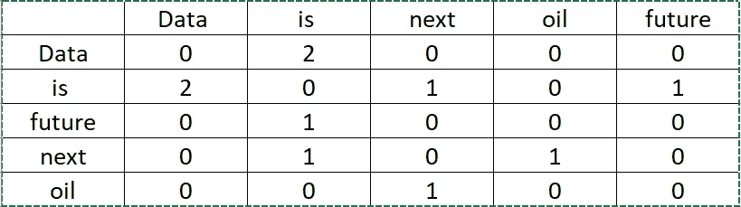
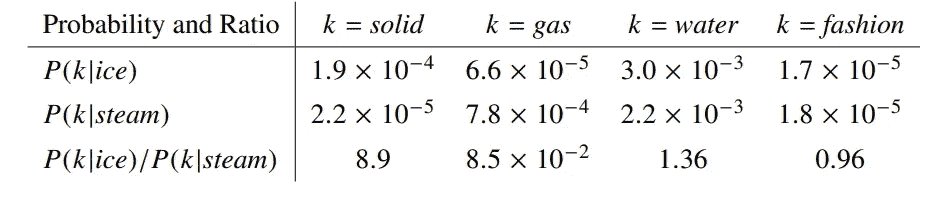
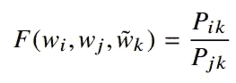
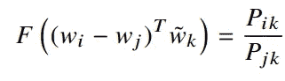
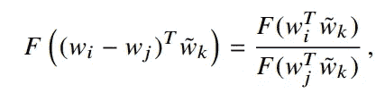
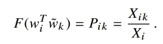
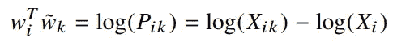
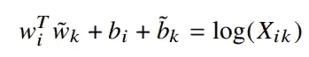
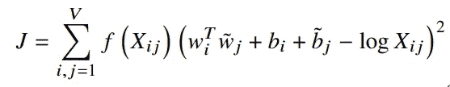
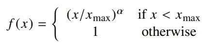

# 单词嵌入:文本分析:自然语言处理:第 3 部分:手套

> 原文：<https://medium.com/nerd-for-tech/word-embedding-text-analysis-nlp-part-3-glove-and-fasttext-da21d074237a?source=collection_archive---------9----------------------->

*手套背后的直觉*

正如我们在 Word2Vec 的前一篇文章中看到的，它可以获取单词的局部统计信息，而“全局向量”(GloVe)可以满足单词的全局上下文信息，这意味着它也可以处理未见过的单词。手套模型于 2014 年由 Jeffrey Pennington、Richard Socher 和 Christopher D. Manning 推出。然而，Word2Vec 有一些缺点，但结合 LDA 可以生成手套模型。因此，我们也将使用 Word2Vec 来构建手套模型。

# 手套

我们可以借助共现矩阵来推导单词之间的语义关系。给定一个语料库有 U 个单词，那么共现矩阵 X 将是 **UxX** 。在这个矩阵中 ***ith*** raw 和 ***jth*** 列将代表 ***Xij*** 即 2 个字在 ***ith*** raw 和 ***jth*** 列位置出现的值。我们可以看到共生矩阵的图示。

例如，我们有下面两个句子

数据是下一个石油。

数据是未来。

基于这两个句子，我们可以建立下面的共现矩阵。最后，设***P(j | I)= Xij/Xi***为单词 j 在 I 的上下文中出现的概率，这里，在下表中如果我们要计算 P(Data|is) = 2/4，

让我们以一篇研究论文中的同一个例子来说明共现矩阵的威力，以及我们如何使用该矩阵来计算单词之间的语义相似度。让我们举一个上面提到的研究论文中的例子。

来源:-[https://nlp.stanford.edu/pubs/glove.pdf](https://nlp.stanford.edu/pubs/glove.pdf)

**P _ ik/P _ JK其中**P _ ik = X _ ik/X _ I .****

所以根据上面的公式和表格，我们可以看到固体冰的概率比气体冰的概率高。这样我们可以看到，每当单词相关时，概率很高，单词不相关时，概率很低。但是当一个词与更多的词相关时，例如水与蒸汽和冰相关，那么在这些情况下我们会得到高概率。为了解决这个问题 ***P_ik/P_jk*** 被采用。

因此，当我们试图直接使用这个共生矩阵时，它会有一个维数问题，它是以百万计的。因此，GloVe 引入了使用 Word2Vec 的共生矩阵来解决这个问题。

来源:【https://nlp.stanford.edu/pubs/glove.pdf】T42

我们可以在上面的公式中看到，我们使用了单词向量 ***i，j，k*** ，其中 k 是上下文向量。所以当我们传递函数 F 的这三个向量时，我们会得到概率比。

**让我们来研究方程式**

根据上述等式，我们必须处理几个问题。首先，我们有一个标量的概率比，左边是向量，所以我们必须把向量转换成标量。第二，选择一个函数 F 应用于向量。第三，我们有 3 个变量 ***i，j，k*** ，很难用 3 个变量准备成本函数。让我们一步步解决这些问题。

1.  为了将向量转换成标量，我们将使用两个向量的点积，但问题是我们这里有三个向量。所以，我们对 I 和 j 向量做向量减法。这是从 Word2Vec 模型中提取的，因为我们可以在单词之间进行类比，并对其进行转置以匹配维度。我们可以在下面的公式中看到这一点。

2.那么 F 是什么呢，它是基于减群和除群之间的同态得到的，就像这样。

同样，这种特殊的同态保证了 ***F(X-Y)*** 的减法可以作为除法 ***F(X)/F(Y)*** 给出并得到相同的结果。

现在上述公式的解是

根据给定的计算，我们可以得出结论，我们可以把解决方案作为一个指数函数。所以公式应该是这样的。

为了方程的对称性，我们来介绍一下上面方程中的一些偏置 ***bi*** 和 ***bk*** 。

3.现在是研究成本函数的时候了。上式中的问题是当 ***Xik*** 为 0 时。一种解决方案是在对数中包括加法移位，***【log(Xik)→log(1+Xik)***，这被称为拉普拉斯变换，其保持了 X 的稀疏性，同时避免了发散。这是 LSA 的财产，通过这种方式，我们将 LSA 和 Word2Vec 结合起来，生成 GloVe。

添加这部分后，问题是，即使在很少出现协方差矩阵后，它们的权重也是相等的。因此，为了解决这些问题，添加了加权回归模型，并将加权函数***【f(Xij)***加入到成本函数中。所以，成本函数公式应该是这样的。

这里，我们在定义 F 时已经去掉了前一个公式中的第三个向量 k。因此， ***j*** 在这个公式中将像上下文向量一样工作。

# **手套模型的实现**

接下来，我们将看看用于嵌入的 FastText。衷心欢迎提出建议。

# 参考

1.  [https://medium . com/analytics-vid hya/glove-theory-and-python-implementation-b 706 AEA 28 AC 1](/analytics-vidhya/glove-theory-and-python-implementation-b706aea28ac1)
2.  https://nlp.stanford.edu/projects/glove/