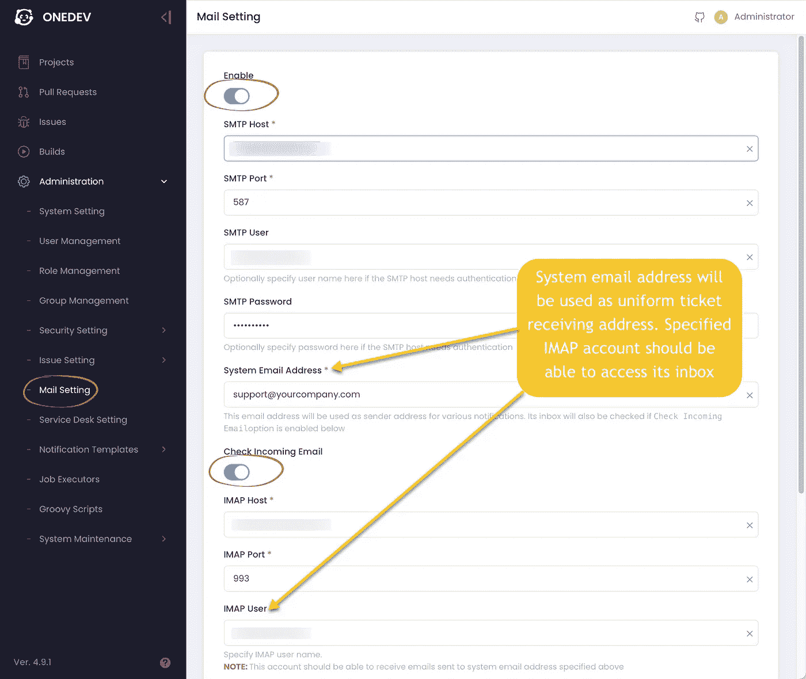
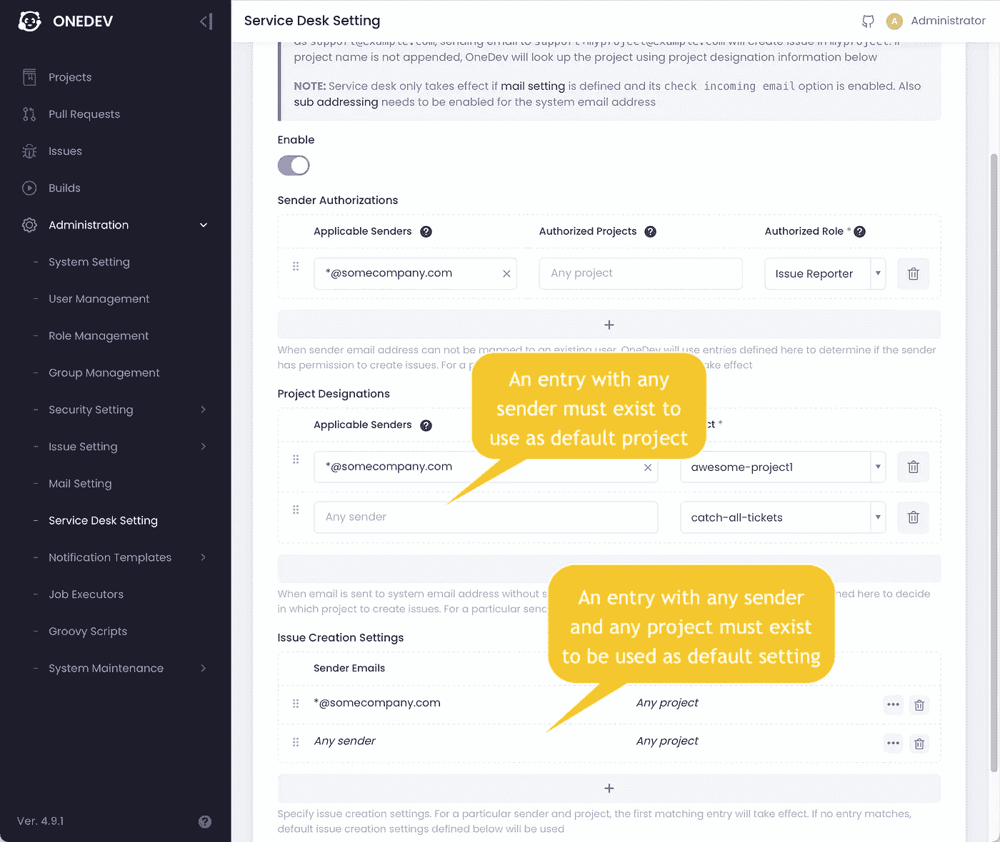
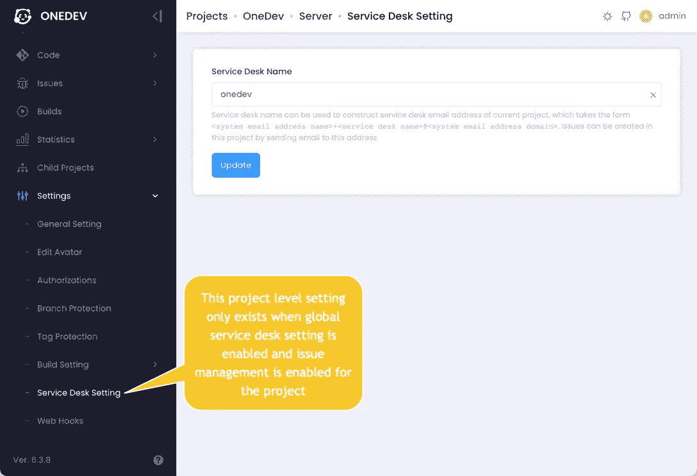

# 通过 OneDev 服务台将客户与开发人员联系起来

> 原文：<https://medium.com/nerd-for-tech/work-with-onedev-service-desk-e56d62c27e57?source=collection_archive---------17----------------------->

# 介绍

OneDev 是一个高性能的开源 git 服务器，具有可定制的问题工作流程和内置的 CI/CD。

4.9 版附带服务台功能，允许您的客户通过电子邮件提交票证，而无需拥有 OneDev 帐户。然后，可以在所需的项目中创建这些票证，并将其分配给团队中适当的员工。所有关于门票的进一步讨论可以完全在电子邮件中进行，讨论内容作为评论发布到门票上。当有任何票证活动时，客户也会收到通知，例如，当创建或部署相关版本时。

# 特色亮点

在开始服务台设置之前，让我们看看服务台能为您做些什么:

1.  客户可以将票证发送到统一的电子邮件地址，例如 support@yourcomany.com*，或者发送到项目特定的电子邮件地址，例如*支持+ <项目服务台名称或路径> @yourcompany.com* 。发送到统一电子邮件地址的票证将在客户的默认项目中创建，如果需要，您可以稍后将它们移动到其他项目。*
2.  *客户只能在授权项目中创建票证。授权是通过检查客户的电子邮件地址完成的。*
3.  *该电子邮件的所有收件人都将被添加到已创建票证的观察列表中，以便他们可以收到有关票证活动的通知并加入讨论。*
4.  *电子邮件的 Html 格式和附件经过精心处理，以实现电子邮件端和 web UI 端的相同体验。*
5.  *对于不同的客户，您可以配置不同的票证属性，如优先级和被分配人。*
6.  *与特定票证相关的所有电子邮件将被组织到单个线程中，以跟踪讨论上下文，并减少通知噪音。用户也可以退订机票。*
7.  *可以自定义票证通知电子邮件的内容。*

# *如何设置*

*首先，您需要启用*邮件设置*及其*检查收到的邮件*选项:*

**

*另外，需要在您的邮件服务器上为系统电子邮件地址启用[子地址](https://en.wikipedia.org/wiki/Email_address#Subaddressing)。在页面底部测试邮件发送和接收，以确保其正常工作。*

*现在 OneDev 能够通过电子邮件发送机票通知。收到通知电子邮件的用户也可以通过回复电子邮件向票证添加注释。可以通过邮件设置下的*通知模板*定制通知邮件的内容。*

*但是，为了能够通过电子邮件创建票证，您还应该启用*全球服务台设置*，如下所示:*

**

*如果不想使用项目路径进行子寻址，您还可以选择为项目指定服务台名称:*

**

*全部完成！现在授权用户可以发送电子邮件到系统电子邮件地址来创建门票！*