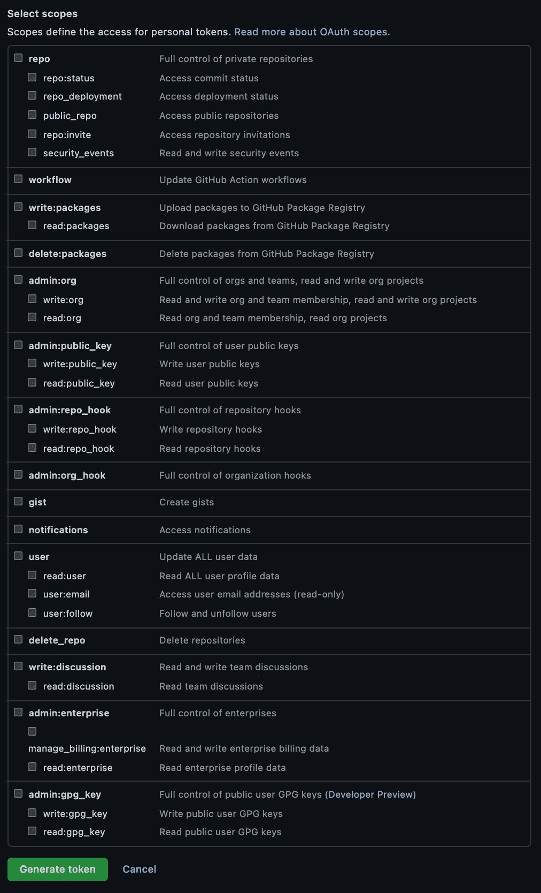
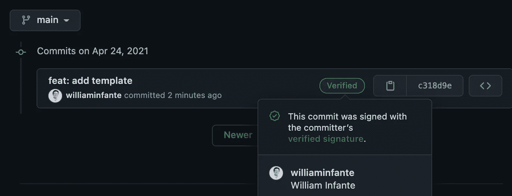

# 在您的终端中切换 GitHub 帐户

> 原文：<https://medium.com/nerd-for-tech/workflow-for-switching-github-accounts-in-your-terminal-d87e50bb5511?source=collection_archive---------0----------------------->

*更新了针对拥有 2FA 和个人访问令牌的帐户的说明*


[张侨勇](https://unsplash.com/@yungnoma?utm_source=unsplash&utm_medium=referral&utm_content=creditCopyText)在 [Unsplash](https://unsplash.com/s/photos/switches?utm_source=unsplash&utm_medium=referral&utm_content=creditCopyText) 上拍照

所以，你有多个 GitHub 账户。一个用于个人回复，至少一个用于工作回复。无论是为了个人还是为了工作，改变项目经常发生，你只是想在签署提交和推送之前，有一个快速的单一参考来检查和改变什么。此外，您希望它适用于具有双因素身份认证(2FA)和个人访问令牌的帐户。那么，这篇文章应该提供纲要。

我很确定有很多文章和论坛提到了你需要的改变，但是我只是想把它们放在一个参考文献中。当我切换账户时，有时会发生错误的提交，所以我希望这能防止你犯和我一样的错误。我只是想快速检查和改变，这也很酷使用 2FA 和代币。

顺便说一句，我并不建议为不同的项目或组织使用多个 GitHub 帐户。在最后一部分会有更多的介绍。

# 检查

通常，我想检查我当前的配置，看看我是否启用了签名提交，我当前的用户名和电子邮件:

```
git config --list
```

如果我使用 GPG 签名，我也会检查我拥有的可用 GPG 列表。

```
gpg --list-secret-keys --keyid-format LONG
```

这也是识别即将过期密钥的简便方法。下面是一个输出示例:

```
sec   rsa2048/your_hash_sec_short_a 2020-01-01 [SC]
      [expires: 2022-01-01]
      your_hash_sec_long_a
uid   [ultimate] Your Name <your.name@work.com>
ssb   rsa2048/your_hash_ssb_a 2020-01-01 [E]
      [expires: 2022-01-01]sec   rsa4096/your_hash_sec_short_b 2020-01-01 [SC]
      hash_sec_long_b
uid   [ultimate] Your Name (main) <your.name@personal.com>
ssb   rsa4096/hash-ssb-b  2020-01-01 [E]
```

# 变化

我对我的账户使用相同的名字，所以不需要改变`user.name`，但是我需要改变以下签名的提交:

```
git config credential.username "your_username"
git config user.email "your_email"
git config user.signingkey your_ssb_hash
```

如果你想为所有回购更改它们，只需添加`--global`。下面加了，方便复制粘贴。

```
git config --global credential.username "your_username"
git config --global user.email "your_email"
git config --global user.signingkey your_ssb_hash
```

# 使用 2FA 和个人访问令牌的示例

假设您当前在终端中设置了 GitHub 工作帐户，您想要创建一个新的回购，并首先使用您的启用了 2FA 的个人 GitHub 帐户提交。只要遵循`Checks`部分提到的改变，在那之后，你应该能够像这样提交:

```
echo "# your_new_repo" >> README.md
git init
git add README.md
git commit -m "first commit"
```

如果您正确设置了您的签名提交，当您输入密码时，您应该会看到正确的电子邮件和秘密子密钥。

```
┌────────────────────────────────────────────────────────────────┐
│ Please enter the passphrase to unlock the OpenPGP secret key:  │
│ "William Infante (main) <your_email>"                          │
│ 4096-bit RSA key, ID your_ssb_hash,                            │
│ created 2020-01-01\.                                            │
│                                                                │
│                                                                │
│ Passphrase: __________________________________________________ │
│                                                                │
│         <OK>                                    <Cancel>       │
└────────────────────────────────────────────────────────────────┘
```

另外，基于使用 gnupg2 和 gpg-agent 2.x 时的 [stackoverflow post](https://stackoverflow.com/questions/39494631/gpg-failed-to-sign-the-data-fatal-failed-to-write-commit-object-git-2-10-0) ，我们需要设置环境变量`GPG_TTY`。我通常把它放在我的 bash rc 或 zsh rc 中。

```
export GPG_TTY=$(tty)
```

然后，继续，你就可以走了。

```
git branch -M main
git remote add origin https://github.com/<user>/<your_new_repo>.git
git push -u origin main
```

哦，当他们问你的密码，这不是你的 GitHub 密码。我总是犯这个错误，你会得到以下提示:

```
Password for 'https://your_username@github.com':
remote: Invalid username or password.
```

如果启用了 2FA，您将需要提供您的个人访问令牌。有时，我会忘记将个人访问令牌放在哪里。在这种情况下，只需生成一个新的，如:

[](https://docs.github.com/en/github/authenticating-to-github/creating-a-personal-access-token) [## 创建个人访问令牌

### 您应该通过命令行或 API 创建一个个人访问令牌来代替密码。个人…

docs.github.com](https://docs.github.com/en/github/authenticating-to-github/creating-a-personal-access-token) 

另一方面，要求个人访问令牌，这一过程让我可以更详细地了解我的终端中允许的设置。



生成 GitHub 个人访问令牌时的范围

# 维护多个 GitHub 帐户

最初，我为个人账户和工作账户创建了不同的账户。当时我确实想把我个人的项目和别人划清界限。但是如果你今天问我，如果我被要求为一个新的 github 组织提供一个 GitHub 帐户，我可能会为我的个人和工作帐户使用同一个帐户。

嗯，GitHub 建议我们只使用一个帐户来存放个人和工作资料。

 [## 合并多个用户帐户

### 如果您有单独的工作帐户和个人帐户，可以合并这些帐户。提示:我们建议只使用一个…

docs.github.com](https://docs.github.com/en/github/setting-up-and-managing-your-github-user-account/merging-multiple-user-accounts) 

上面的链接甚至提供了合并多个用户账户的方法，但是如果你和我一样，我更愿意保留我在 GitHub 组织中使用的用户名。但接下来，我将只为新组织使用一个帐户。这意味着在可预见的未来，我可能会使用这个切换 github 帐户的工作流程。

总的来说，我只是想在切换我的 GitHub 账户时有一个快速的参考，并且仍然正确地显示签名的提交。

