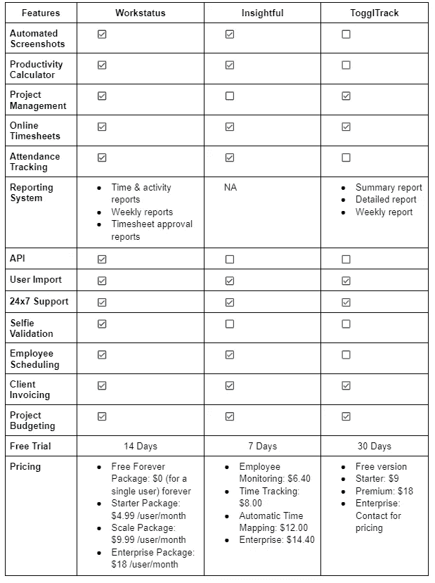

# 劳动力分析软件:工作状态 vs .洞察力 vs. Toggl 跟踪

> 原文：<https://medium.com/nerd-for-tech/workforce-analytics-software-workstatus-vs-insightful-vs-toggl-track-bb723a8198?source=collection_archive---------12----------------------->

**您是否正在为您的公司寻找合适的劳动力分析软件？**

我们理解为您的组织选择一个新的软件工具可能会令人生畏。但是，如果是时候改进和简化您的工作流程，选择正确的工具对于轻松过渡至关重要。

你一定在三大工具- **工作状态、洞察力和 Toggl 跟踪**中感到困惑。

那么，哪个适合你的团队——**Workstatus vs . insight vs . tog GL Track？**

阅读博客，了解主要差异、功能、定价等，帮助您做出明智的决定。

我们开始吧-

# **什么是工作状态？**

Workstatus 是一款[员工管理软件](https://www.workstatus.io/)，帮助公司及其员工跟踪工作时间并提高生产率。

Workstatus 配备了一个智能分析系统，使您能够自动监控员工在工作中不同任务上花费的时间。

## **Workstatus 的一些主要功能包括:**

*   带有图形和图表的详细报告
*   准确的在线时间表
*   主动截图和员工监控
*   预算管理和客户发票
*   知道时间浪费的空闲时间跟踪器

Workstatus 可在 Windows 和 Mac 平台上使用。此外，您可以在 iOS 和 Android 设备上使用 Workstatus。

## **定价:**

*   永久免费套装:0 美元(单个用户)永久免费
*   初级套装:4.99 美元/用户/月
*   扩展包:9.99 美元/用户/月
*   企业套餐:18 美元/用户/月

***您是否在寻找更多关于工作状态的信息？***

**查看-** [**使其成为完美劳动力管理系统的 10 大特点**](https://www.workstatus.io/blog/10-features-of-workstatus-that-make-it-a-perfect-workforce-management-system/)

# **什么是有见地？**

Insightful 是一款自动劳动力分析软件，可提高员工的整体生产力。基于可操作的数据洞察，轻松做出更好的决策，确保您的所有运营都在预算范围内按时完成。

## **一些有见地的主要特点包括:**

*   远程工作管理
*   生产力监控
*   时间跟踪
*   活动监控

Insightful 让您专注于发展业务，而不必担心组织的重复性任务。

## **定价:**

*   员工监控:6.40 美元
*   时间追踪:8 美元
*   自动时间映射:12.00 美元
*   企业版:14.40 美元

# **什么是 Toggl 赛道？**

Toggl 跟踪是一个简单的劳动力分析工具，以帮助您取代传统的时间表。

尽管是一个时间表应用程序，但它提供了收入跟踪和项目管理功能，对希望增加利润的自由职业者和组织很有帮助。

## Toggl Track 的一些主要功能包括:

*   估算项目管理的预算
*   跟踪计费和非计费时数
*   自动时间跟踪

它可以集成其他工具，如特雷罗，Asana 和吉拉。

## **定价:**

*   免费版本
*   起始价:9 美元
*   溢价:18 美元
*   企业:联系定价

# **终极对决:工作状态 vs 洞察力 vs. Toggl 赛道**

我们将根据以下主要特征对**的工作状态、【洞察力】、**和**进行比较:**

1.时间跟踪

2.活动监控

3.自拍验证

4.货品计价

5.报告

让我们开始:

## **1。时间跟踪**

**工作状态**

Workstatus 使您只需单击一个按钮即可开始或停止跟踪时间。它还提供了离线时间跟踪功能，可以手动编辑或添加时间条目。

Workstatus 是远程和办公室团队跟踪任何项目或任务时间的优秀工具。这有助于他们查看花费在任何项目上的准确时间，并使其易于对即将到来的项目进行预测。此外，您的团队甚至可以监控他们的休息时间。

由于 Workstatus 会以在线时间表的形式自动汇总所有跟踪的时间，因此管理层将始终掌握员工的工作时间。对团队的工作时间了如指掌。

**见解深刻**

如果您只是在寻找一种方法来监控您的团队在远程工作时的时间，insight 可能是您的正确选择。它还允许你跟踪花费在多个项目上的时间，但缺乏离线时间跟踪功能。

这意味着你将无法考虑离线工作，这可能会在向客户计费时产生问题。

## **Toggl 轨道**

Toggl Track 提供了一个简单的自动时间跟踪功能和一个番茄定时器。易于跨多个平台使用，如 web 应用程序、移动应用程序和桌面。

你也可以通过 chrome 或 firefox 扩展访问 Toggl。

# **2。活动监控**

## **工作状态**

Workstatus 有一个强大的功能，可以检测您使用鼠标或键盘活动的每一秒钟。这段忙碌的时间被称为“活跃时间”，而休息被归类为“空闲时间”

例如，假设一名员工工作 1 分钟。

20 秒用来打字，10 秒用来移动鼠标。鼠标和键盘都用了 15 秒，剩下的 15 秒没有任何活动。

这使得员工的活动率为 75%，其余的 25%被认为是“空闲时间”

因此，Workstatus 可以让您清楚地了解团队在任何任务或项目上花费的**活动时间和**空闲时间。但是，根据员工的工作性质，这一活动时间可能会有很大的不同。

其他活动监控方式:

**截图:** Workstatus 抓取**工作画面截图**，为管理者提供实时数据。

应用程序和网络跟踪:这可以告诉经理你的员工正在访问哪些应用程序和网站，以防止任何数据泄露或网络攻击。

## **见解深刻**

Insightful 也是一款优秀的员工监控软件，可以让您准确了解员工在任何给定时间的工作情况。

全面了解员工的时间表、工作效率和日常活动。它在隐形模式下工作，不会妨碍工作人员的日常任务。

## **Toggl 轨道**

Toggl Track 附带了一个功能，可以监控员工访问过的每个网站或应用程序至少 10 秒钟。

详细了解您的员工在工作场所是如何度过时间的，并检查他们是否访问了任何不良网站或应用程序。

但是，Toggl 并不认为自己是员工活动监控软件，所以它不提供像截图，活动率等关键功能。

# **3。自拍验证**

## **工作状态**

Workstatus 提供了一种全面的考勤管理方法，其主要特点是即时 [**自拍验证**](https://www.workstatus.io/best-facial-recognition-software?utm_source=gp&utm_medium=medium-rn) 。您可以快速验证打卡时间，并通过自拍自动跟踪出勤情况。不再需要人工打卡或考勤卡。

**它会帮你减少以下:**

*   伙伴拳击
*   人工错误
*   人工时间表
*   时间盗窃

它通过消除可疑的打卡和对面部特征不匹配发出即时警报来立即采取行动，确保 100%的透明度。

从它的人工智能仪表板上很容易设置半天，加班，轮班时间和其他出勤政策。

## **见解深刻**

Insightful 确实提供了一种自动跟踪员工出勤的方法，但目前它缺乏监控出勤的自拍验证功能。

## **Toggl 轨道**

Toggl Track 不向其用户提供任何考勤管理手段。

# **4。开票**

## **工作状态**

Workstatus 跟踪计费小时数以自动生成发票，从而节省时间并减少错误，实现顺畅的薪资管理。

您可以使用 Workstatus 的空闲时间计算器来查找您的准确工作时间，并使用该时间来生成发票并将其发送给客户。

## **见解深刻**

Insightful 拥有简化账单和工资单的所有功能，但它无法自动生成发票并将其发送给账单客户。

## **Toggl 轨道**

虽然 Toggl Track 有一个计费小时跟踪器，但它缺乏一个内置的计算器来进行工资管理和开具发票。

# **5。报告**

## **工作状态**

Workstatus 有一个自动报告系统，允许用户下载并保存实时数据，以供进一步分析和改进。**下载工作状态**并访问多个报告，如:

*   时间和活动报告
*   每周报告
*   时间表审批报告

无需投入太多精力，即可准确了解员工的生产力、时间和活动。

## **见解深刻**

Insightful 向其客户提供最少的报告。

## **Toggl 轨道**

**Toggl Track 还提供多种报告，如:**

*   总结报告
*   详细报告
*   周报告

通过这些报告，您可以快速准确地了解员工一天的工作情况。

# **对比表-** **工作状态与洞察力与 Toggl 轨迹**

让我们快速回顾一下 Workstatus、inspective 和 Toggl Track 的一些主要功能

# **工作状态 vs .洞察力 vs. Toggl 轨迹:结论**

劳动力分析领域三大勇士之间的战斗现在已经结束。Workstatus、Insightful 和 tog GL Track——都为他们的客户提供了许多功能。

但是，在为您的组织选择合适的软件时，这完全取决于您的具体要求和预算。

尽管如此，如果你需要能够为你提供一个完整的劳动力分析软件套件，而不仅仅是一个生产力和时间跟踪平台，那么 **Workstatus** 就是适合你的工具。

**现在就开始> >**

在此免费试用 14 天-