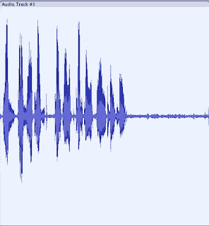
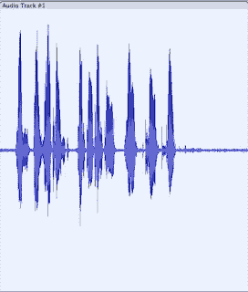
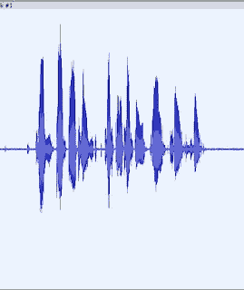

# 在家工作时，请使用舒尔 MV5C 话筒

> 原文：<https://medium.com/nerd-for-tech/working-from-home-be-shure-to-use-a-mv5c-microphone-8a8b92d3583b?source=collection_archive---------3----------------------->

舒尔以其专业入耳式耳机、头戴式耳机、麦克风和无线系统而闻名，WFH 和舒尔本很早就出现了(自 1925 年以来)。入耳式耳机可以产生非常高质量的音频，因为它们将声音与外界隔离开来，音乐家定制了耳机，因此它们完全适合耳道(这也允许音频播放得更安静，这对耳鼓更好，并减少损伤)。

最近，会议系统也成为非常针对企业的产品组合的一部分。

现在，随着每个人都在家工作，舒尔进入了家庭办公空间，生产了一款适合视频和语音通话的话筒，即 MV5C 话筒。

需要进行一些组装(将大球端螺钉穿过底座拧入麦克风球)。

麦克风通过 micro-USB 连接电脑(这个时代为什么不用 USB-C？).背面还有一个耳机插孔，用于连接有线(插孔)耳机或头戴式耳机，因此可以监听原始输入。

完成的单元看起来很专业，虽然麦克风的球是塑料制成的。

麦克风应尽可能靠近用户的面部(在键盘前面，底座可以滑到一些键盘下面，但仍能有效地使用键盘)。音质很好。

主要问题是它很容易拾取背景噪音，特别是硬盘(即内部有硬盘或备份外部磁盘的旧电脑)和风扇的嗡嗡声。基于固态硬盘(SSD)的新系统听起来会好得多。也可以将麦克风安装在一些隔音材料上，因为嗡嗡声主要是通过底座发出的。

以下是使用 MV5C 和 Audacity (44KHz 采样，32 位浮点)进行的 3 次记录，以及捕获的图像—基线波形幅度显示了嗡嗡声/背景噪声。

桌面

可以听到背景嗡嗡声，但质量仍然很好。

离开桌面是用一些吸音材料录制的。嗡嗡声略低。

最终版本是在麦克风与桌面(电脑和备份磁盘在桌面上)隔离的情况下进行录音，麦克风后面的屏幕位于麦克风和电脑之间。

每次采集时，背景噪音都会减少，将麦克风放在不会拾取外来噪音的位置会对音频质量产生巨大影响——尽管如果是离线编辑，那么噪音消除会有所帮助。

作为一款桌面话筒，并且设置正确(靠近使用它的人)，它是一款质量非常好的话筒，在使用视频会议或电话应用时，与耳机或其他设备中质量较差的话筒相比，它可以发挥很大的作用。

MV5C 还可以与 ShurePlus MOTIV 移动录音软件[配合使用(iOS 或 Android 免费下载),不过它需要正确的线缆(I..e 设备到微型 USB)。该软件提供工具将音频剪切成片段，淡入淡出，并以各种格式保存。](https://www.shure.com/en-GB/products/software/shure_plus_motiv)

它直接从舒尔[零售 115 英镑，尽管在网上可以找到更便宜的。](https://www.shure.com/en-GB/products/microphones/mv5c)

【http://eurotechnews.blogspot.com】最初发表于**。**