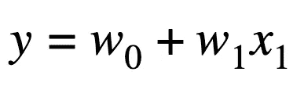
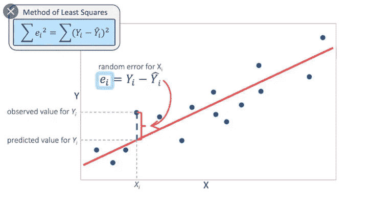
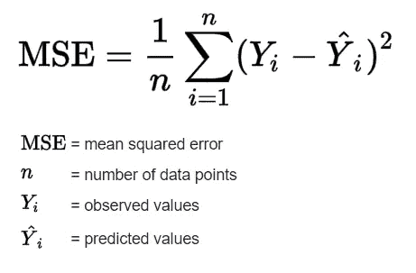
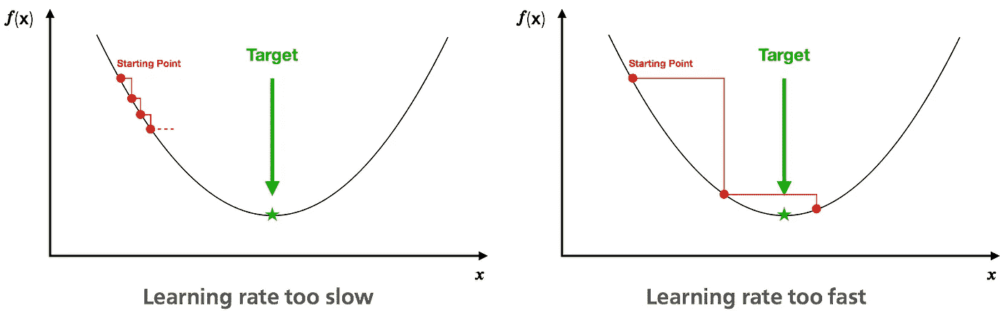
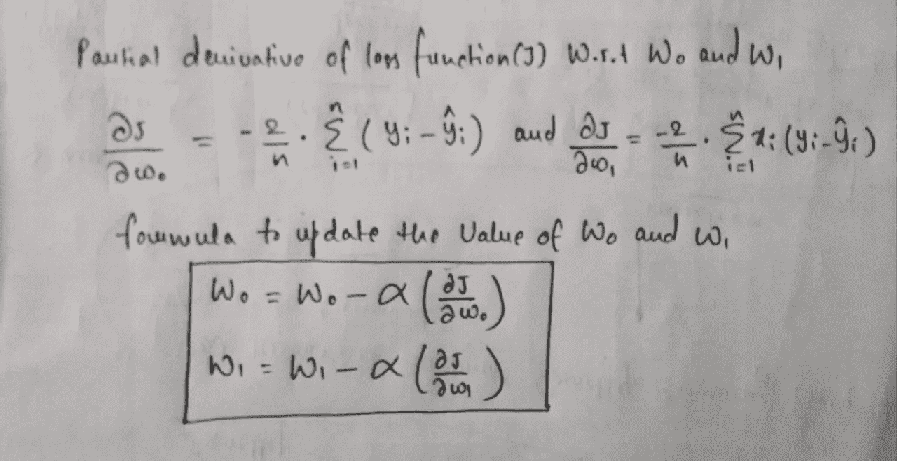
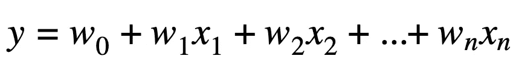
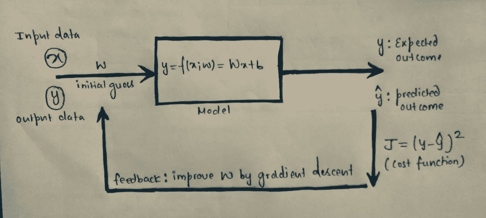

# 线性回归算法的工作

> 原文：<https://medium.com/nerd-for-tech/working-of-linear-regression-algorithm-9eeccb70478e?source=collection_archive---------11----------------------->

## 机器学习的基础算法之一。

**作者图片-线性回归**

线性回归通常被称为一种简单但非常有用且强大的理解数据的机器学习算法，但仍然只有少数人知道它的基本概念。

***本文旨在帮助你理解线性回归及其原理。***

在我们深入线性回归算法的细节之前，让我们先了解一下**“什么是回归？”**

你可能听说过*“回归是一组用于估计变量间关系的统计过程。”*或*“回归用于确定因变量与一个或多个自变量之间的关系强度。”*或*“回归是发现数据趋势的一种方式”*等。

关于回归有各种各样的解释，但我觉得大多数解释都是直接进入方程、模型、统计分布和所有那些技术层面的东西。所以暂时忘掉所有这些技术术语，让我们用最简单的术语来理解回归

*如果你坐过出租车，就能理解回归:*

当你坐在出租车里的时候，你会看到那里有一个固定的数额(被称为基本公平)。不是出租车开动，就是你下车，这是你欠司机的。当你跨进出租车的那一刻…那是一个常数，你必须支付这个数目。然后当它开始移动时，每一米或 100 米，票价增加一定的数量。所以在距离和你要支付的金额之间有一个关系，在这个常数之上。如果你不动，又被堵在路上，那么每多一分钟，你就得多付钱。因此，随着分钟数的增加，您的票价也会增加，随着距离的增加，票价也会增加，当这一切发生时，您已经支付了一个恒定的基本票价。这就是回归结果，它会告诉你基本票价是多少，你支付的时间和票价与你旅行的距离之间的关系是什么。

*注:我在 YouTube 上找到了穆尔塔扎·海德尔教授的这个解释。*

这里“总费用”是我们试图预测的因变量/目标变量，而“距离”和“时间”是独立变量或预测变量。

## **为什么要用回归？**

当因变量是连续数据类型且预测值或自变量可以是任何数据类型(如连续、名义/分类等)时，执行回归。它试图找到最佳拟合线，以最小误差显示因变量和自变量之间的关系。

## **线性回归**

**线性回归**

***线性回归是一种通过将线性方程拟合到观测数据来模拟因变量和自变量之间关系的方法。***

最佳拟合线的一般公式为:

上面的等式是一元或简单线性回归的**表示，其中自变量的数量为 1，自变量( **x** )和因变量( **y** )之间存在线性关系。**

该算法的目标是为我们拥有的输入数据找到最佳拟合线，即未知参数 **W0** 和 **W1** 的最佳值，但是有无限的 **W0** 和 **W1** 的可能性，所以我们经常会想到选择哪一个，或者是否有任何方法可以量化哪一个是最佳拟合模型？

## **所以这里成本函数进入了画面**

LSE(图片来源:谷歌)

这是一个在给定数据上衡量模型性能的函数。它量化了预测值和期望值之间的误差，并以单个实数的形式呈现出来。*(无论选择* ***W0*** *和* ***W1*** *中的哪一个，都将最小化总误差或成本函数，这将是该模型的最优值)*。

线性回归模型最常用的成本函数是 **MSE(均方误差)**

基本上，我们对所有数据点的误差差求平方并求和，然后用该值除以数据点总数。这提供了所有数据点的平均平方误差。

**注意:成本函数越小，模型的精度越高。**

## 梯度下降

为了最小化成本函数(MSE)并提高模型权重( **W0** 和 **W1** )，我们使用称为**梯度下降**的优化算法。

现在，我们已经将拟合问题简化为优化问题。

因此，基本上这种梯度下降算法所做的是，它从某些给定的任意值开始，用于 **W0** 和 **W1** ，然后迭代地改变这些值，直到它找到导致最小成本函数的权重的最优值。

*但是这个算法是怎么算出* ***W0*** *和* ***W1*** *的值在每次迭代/步长之后应该改变多少呢？*

答案是**学习率。它决定了算法收敛到最小值的速度。**

为了理解这一点，让我们看看下面给出的图表

学习率

想象你在这条 U 形曲线的顶端，你的目标是到达这条曲线的底端。如果你决定一次走一步，你最终会到达底部，但这需要更长的时间，如果你每次选择走更长的步，你会更快到达，但有可能你会越过底部，而不是完全在底部。因此，为了快速到达底部而不越过它，我们需要选择快速到达底部点(最小值)的最佳步骤。这里的步长代表学习速率。

为了更新参数( **W0** 和 **W1** )，我们从成本函数中提取梯度。为了发现这些参数如何影响 MSE，我们对 **W0** 和 **W1** 进行偏导数。

偏导数是梯度(告诉向哪个方向移动)，它们用于更新 **W0** 和 **W1** 的值。Alpha( **α** )是学习率，它是一个必须指定的超参数(步长)。

梯度下降算法不断寻找 w0 和 W1 的最佳值，直到成本函数值变得非常小或变为 0(理想情况下)，这就是我们如何找到最佳拟合回归线。

## 多元线性回归

当我们处理现实世界的问题时，有多个独立变量，而不是只有一个单一的变量，有助于预测目标变量。所以我们主要处理**多元线性回归。**

***多元回归模型因此描述了单个响应变量 Y 如何线性依赖于多个预测变量。***

等式保持不变，就像简单的线性回归一样，唯一的区别是我们简单地添加了多个独立变量/预测值及其相应的系数。

多元线性回归总是比简单的回归好，因为我们每增加一个相关变量，就增加了模型的解释力。

*注意:算法的工作原理保持不变，唯一变化的是梯度下降图。在简单线性回归中，梯度下降图呈 2D 形式，但随着独立特征/预测因子数量的增加，梯度下降图的维数也不断增加。*

下图总结了线性回归算法的工作步骤。

**来源:**[**https://astha-s15 . medium . com/how-do-machines-actually-learn-16573 b71c 520**](https://astha-s15.medium.com/how-do-machines-actually-learn-16573b71c520)

**…****这就是线性回归算法的工作原理。****

*我希望有人觉得这篇文章有帮助。*

*您可以通过以下方式与我联系:*

*   ****领英:****[*https://www.linkedin.com/in/astha-sharma-47266b11b/*](https://www.linkedin.com/in/astha-sharma-47266b11b/)**
*   *****GitHub:***[*https://github.com/asthasharma98*](https://github.com/asthasharma98)**

*****谢谢！*****