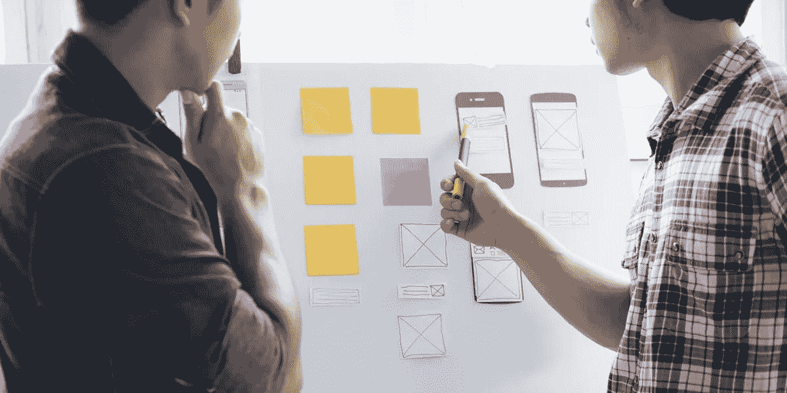

# 在 UX 设计访谈中应对设计挑战

> 原文：<https://medium.com/nerd-for-tech/working-through-design-challenges-in-ux-design-interviews-5c932359e54c?source=collection_archive---------15----------------------->

最常见的一轮现场面试是[白板设计挑战](https://bit.ly/3cjSew5)。像谷歌这样的公司在现场面试当天有四个白板挑战，可以减缓你的思维过程，让你一整天都沉迷其中。当务之急是要有一个战略，一个面对挑战的计划，和一个帮助你快速思考的结构。虽然听起来很即兴，但白板挑战最好是在您有一个游戏计划时解决。

白板挑战通常出现在 UX 设计师面试的最后一轮，也就是现场阶段。面试官会拟定一个面试官事先不会知道的与产品设计相关的问题，要求他在阐述自己思考过程的同时，快速构思，在 30 到 60 分钟内画出解决方案。

在面试官画图的时候，面试官通常会根据情况扮演设计总监/产品经理/利益相关者/用户等不同的角色，随时与面试官互动，回答他的问题，或者对他的设计提出想法。

这与一些最好的即兴音乐家或单口喜剧演员不是靠魔法而是通过纯粹的严格练习做到的类似。根据 [Wondershare Mockitt](https://bit.ly/3ewCXuz) 的研究，白板设计挑战作为面试官评估设计师的一种方式越来越受欢迎。这是观察设计师思维过程的最佳方式之一，可以看到他们是如何解决问题的。通过解决设计师的电路板问题，你可以从他们身上学到很多东西:

*   对解决问题的热情表明了对这个角色的兴趣
*   对董事会的信任显示了经验和成熟
*   当你批评一个决定时，答案会告诉你这个人将如何与团队合作

# 为什么白板设计挑战如此重要？面试官在寻找什么？

在准备白板设计挑战时，我注意到我几乎占据了白板上的所有空间。我画出了好的解决方案，但后来意识到它们没有方向。对于我的设计的走向，没有一个清晰的理解。简而言之，我不是一个团队成员。结构不是设计任务的重要部分，因为设计实际上不是一个结构化的过程，而是相当混乱的。重要的是要明白，你作为一个面试候选人，是要向面试官展示你的思维过程、你设计决策的能力，以及促进其他团队成员的进一步锻炼。

从面试官的角度来看，木板设计的挑战不是你想出了多少新点子，也不是你的图纸有多漂亮；这是关于你如何处理一个问题，以及一个设计师如何与他人合作。你如何设计你的董事会就是你如何与团队合作，这是面试官的评价。在作业过程中，面试官寻找以下迹象，以表明你理解设计的基本原则以及使用“设计思维”的意义:

***1。你提问是为了明确目的吗？***

**2*。你的目标是用户和他们的背景吗？***

***3。你是否做出了有根据的猜测并提出了正确的问题？***

***4。你是否超越了用户界面，从整体上考虑了整个场景？***

***5。你了解基本的设计原则和模式吗？***

***⑥。你提到你的解决方案中的弱点和改进了吗？***

***7。你提供练习之外的想法吗？***

**8。你对用户研究有什么建议吗？路线图？还是执行力？**

***9。你了解可能的技术限制吗？***

# 在白板设计挑战中，您应该避免哪些常见错误？

像任何其他面试问题一样，创建白板设计的实践会有回报。了解几个典型问题的解决方案，讨论你的解决方案，不要忘记在最后总结你的建议。通过避免这 5 个常见的错误，你将在正确的轨道上迎接下一个设计挑战。

***不要马虎***

我记得我的第一次设计练习，我检查了所有的文字和界面，所以没有人，包括我在内，可以阅读。邋遢说明你慌了。所以要快，但是不要马虎，写全字，画直线。

***不要停止说话***

另一个常见的错误是不与面试官互动而在白板上默默画画。你可能是单独工作，但你不应该在这样的团队中工作。所以思考，提问，互动。

***不要防守***

当面试官问一个关于你的设计的问题时，他们并不是想选择你。面试官只是想了解你的思维过程。因此，倾听并根据反馈进行重复。只在必要的时候为你的设计辩护。

***不要光说不练***

相反，不说话，也有太多的话。虽然交流很重要，但白板设计具有挑战性。所以不要只说不做，留下一张空白的白板。写下你们谈论的内容，尤其是指导你设计的决定。

***不要失去焦点***

同样，设计挑战的目标不是测试你能带来多少想法。表明你熟悉日常设计工作的常用设计方法是很重要的。所以不要有一百个想法，不要在最后展示任何细节。

# 应对白板设计挑战的步骤

面试设计问题没有完美的方法；每个人都有自己的流程和性格。但是，有一个不好的做法，就是马上开始画。如果这是你的方法，我建议你试试我的，并告诉我你的想法:

1.提问以指出问题

2.询问用户及其背景

3.写下故事的主要阶段

4.画一些重要的屏幕

5.总结故事，谈论替代方案、改进或其他用例。

***1。提问要注明问题***

和任何设计项目一样，在你理解你要解决的问题之前，不要开始设计。第一步是提问，以获得更多关于设计问题的信息，例如:

*   设计的目的是什么？
*   问题的一些细节和背景是什么？
*   时间、设备或其他限制是什么？

***2。询问用户及其背景***

作为 UX 设计师，我们的工作就是了解用户。所以不要只是问“谁是用户？”我们应该做出有根据的猜测，并尝试回答这些问题，而不仅仅是问:

*   有哪些类型的用户？
*   对他们的行为和问题有哪些假设？
*   有哪些常见的用例？
*   我们应该提供哪些福利？

***3。写下故事的主要阶段***

现在你已经了解了问题和用户，在开始画之前写下故事中的里程碑是非常重要的。它将帮助你专注并全程指导设计。同样重要的是，从一个用例开始，讲述一个故事，而不仅仅是画屏幕。

***4。画一些重要的屏幕***

是时候画些屏幕了！一旦准备好步骤 1 到 3，基于通用设计模式开发用户界面就相当容易了。请记住:

*   根据步骤 3 中提到的内容，写出你的故事
*   仅绘制历史中的关键屏幕
*   清晰地绘制并标记图纸

***5。*总结故事**

用户界面差不多完成了，但是如果你有时间的话，还有一个步骤:评估，进行任何调整或改进，讨论替代方案或其他用例。您不需要深入了解增强或替代用例的细节；谈论它们表明你理解批评和重复在设计过程中的重要性。

# 相信你的设计师直觉

在多年的设计实践中，你已经建立了一种杀手直觉——好好利用它。在挑战中说“我的直觉告诉我”然后继续设计是完全可以接受的。在设计学校，你将被训练为每个决定和方向提出一个基本原理。然而，这在白板设计挑战中是不可能的。你总是在设计的时候做假设。如果你相信你的直觉，并接受这是一个假设的方向，这将向你的面试官展示你清晰的思维。

# 假设

作为设计师，我们会做很多假设。随着时间的推移，我们验证它们并执行适当的迭代。这是我们设计过程的一个重要部分。如果你指出我们考虑到了这一点，你会得到注意。在白板上列出您做出的任何假设。一些假设可以通过与我们的主要研究来源(采访者之一)进行比较来验证。大多数假设不会被检查，这没什么。当你承认它们是假设并且需要被验证的事实时，你就不会对设计有偏见了。

# 结论

设计就是要优先考虑和寻找折衷方案，对于每个设计问题都没有唯一正确的解决方案。我们在本次设计挑战中展示的结果和细节将取决于您提出的问题和做出的决定。但希望通过演示使用这 5 个步骤的过程，你现在有一个结构化的方法来解决电路板设计的挑战，这将有助于你在下次面试中展示你所有惊人的设计技能。

感谢您花时间阅读这篇文章。[了解更多关于 Mockitt 的信息](https://bit.ly/3ewCXuz)

我们为 UX 初学者创建了一个[终极指南](https://bit.ly/2OLPPlW)，它收集了来自多个 UXers 的知识、经验和建议。

订阅我们的 [YouTube](https://www.youtube.com/channel/UCESxamaRS8nOGpWYvP1VSqA) [脸书](https://www.facebook.com/mockitt) [Instagram](https://www.instagram.com/wondershare.mockitt/)

*最初发表于*[*【https://mockitt.wondershare.com】*](https://mockitt.wondershare.com/ui-ux-design/design-challenges.html)*。*