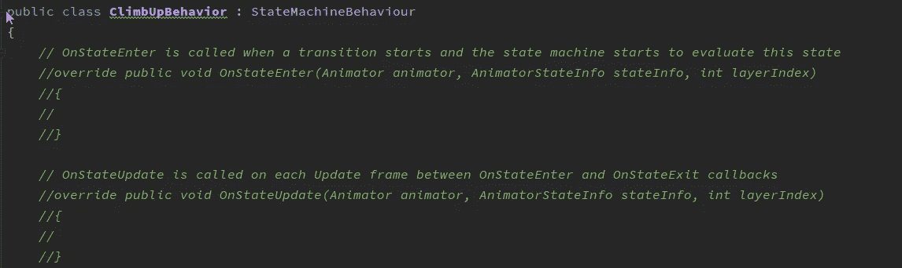

# 在 Unity 中处理动画事件

> 原文：<https://medium.com/nerd-for-tech/working-with-animation-events-in-unity-28ede5b3f9af?source=collection_archive---------11----------------------->

//更多 POWAH！

动画甚至脚本的一部分

在过去的几天里，我写了关于我们如何使用动画来帮助制作一个烟雾和镜子壁架抓取系统。今天我们来看看这个谜题的最后一块，动画事件。